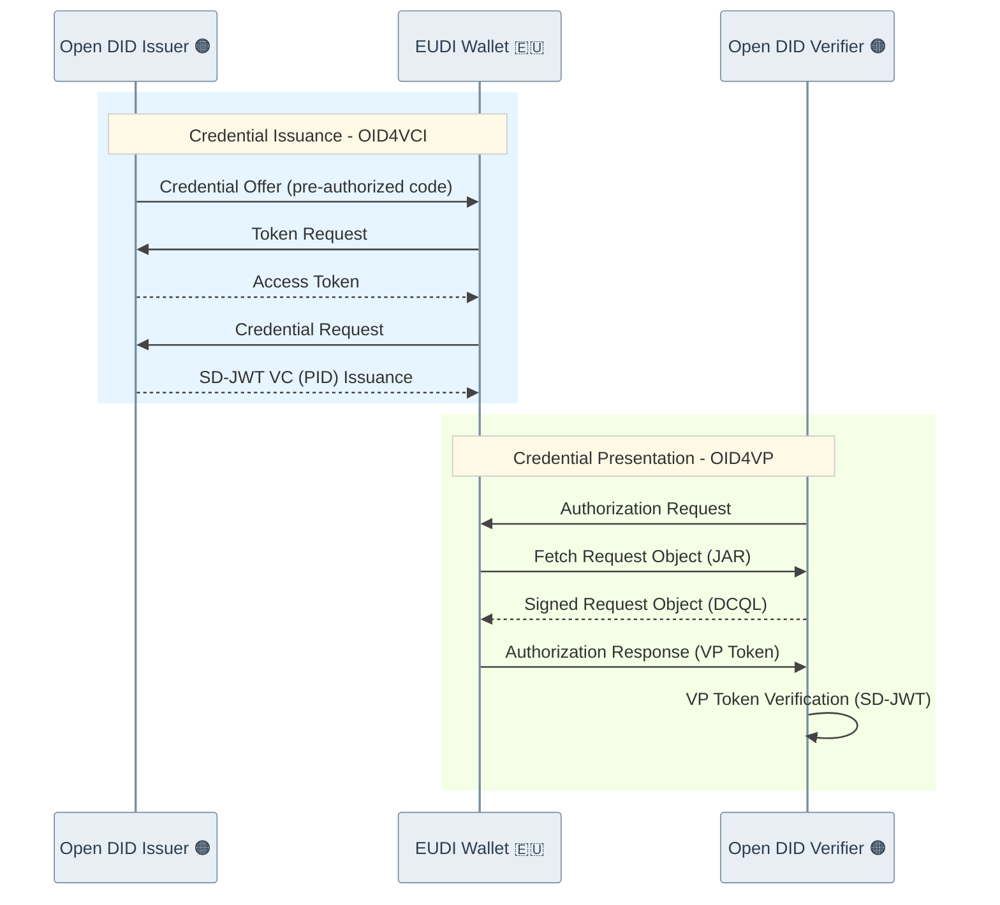

# OID4VC (OpenID for Verifiable Credentials) PoC

Welcome to the OID4VC PoC repository.
This repository contains a Proof of Concept (PoC) project for testing the OID4VC (OID4VCI/OID4VP) standards in integration with OpenDID.

## Project Goals

* Understand the issuance and verification flows of the OID4VC protocol
* Evaluate the feasibility of building a DID-based VC (Verifiable Credential) ecosystem
* Test integration between Spring Boot-based servers and native mobile applications (Android/iOS)
* Verify ISO 18013-5 based mDoc offline proximity presentation (BLE/NFC)

## 🇪🇺🤝 EUDI Wallet Interoperability Demo

https://github.com/user-attachments/assets/d5637ebb-a11f-45dc-a161-28a8d50f5d2e

This project has successfully completed internal interoperability testing with the [EUDI Wallet](https://github.com/eu-digital-identity-wallet/eudi-app-android-wallet-ui).
It has been verified that Open DID's Issuer and Verifier servers interoperate with the EUDI Wallet based on the OID4VCI/OID4VP standards.

- **Test Wallet Version**: [EUDI Wallet 2026.02.35-Demo](https://github.com/eu-digital-identity-wallet/eudi-app-android-wallet-ui/releases/tag/Wallet%2FDemo_Version%3D2026.02.35-Demo_Build%3D35) ([commit](https://github.com/eu-digital-identity-wallet/eudi-app-android-wallet-ui/commit/bb008698fe48fcd3f7224d516aca0748fb1566f3))

The demo video above demonstrates the following:

| Category | Method | Description |
|:-----|:-----|:-----|
| Credential | SD-JWT VC | Issued in PID (Person Identification Data) format |
| Issuance | Pre-Authorized Code Flow | VC issuance via pre-authorized code |
| Verification | direct_post | VP Token submitted and verified via direct_post |

In addition to the SD-JWT VC flow shown in the demo, the project also supports **mDoc-based credential issuance and verification**, including **PID (Person Identification Data)** and **mDL (Mobile Driving License)** formats for EUDI Wallet interoperability.

### Sequence Diagram



## Folder Structure

An overview of the main folders and documents in the project directory.

```
poc-oid4vc
├── source
│   ├── apps
│   │   ├── android-app                # OID4VC Android Wallet App
│   │   ├── ios-app                    # OID4VC iOS Wallet App
│   │   ├── android-mdoc-reader        # mDoc Reader Android App
│   │   └── ios-mdoc-reader            # mDoc Reader iOS App
│   ├── sdks
│   │   ├── poc-sd-jwt-vc-sdk-aos      # SD-JWT VC SDK (Android)
│   │   └── poc-mso-mdoc-sdk-aos       # MSO mDoc SDK (Android)
│   └── servers
│       ├── issuer-server              # OID4VC Issuer Server
│       └── verifier-server            # OID4VC Verifier Server
└── docs
    ├── api
    │   ├── issuer-server              # OID4VCI SDK API Docs
    │   ├── verifier-server            # OID4VP SDK API Docs
    │   ├── poc-sd-jwt-vc-sdk-aos      # SD-JWT VC SDK API Docs
    │   └── poc-mso-mdoc-sdk-aos       # MSO mDoc SDK API Docs
    └── installation
```

Description of each folder:

| Name | Description |
| :--- | :--- |
| **`source/servers`** | Contains server implementations for the OID4VC flow. |
| ┖ `issuer-server` | Issues VC (Verifiable Credentials) according to the OID4VCI standard. |
| ┖ `verifier-server` | Verifies VC according to the OID4VP standard. |
| **`source/apps`** | Contains sample mobile applications. |
| ┖ `android-app` | Sample Android wallet for storing and submitting VCs. |
| ┖ `ios-app` | Sample iOS wallet for storing and submitting VCs. |
| ┖ `android-mdoc-reader` | Android mDoc Reader app for ISO 18013-5 proximity verification. |
| ┖ `ios-mdoc-reader` | iOS mDoc Reader app for ISO 18013-5 proximity verification. |
| **`source/sdks`** | Contains Android native SDKs. |
| ┖ `poc-sd-jwt-vc-sdk-aos` | Android SDK for SD-JWT VC creation and verification. |
| ┖ `poc-mso-mdoc-sdk-aos` | Android SDK for ISO 18013-5 mDoc processing. |
| **`docs`** | Contains project documentation. |
| ┖ `api` | Integration guides and API documentation for servers and SDKs. |
| ┖ `installation` | Installation and operation guides. |

## Supported Versions

| Standard   | Version | Link |
|------------|---------|------|
| OID4VCI    | OpenID for Verifiable Credential Issuance 1.0 | [Specification](https://openid.net/specs/openid-4-verifiable-credential-issuance-1_0.html) |
| OID4VP     | OpenID for Verifiable Presentations 1.0 | [Specification](https://openid.net/specs/openid-4-verifiable-presentations-1_0.html) |
| ISO 18013-5 | Personal identification — ISO-compliant driving licence — Part 5: Mobile driving licence (mDL) application | [ISO 18013-5:2021](https://www.iso.org/standard/69084.html) |

## Feature List
* **OID4VCI**

| Category | Feature | Status |
|:------|:------|:------|
|Authorization & Flows| Authorization Code Flow |  |
|| Pre-Authorized Code Flow |  |
|Credential Formats| SD-JWT VC |   |
|| Open DID VC |  |
|| mDoc Format |  |
|| W3C VC DM(JWT, JSON-LD) |  |
|Endpoints| Token Endpoint |  |
|| Credential Endpoint |  |
|| Nonce Endpoint |  |
|| Deferred Endpoint |  |
|| Notification Endpoint |  |
|Credential Offer & Response| Credential Offer with authorization_code |   |
|| Credential Offer with pre-authorized_code |   |
|| Credential Issuer Metadata |   |
|| Pushed Authorization Request	|  |
|| Credential Response Encryption |  |
|Security| Proof(JWT) |  |
|| PKCE(Proof Key for Code Exchange) |  |
|| JWE(JSON Web Encryption) |  |
|| DPoP(Demonstration of Proof-of-Possession) |  |

* **OID4VP**

| Category | Feature | Status |
|:------|:------|:------|
|Authorization & Flows| Same-Device Flow |  |
|| Cross-Device Flow |  |
|Credential Formats| SD-JWT VC |  |
|| Open DID VC |  |
|| mDoc Format |  |
|| W3C VC DM(JWT, JSON-LD)  |  |
|Authorization Request| Verifiable Presentations Authorization Requests |  |
|| Scoped Authorization Requests |  |
|| Self-Issued OpenID Provider Authorization Requests |  |
|| JWT Secured Authorization Request(JAR) |  |
|Authorization Response| direct_post |  |
|| dc_api |  |
|| fragment |  |
|| *.jwt |  |
|Query & Metadata| DCQL(Digital Credentials Query Language) |  |
|| Client Metadata |  |
|| Wallet Metadata |  |
|| Request URI Methods - GET |  |
|| Request URI Methods - POST |  |
|Additional Features| Transaction Data |  |
|Security| Proof(JWT) |  |
|| JWE(JSON Web Encryption) |  |

## Getting Started

Please refer to the installation and operation guides below to get started with OID4VC.

*   [OID4VC PoC Project Installation and Operation Guide](docs/installation/oid4vc_Installation_Guide.md)
*   [ISO 18013-5 Offline Presentation Installation and Test Guide](docs/installation/mdoc_Offline_Presentation_Guide.md)


For information on each subproject, please refer to the `README.md` file in the respective directory.

* [Issuer Server README](source/servers/issuer-server/README.md)
* [Verifier Server README](source/servers/verifier-server/README.md)
* [Android App README](source/apps/android-app/README.md)
* [iOS App README](source/apps/ios-app/README.md)
* [mDoc Reader Android README](source/apps/android-mdoc-reader/README.md)
* [mDoc Reader iOS README](source/apps/ios-mdoc-reader/README.md)

## API Reference Documentation

API documentation for each component can be found in the `docs/api` directory.

* [Issuer Server API](docs/api/issuer-server/issuer_server_API.md)
* [Verifier Server API](docs/api/verifier-server/verifier_server_API.md)

## Contributing

For detailed information on contribution procedures and the code of conduct, please refer to [CONTRIBUTING.md](CONTRIBUTING.md) and [CODE_OF_CONDUCT.md](CODE_OF_CONDUCT.md).

## License

[Apache 2.0](LICENSE)
