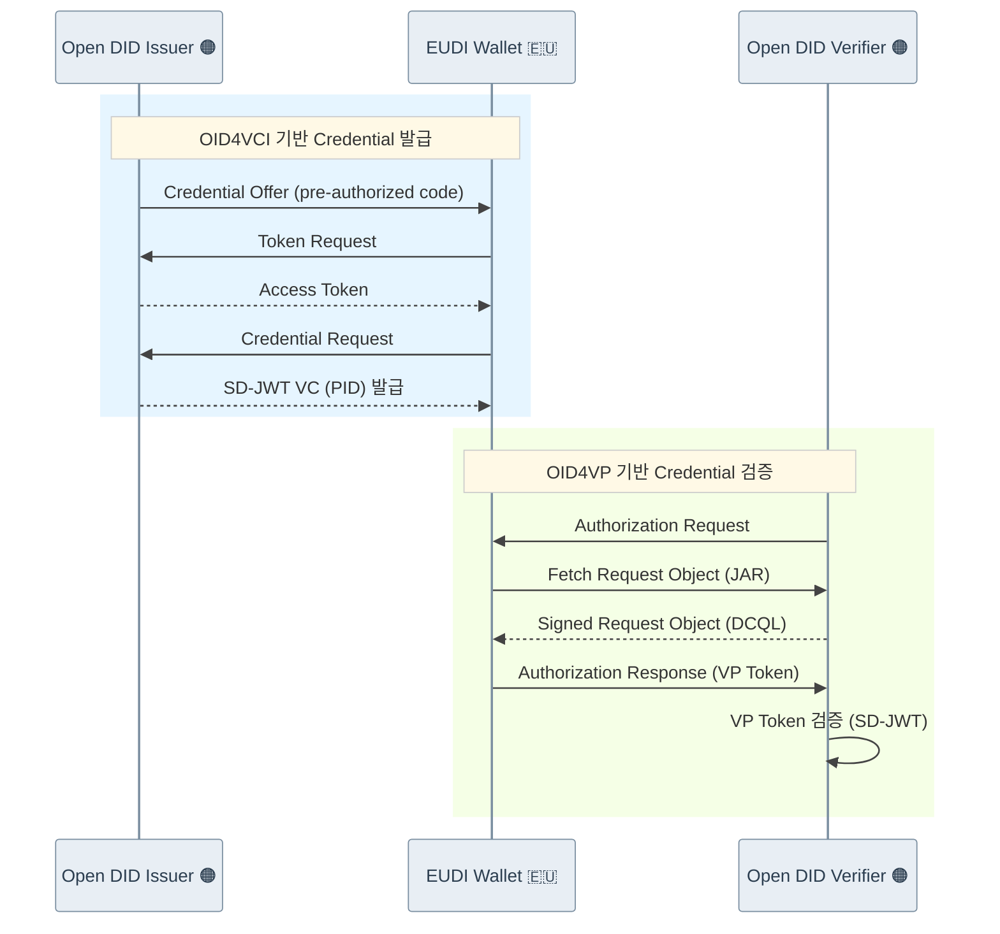

# OID4VC(OpenID for Verifiable Credentials) PoC

OID4VC PoC 저장소에 오신 것을 환영합니다.
이 저장소는 OpenDID와 연동하여 OID4VC(OID4VCI/OID4VP) 표준을 테스트하기 위한 PoC(Proof of Concept) 프로젝트를 포함합니다.

## 프로젝트 목표

*   OID4VC 프로토콜의 발급 및 검증 흐름 이해
*   DID 기반의 VC(Verifiable Credential) 생태계 구축 가능성 검토
*   Spring Boot 기반 서버와 네이티브 모바일 앱(Android/iOS) 연동 테스트
*   ISO 18013-5 기반 mDoc 오프라인 근접 프레젠테이션 검증

## 목표 프로토콜 및 데이터 모델

**본 PoC가 목표로 하는 프로토콜과 Credential 데이터 모델은 다음과 같습니다.**

| 구분 | 대상 |
|:-----|:-----|
| **프로토콜** | OID4VC (OID4VCI / OID4VP), ISO 18013-5 Proximity |
| **데이터 모델** | SD-JWT VC, mDoc Format |

* 본 PoC는 ISO 18013-7도 목표로 하며, 이는 OID4VC 프로토콜을 기반으로 mDL의 온라인 제시를 규정합니다.

## 폴더 구조

프로젝트 디렉터리 내 주요 폴더와 문서에 대한 개요입니다.

```
poc-oid4vc
├── source
│   ├── apps
│   │   ├── android-app                # OID4VC Android 지갑 앱
│   │   ├── ios-app                    # OID4VC iOS 지갑 앱
│   │   ├── android-mdoc-reader        # mDoc Reader Android 앱
│   │   └── ios-mdoc-reader            # mDoc Reader iOS 앱
│   ├── sdks
│   │   ├── poc-sd-jwt-vc-sdk-aos      # SD-JWT VC SDK (Android)
│   │   └── poc-mso-mdoc-sdk-aos       # MSO mDoc SDK (Android)
│   └── servers
│       ├── issuer-server              # OID4VC Issuer Server
│       └── verifier-server            # OID4VC Verifier Server
└── docs
    ├── api
    │   ├── issuer-server              # OID4VCI SDK API 문서
    │   ├── verifier-server            # OID4VP SDK API 문서
    │   ├── poc-sd-jwt-vc-sdk-aos      # SD-JWT VC SDK API 문서
    │   └── poc-mso-mdoc-sdk-aos       # MSO mDoc SDK API 문서
    └── installation
```

각 폴더에 대한 설명은 다음과 같습니다.

| 이름 | 설명 |
| :--- | :--- |
| **`source/servers`** | OID4VC 흐름을 위한 서버 구현체를 포함합니다. |
| ┖ `issuer-server` | OID4VCI 표준에 따라 VC(Verifiable Credential)를 발급합니다. |
| ┖ `verifier-server` | OID4VP 표준에 따라 VC를 검증합니다. |
| **`source/apps`** | 샘플 모바일 애플리케이션을 포함합니다. |
| ┖ `android-app` | VC를 저장하고 제출하는 샘플 안드로이드 지갑입니다. |
| ┖ `ios-app` | VC를 저장하고 제출하는 샘플 iOS 지갑입니다. |
| ┖ `android-mdoc-reader` | ISO 18013-5 근접 검증을 위한 Android mDoc Reader 앱입니다. |
| ┖ `ios-mdoc-reader` | ISO 18013-5 근접 검증을 위한 iOS mDoc Reader 앱입니다. |
| **`source/sdks`** | Android 네이티브 SDK를 포함합니다. |
| ┖ `poc-sd-jwt-vc-sdk-aos` | SD-JWT VC 생성·검증을 위한 Android SDK입니다. |
| ┖ `poc-mso-mdoc-sdk-aos` | ISO 18013-5 mDoc 처리를 위한 Android SDK입니다. |
| **`docs`** | 프로젝트 문서를 포함합니다. |
| ┖ `api` | 서버 및 SDK에 대한 연동 가이드 및 API 문서입니다. |
| ┖ `installation` | 설치 및 구동 가이드입니다. |

## 🇪🇺🤝 EUDI Wallet 상호운용 시연 영상

https://github.com/user-attachments/assets/be33f5b5-8114-4e47-aa73-e065e246085f

본 프로젝트는 [EUDI Wallet](https://github.com/eu-digital-identity-wallet/eudi-app-android-wallet-ui)과의 자체적인 상호운용 테스트를 성공적으로 완료하였습니다.
Open DID의 Issuer 및 Verifier 서버가 EUDI Wallet과 OID4VCI/OID4VP 표준 기반으로 정상적으로 연동됨을 확인하였습니다.

- **테스트 기준 월렛 버전**: [EUDI Wallet 2026.02.35-Demo](https://github.com/eu-digital-identity-wallet/eudi-app-android-wallet-ui/releases/tag/Wallet%2FDemo_Version%3D2026.02.35-Demo_Build%3D35) ([커밋](https://github.com/eu-digital-identity-wallet/eudi-app-android-wallet-ui/commit/bb008698fe48fcd3f7224d516aca0748fb1566f3))

위 시연 영상은 Pre-Authorized Code Flow를 통한 SD-JWT VC 발급(PID 형식)과 direct_post 방식의 VP Token 검증 과정을 보여줍니다.

위 시연 영상은 SD-JWT VC 흐름을 기준으로 하며, 이 외에도 **mDoc 기반의 Credential 발급 및 검증**을 지원합니다. EUDI Wallet 상호운용 시 **PID(Person Identification Data)** 및 **mDL(Mobile Driving License)** 포맷의 mDoc 발급·검증이 가능합니다.

### 시퀀스 다이어그램 기반 구성도



## 지원 버전

| 구분       | 버전 정보 | 링크 |
|------------|-----------|------|
| OID4VCI    | OpenID for Verifiable Credential Issuance 1.0 | [스펙 문서](https://openid.net/specs/openid-4-verifiable-credential-issuance-1_0.html) |
| OID4VP     | OpenID for Verifiable Presentations 1.0 | [스펙 문서](https://openid.net/specs/openid-4-verifiable-presentations-1_0.html) |
| ISO 18013-5 | Personal identification — ISO-compliant driving licence — Part 5: Mobile driving licence (mDL) application | [ISO 18013-5:2021](https://www.iso.org/standard/69084.html) |

## 기능 목록
* **OID4VCI**

| 구분 | 기능 | 상태 |
|:------|:------|:------|
|Authorization & Flows| Authorization Code Flow |  |
|| Pre-Authorized Code Flow |  |
|Credential Formats| SD-JWT VC |   |
|| Open DID VC |  |
|| mDoc Format |  |
|| W3C VC DM(JWT, JSON-LD) |  |
|Endpoints| Token Endpoint |  |
|| Credential Endpoint |  |
|| Nonce Endpoint |  |
|| Deferred Endpoint |  |
|| Notification Endpoint |  |
|Credential Offer & Response| Credential Offer with authorization_code |   |
|| Credential Offer with pre-authorized_code |   |
|| Credential Issuer Metadata |   |
|| Pushed Authorization Request	|  |
|| Credential Response Encryption |  |
|Security| Proof(JWT) |  |
|| PKCE(Proof Key for Code Exchange) |  |
|| JWE(JSON Web Encryption) |  |
|| DPoP(Demonstration of Proof-of-Possession) |  |

* **OID4VP**

| 구분 | 기능 | 상태 |
|:------|:------|:------|
|Authorization & Flows| Same-Device Flow |  |
|| Cross-Device Flow |  |
|Credential Formats| SD-JWT VC |  |
|| Open DID VC |  |
|| mDoc Format |  |
|| W3C VC DM(JWT, JSON-LD)  |  |
|Authorization Request| Verifiable Presentations Authorization Requests |  |
|| Scoped Authorization Requests |  |
|| Self-Issued OpenID Provider Authorization Requests |  |
|| JWT Secured Authorization Request(JAR) |  |
|Authorization Response| direct_post |  |
|| dc_api |  |
|| fragment |  |
|| *.jwt |  |
|Query & Metadata| DCQL(Digital Credentials Query Language) |  |
|| Client Metadata |  |
|| Wallet Metadata |  |
|| Request URI Methods - GET |  |
|| Request URI Methods - POST |  |
|Additional Features| Transaction Data |  |
|Security| Proof(JWT) |  |
|| JWE(JSON Web Encryption) |  |

## 시작하기

OID4VC를 시작하기 위한 절차는 아래 설치 및 구동 가이드를 참고하세요.

*   [OID4VC PoC 프로젝트 설치 및 구동 가이드](docs/installation/oid4vc_Installation_Guide_ko.md)
*   [ISO 18013-5 오프라인 프레젠테이션 설치 및 테스트 가이드](docs/installation/mdoc_Offline_Presentation_Guide_ko.md)


각 하위 프로젝트의 정보는 해당 프로젝트 디렉터리의 `README.md` 파일을 참고하세요.

*   [발급 서버 README](source/servers/issuer-server/README_ko.md)
*   [검증 서버 README](source/servers/verifier-server/README_ko.md)
*   [안드로이드 앱 README](source/apps/android-app/README_ko.md)
*   [iOS 앱 README](source/apps/ios-app/README_ko.md)
*   [mDoc Reader Android README](source/apps/android-mdoc-reader/README.md)
*   [mDoc Reader iOS README](source/apps/ios-mdoc-reader/README_ko.md)

## API 참고 문서

각 구성 요소에 대한 API 문서는 `docs/api` 디렉터리에서 찾을 수 있습니다.

*   [발급 서버 API](docs/api/issuer-server/issuer_server_API_ko.md)
*   [검증 서버 API](docs/api/verifier-server/verifier_server_API_ko.md)

## 기여

기여 절차와 행동 강령에 대한 자세한 내용은 [CONTRIBUTING.md](CONTRIBUTING.md)와 [CODE_OF_CONDUCT.md](CODE_OF_CONDUCT.md)를 참조해 주십시오.

## 라이선스

[Apache 2.0](LICENSE)
