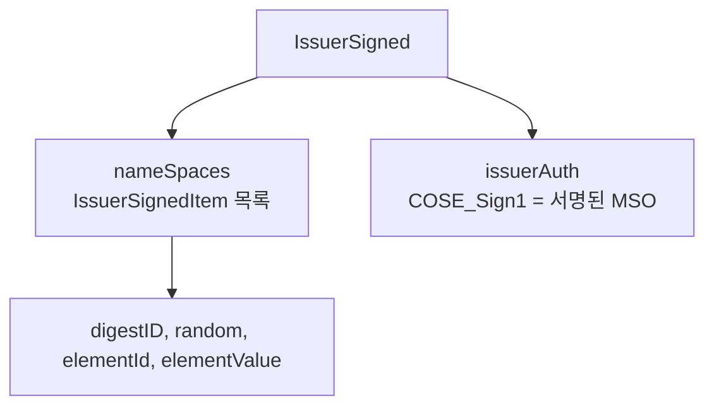
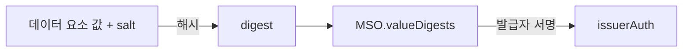
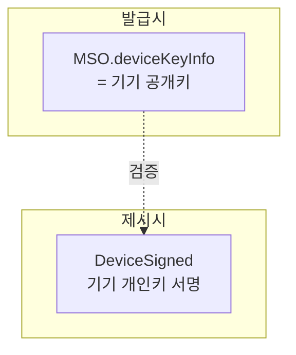
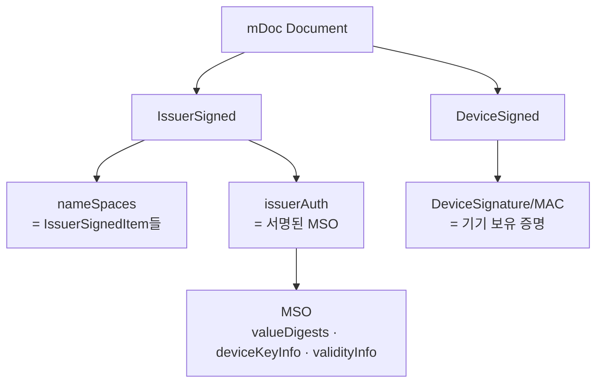

# mDoc 개요와 데이터 모델

| 항목 | 내용 |
|------|------|
| 주제 | ISO 18013-5 mDoc 데이터 모델과 구조 |
| 작성 | 오픈소스개발팀 |
| 일자 | 2026-06-01 |
| 버전 | v1.0.0 |

## 변경 이력

| 버전 | 일자 | 변경 내용 |
|------|------|-----------|
| v1.0.0 | 2026-06-01 | 초기 작성 |

## 목차

1. [mDoc이란](#1-mdoc이란)
2. [CBOR와 COSE](#2-cbor와-cose)
3. [Namespace와 Data Element](#3-namespace와-data-element)
4. [IssuerSigned: 발급자가 서명한 부분](#4-issuersigned-발급자가-서명한-부분)
5. [MSO(Mobile Security Object)](#5-msomobile-security-object)
6. [DeviceSigned: 기기가 서명한 부분](#6-devicesigned-기기가-서명한-부분)
7. [전체 구조 한눈에 보기](#7-전체-구조-한눈에-보기)
8. [관련 표준](#8-관련-표준)

---

## 1. mDoc이란

**mDoc(mobile document)** 은 ISO/IEC 18013-5 표준이 정의하는 모바일 신원 문서 형식이다.
대표적인 적용 사례가 **mDL(Mobile Driving Licence, 모바일 운전면허증)** 이다.

mDoc은 SD-JWT 같은 텍스트(JSON) 기반 포맷과 달리, **CBOR**라는 이진(binary) 인코딩과
**COSE**라는 이진 서명 방식을 사용한다. 이는 다음을 위한 선택이다.

- **오프라인 제시**: 네트워크 없이 기기 간(근접) 제시가 가능해야 한다.
- **작은 크기**: NFC/BLE 같은 제약된 채널로 빠르게 전송되어야 한다.
- **선택적 공개**: 운전면허 중 "성인 여부"만 보여주는 등 항목 단위 선택 제시를 지원한다.

> mDoc은 본래 **근접(proximity) 오프라인 제시**(ISO 18013-5)를 위해 설계됐지만,
> [OID4VP](../oid4vp/oid4vp_overview.md)를 통해 **온라인 제시**(ISO 18013-7)에도 사용된다.

---

## 2. CBOR와 COSE

mDoc을 이해하려면 두 가지 기반 기술을 알아야 한다.

| 기술 | 설명 |
|------|------|
| **CBOR** (Concise Binary Object Representation) | JSON과 유사한 데이터 모델을 가진 이진 인코딩. JSON보다 작고 빠르다. (RFC 8949) |
| **COSE** (CBOR Object Signing and Encryption) | CBOR 데이터에 대한 서명·암호화 표준. JWT/JOSE의 CBOR 버전에 해당한다. (RFC 9052) |

쉽게 말해, **JSON ↔ CBOR**, **JWT ↔ COSE**의 대응 관계로 이해하면 된다.
mDoc의 서명은 `COSE_Sign1` 구조로 표현된다.

---

## 3. Namespace와 Data Element

mDoc의 데이터는 **Namespace**로 묶인 **Data Element(데이터 요소)** 들의 모음이다.

- **Namespace**: 데이터 요소들의 그룹을 식별하는 이름. 역방향 도메인 표기를 쓴다.
  예: `org.iso.18013.5.1` (mDL 표준 요소들의 네임스페이스)
- **Data Element**: 실제 클레임 하나. 이름과 값을 가진다.
  예: `family_name`, `birth_date`, `age_over_18`, `driving_privileges`

```
doctype: org.iso.18013.5.1.mDL
└─ namespace: org.iso.18013.5.1
   ├─ family_name      = "Hong"
   ├─ given_name       = "Gildong"
   ├─ birth_date       = 1990-01-01
   ├─ age_over_18      = true
   └─ driving_privileges = [...]
```

| 용어 | 의미 |
|------|------|
| **doctype** | 문서의 종류 식별자 (예: `org.iso.18013.5.1.mDL`) |
| **namespace** | 데이터 요소 묶음의 이름 |
| **data element** | 개별 클레임(이름-값) |

---

## 4. IssuerSigned: 발급자가 서명한 부분

mDoc은 두 개의 서명 영역으로 구성된다. 그중 하나가 **IssuerSigned**다.

IssuerSigned에는 다음이 들어 있다.

- **`nameSpaces`**: 각 데이터 요소를 담은 항목(`IssuerSignedItem`)들의 묶음.
  각 항목은 요소값과 함께, 선택적 공개를 위한 **랜덤값(salt)** 과 **digestID**를 가진다.
- **`issuerAuth`**: 발급자가 서명한 **MSO**(아래 참고). `COSE_Sign1` 구조다.



각 `IssuerSignedItem`은 개별적으로 분리·제거가 가능하다.
이 덕분에 제시할 때 **요구된 요소만 남기고 나머지는 빼는** 선택적 공개가 가능하다.

---

## 5. MSO(Mobile Security Object)

**MSO(Mobile Security Object)** 는 mDoc의 무결성과 신뢰의 핵심이다.
발급자가 서명하는 보안 객체로, 다음을 담는다.

| 항목 | 설명 |
|------|------|
| **valueDigests** | 각 데이터 요소의 **해시값** 목록 (digestID → digest) |
| **deviceKeyInfo** | 보유자 기기의 공개키. DeviceSigned 검증에 사용 |
| **docType** | 문서 종류 |
| **validityInfo** | 유효기간 (signed, validFrom, validUntil) |

MSO의 핵심 아이디어는 **데이터 요소의 값을 직접 서명하지 않고, 그 해시(digest)를 서명**한다는 점이다.



이 구조 덕분에 제시할 때 일부 요소를 빼더라도,
남은 요소의 해시가 MSO의 서명된 digest와 일치하면 **무결성이 그대로 검증**된다.
이것이 mDoc의 선택적 공개를 가능하게 하는 핵심 메커니즘이다.

---

## 6. DeviceSigned: 기기가 서명한 부분

두 번째 서명 영역은 **DeviceSigned**다.
이는 **보유자의 기기**가 제시 시점에 만드는 서명으로, "지금 이 자격증명을 제시하는 주체가
정당한 보유자"임을 증명한다.

- **deviceKey**: 발급 시 MSO의 `deviceKeyInfo`에 박제된 기기 공개키
- **DeviceSignature / DeviceMac**: 제시 시 기기 개인키로 생성한 서명(또는 MAC)



검증자는 MSO에 박힌 기기 공개키로 DeviceSigned를 검증하여
**발급 대상 기기와 제시 기기가 동일**함을 확인한다.
이를 **Device Authentication(기기 인증)** 이라 한다. 자세한 내용은
[mDoc 검증과 신뢰 모델](mdoc_verification_and_trust.md)에서 다룬다.

---

## 7. 전체 구조 한눈에 보기



정리하면 mDoc은 다음 두 축으로 구성된다.

- **IssuerSigned (발급자)**: 데이터 요소 + 그 해시를 담은 서명된 MSO → *자격증명이 진짜인가*
- **DeviceSigned (보유자)**: 기기 키로 만든 서명 → *제시자가 정당한 보유자인가*

---

## 8. 관련 표준

| 표준 | 설명 | 링크 |
|------|------|------|
| ISO/IEC 18013-5:2021 | 모바일 운전면허(mDL) 애플리케이션 | <https://www.iso.org/standard/69084.html> |
| ISO/IEC 18013-7 | OID4VP 기반 mDL 온라인 제시 | <https://www.iso.org/standard/82772.html> |
| RFC 8949 | CBOR | <https://datatracker.ietf.org/doc/html/rfc8949> |
| RFC 9052 | COSE | <https://datatracker.ietf.org/doc/html/rfc9052> |
