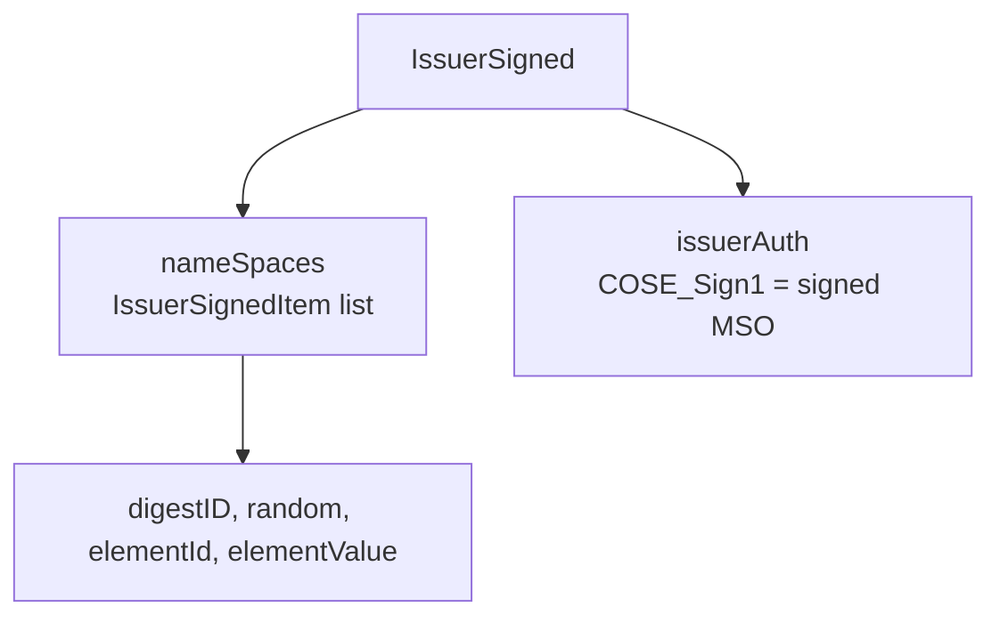
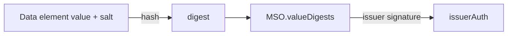
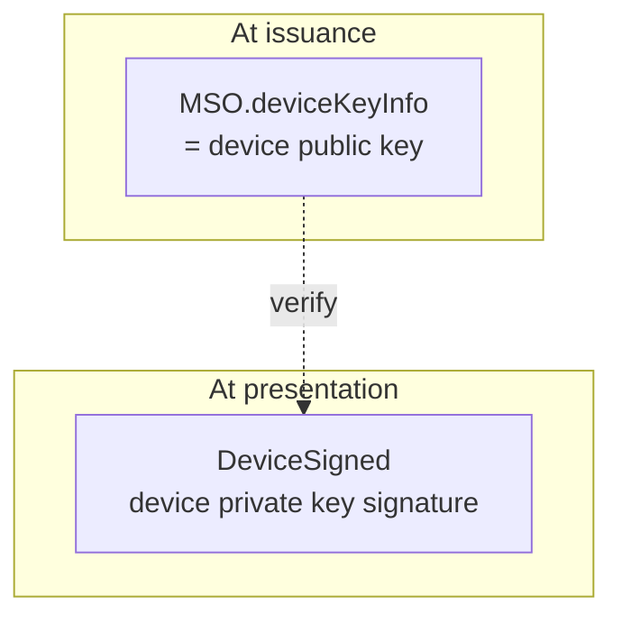
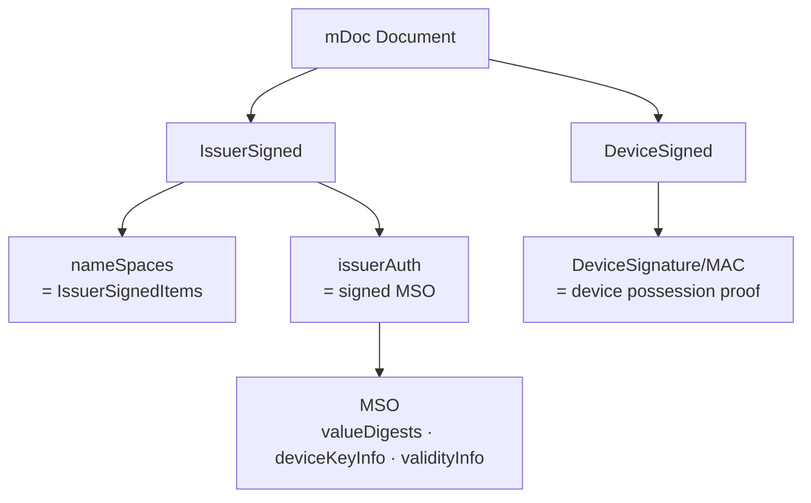

# mDoc Overview and Data Model

| Item | Content |
|------|---------|
| Subject | ISO 18013-5 mDoc Data Model and Structure |
| Author | Open Source Development Team |
| Date | 2026-06-01 |
| Version | v1.0.0 |

## Change History

| Version | Date | Changes |
|---------|------|---------|
| v1.0.0 | 2026-06-01 | Initial version |

## Table of Contents

1. [What Is mDoc](#1-what-is-mdoc)
2. [CBOR and COSE](#2-cbor-and-cose)
3. [Namespace and Data Element](#3-namespace-and-data-element)
4. [IssuerSigned: The Issuer-Signed Portion](#4-issuersigned-the-issuer-signed-portion)
5. [MSO (Mobile Security Object)](#5-mso-mobile-security-object)
6. [DeviceSigned: The Device-Signed Portion](#6-devicesigned-the-device-signed-portion)
7. [The Complete Structure at a Glance](#7-the-complete-structure-at-a-glance)
8. [Related Standards](#8-related-standards)

---

## 1. What Is mDoc

**mDoc (mobile document)** is a mobile identity document format defined by the ISO/IEC 18013-5 standard.
Its most representative use case is the **mDL (Mobile Driving Licence)**.

Unlike text (JSON) based formats such as SD-JWT, mDoc uses a binary encoding called **CBOR**
and a binary signature scheme called **COSE**. These choices serve the following purposes:

- **Offline presentation**: It must support device-to-device (proximity) presentation without a network.
- **Small size**: It must be transmitted quickly over constrained channels such as NFC/BLE.
- **Selective disclosure**: It supports element-level selective presentation, such as showing only "whether the person is an adult" from a driving licence.

> mDoc was originally designed for **proximity offline presentation** (ISO 18013-5), but
> through [OID4VP](../oid4vp/oid4vp_overview.md) it is also used for **online presentation** (ISO 18013-7).

---

## 2. CBOR and COSE

To understand mDoc, you need to be familiar with two foundational technologies.

| Technology | Description |
|------------|-------------|
| **CBOR** (Concise Binary Object Representation) | A binary encoding with a data model similar to JSON. It is smaller and faster than JSON. (RFC 8949) |
| **COSE** (CBOR Object Signing and Encryption) | A standard for signing and encrypting CBOR data. It is the CBOR counterpart of JWT/JOSE. (RFC 9052) |

Put simply, you can understand them through the correspondence **JSON ↔ CBOR** and **JWT ↔ COSE**.
An mDoc signature is represented by the `COSE_Sign1` structure.

---

## 3. Namespace and Data Element

The data in an mDoc is a collection of **Data Elements** grouped by **Namespace**.

- **Namespace**: A name that identifies a group of data elements. It uses reverse domain notation.
  Example: `org.iso.18013.5.1` (the namespace for standard mDL elements)
- **Data Element**: A single actual claim. It has a name and a value.
  Examples: `family_name`, `birth_date`, `age_over_18`, `driving_privileges`

```
doctype: org.iso.18013.5.1.mDL
└─ namespace: org.iso.18013.5.1
   ├─ family_name      = "Hong"
   ├─ given_name       = "Gildong"
   ├─ birth_date       = 1990-01-01
   ├─ age_over_18      = true
   └─ driving_privileges = [...]
```

| Term | Meaning |
|------|---------|
| **doctype** | Identifier for the kind of document (e.g., `org.iso.18013.5.1.mDL`) |
| **namespace** | The name of a bundle of data elements |
| **data element** | An individual claim (name-value) |

---

## 4. IssuerSigned: The Issuer-Signed Portion

An mDoc consists of two signature regions. One of them is **IssuerSigned**.

IssuerSigned contains the following:

- **`nameSpaces`**: A bundle of items (`IssuerSignedItem`) that hold each data element.
  Each item carries, along with the element value, a **random value (salt)** and a **digestID** for selective disclosure.
- **`issuerAuth`**: The **MSO** signed by the issuer (see below). It is a `COSE_Sign1` structure.



Each `IssuerSignedItem` can be individually separated and removed.
Thanks to this, selective disclosure is possible when presenting, by **keeping only the requested elements and omitting the rest**.

---

## 5. MSO (Mobile Security Object)

The **MSO (Mobile Security Object)** is the core of an mDoc's integrity and trust.
It is a security object signed by the issuer, and it holds the following:

| Item | Description |
|------|-------------|
| **valueDigests** | A list of the **hash values** of each data element (digestID → digest) |
| **deviceKeyInfo** | The holder device's public key. Used to verify DeviceSigned |
| **docType** | The kind of document |
| **validityInfo** | Validity period (signed, validFrom, validUntil) |

The key idea of the MSO is that **it does not sign the values of the data elements directly, but signs their hashes (digests)**.



Thanks to this structure, even if some elements are omitted when presenting,
the **integrity is still verified** as long as the hashes of the remaining elements match the signed digests in the MSO.
This is the core mechanism that enables selective disclosure in mDoc.

---

## 6. DeviceSigned: The Device-Signed Portion

The second signature region is **DeviceSigned**.
This is a signature created by the **holder's device** at the time of presentation, proving that "the party
presenting this credential right now is the legitimate holder."

- **deviceKey**: The device public key embedded in the MSO's `deviceKeyInfo` at issuance time
- **DeviceSignature / DeviceMac**: The signature (or MAC) generated with the device private key at presentation time



The verifier verifies DeviceSigned using the device public key embedded in the MSO, thereby confirming that
**the device the credential was issued to and the device presenting it are the same**.
This is called **Device Authentication**. For details, see
[mDoc Verification and Trust Model](mdoc_verification_and_trust.md).

---

## 7. The Complete Structure at a Glance



In summary, an mDoc is composed along the following two axes:

- **IssuerSigned (issuer)**: A signed MSO holding the data elements plus their hashes → *is the credential genuine?*
- **DeviceSigned (holder)**: A signature created with the device key → *is the presenter the legitimate holder?*

---

## 8. Related Standards

| Standard | Description | Link |
|----------|-------------|------|
| ISO/IEC 18013-5:2021 | Mobile Driving Licence (mDL) application | <https://www.iso.org/standard/69084.html> |
| ISO/IEC 18013-7 | OID4VP-based online presentation of mDL | <https://www.iso.org/standard/82772.html> |
| RFC 8949 | CBOR | <https://datatracker.ietf.org/doc/html/rfc8949> |
| RFC 9052 | COSE | <https://datatracker.ietf.org/doc/html/rfc9052> |
