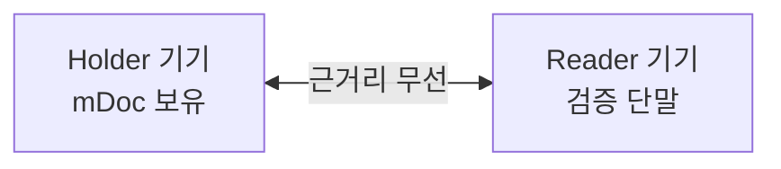
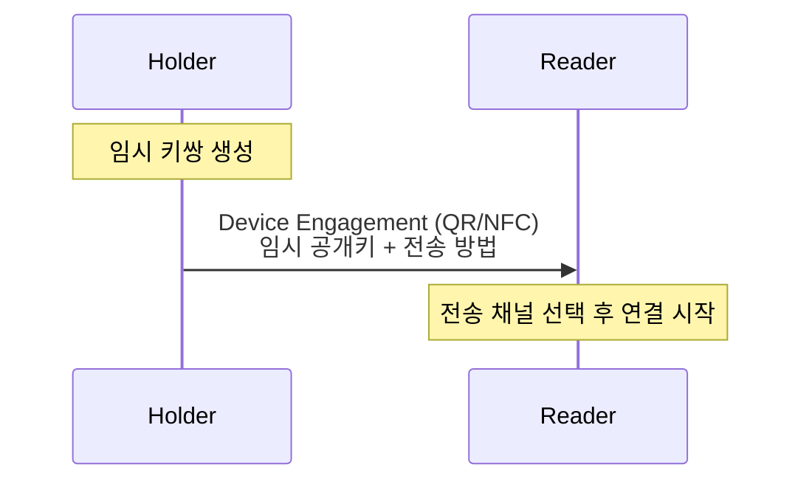
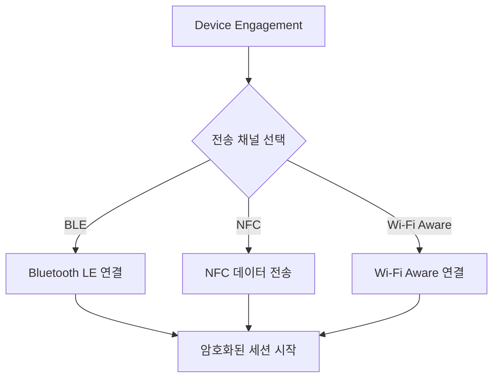
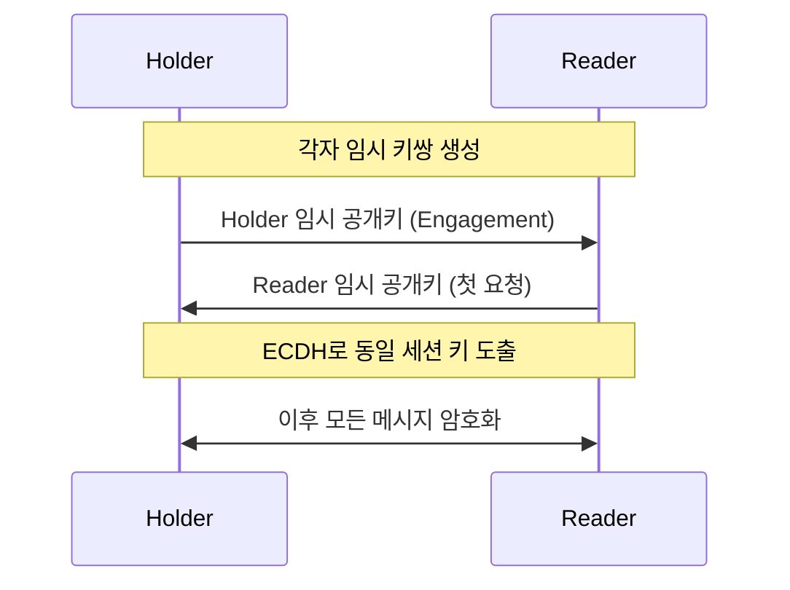
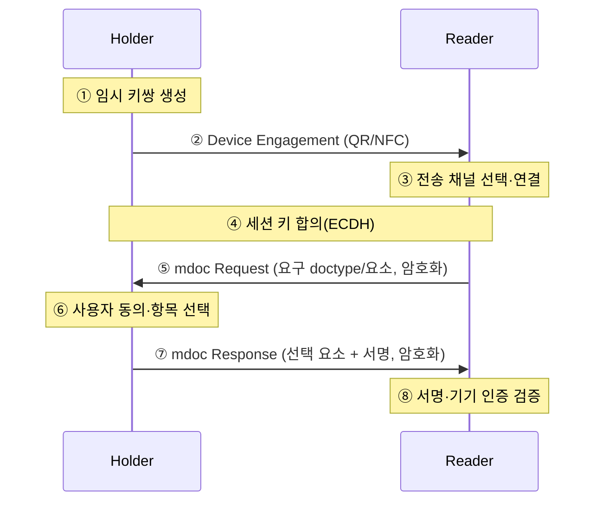

# mDoc 근접 제시(Proximity Presentation)

| 항목 | 내용 |
|------|------|
| 주제 | ISO 18013-5 근접 제시: Device Engagement, 전송 채널, 세션 암호화 |
| 작성 | 오픈소스개발팀 |
| 일자 | 2026-06-01 |
| 버전 | v1.0.0 |

## 변경 이력

| 버전 | 일자 | 변경 내용 |
|------|------|-----------|
| v1.0.0 | 2026-06-01 | 초기 작성 |

## 목차

1. [근접 제시란](#1-근접-제시란)
2. [참여자: Holder와 Reader](#2-참여자-holder와-reader)
3. [Device Engagement](#3-device-engagement)
4. [전송 채널](#4-전송-채널)
5. [세션 암호화](#5-세션-암호화)
6. [전체 제시 흐름](#6-전체-제시-흐름)
7. [요청과 응답 구조](#7-요청과-응답-구조)

---

## 1. 근접 제시란

**근접 제시(proximity presentation)** 는 인터넷 연결 없이, 두 기기가 가까이 있을 때
직접 통신하여 자격증명을 제시하는 방식이다. ISO 18013-5의 핵심 시나리오다.

예를 들어 경찰관이 모바일 운전면허(mDL)를 확인할 때,
운전자의 폰과 경찰관의 단말이 **NFC를 터치하거나 BLE로 연결**되어
직접 데이터를 주고받는다. 서버나 인터넷이 필요 없다.

근접 제시의 특징은 다음과 같다.

- **오프라인**: 네트워크 없이 기기 간 직접 통신
- **단거리 무선**: NFC, BLE, Wi-Fi Aware 등 근거리 채널 사용
- **세션 보안**: 통신 내용을 일회성 세션 키로 암호화

---

## 2. 참여자: Holder와 Reader

근접 제시에는 두 역할이 있다.

| 역할 | 설명 | 다른 이름 |
|------|------|----------|
| **Holder (mdoc)** | 자격증명을 보관·제시하는 보유자 기기 | mDL holder, device |
| **Reader (mdoc reader)** | 자격증명을 요청·검증하는 검증자 단말 | mDL reader, verifier |

이 문서에서는 두 기기가 어떻게 만나(Engagement), 어떤 채널로 연결되며(Transport),
어떻게 안전하게(Session Encryption) 데이터를 주고받는지 설명한다.

---

## 3. Device Engagement

**Device Engagement(기기 연결 개시)** 는 두 기기가 통신을 시작하기 위한 "첫인사"다.
Holder가 자신과 연결하는 데 필요한 정보를 Reader에게 전달하는 단계다.

Device Engagement에 담기는 핵심 정보는 다음과 같다.

| 항목 | 설명 |
|------|------|
| **버전** | Engagement 구조 버전 |
| **Security** | Holder의 **임시 공개키(ephemeral public key)**. 세션 암호화에 사용 |
| **DeviceRetrievalMethods** | 지원하는 전송 채널 목록 (BLE/NFC/Wi-Fi Aware)과 연결 파라미터 |

Engagement 정보는 보통 다음 매체로 Reader에게 전달된다.

- **QR 코드**: Holder가 QR을 표시하고 Reader가 스캔
- **NFC**: 두 기기를 태그하여 전달

---

## 4. 전송 채널

Engagement 이후, 실제 데이터는 **근거리 무선 전송 채널**로 오간다.
ISO 18013-5는 여러 채널을 정의하며, 구현체는 그중 일부를 지원한다.

| 채널 | 특징 | 비고 |
|------|------|------|
| **BLE** (Bluetooth Low Energy) | 가장 널리 쓰이는 채널. 안정적이고 호환성이 좋음 | Central/Peripheral 역할로 동작 |
| **NFC** | 태그 한 번으로 빠른 개시. 데이터량이 많으면 다른 채널로 전환(handover) | 짧은 거리, 빠른 시작 |
| **Wi-Fi Aware** | 고속·대용량 전송에 유리 | 플랫폼 지원 제약 있음 |

BLE의 경우, 어느 쪽이 연결을 주도하느냐에 따라 두 가지 모드가 있다.

- **Peripheral Server 모드**: Holder가 GATT 서버가 되어 Reader의 연결을 받는다.
- **Central Client 모드**: Holder가 Reader(Peripheral)에 능동적으로 연결한다.

> 채널이 무엇이든, 그 위에서 오가는 데이터는 동일한 **세션 암호화**로 보호된다.
> 채널은 "전송 수단"일 뿐, 보안의 본질은 세션 계층에 있다.

---

## 5. 세션 암호화

근접 제시의 모든 통신은 **일회성 세션 키로 암호화**된다.
이 키는 양측의 **임시 키(ephemeral key)** 를 교환해 만든다.

흐름은 다음과 같다.

1. Holder가 임시 키쌍을 만들고, 공개키를 Device Engagement에 담아 전달한다.
2. Reader도 임시 키쌍을 만들고, 자신의 공개키를 첫 요청에 담아 보낸다.
3. 양측은 상대의 임시 공개키와 자신의 임시 개인키로 **키 합의(ECDH)** 를 수행해
   동일한 세션 키를 도출한다.
4. 이후 모든 메시지는 이 세션 키로 암호화된다.

이 방식은 **세션마다 키가 새로 생성**되므로, 한 세션의 키가 노출되어도
다른 세션에는 영향이 없다(전방향 비밀성).
또한 **SessionTranscript**라는 값에 양측 키와 Engagement 정보가 묶여,
[기기 인증(Device Authentication)](mdoc_verification_and_trust.md)의 기준이 된다.

---

## 6. 전체 제시 흐름

---

## 7. 요청과 응답 구조

| 메시지 | 핵심 내용 |
|--------|----------|
| **DeviceRequest** | Reader가 요구하는 `docType`과 네임스페이스별 데이터 요소 목록. "무엇을 보여달라" |
| **DeviceResponse** | Holder가 돌려주는 문서들. 요구된 요소만 담은 `IssuerSigned` + 기기 서명인 `DeviceSigned` |

DeviceResponse 안에는 [mDoc 개요](mdoc_overview.md)에서 설명한 **IssuerSigned**(발급자 서명 + MSO)와
**DeviceSigned**(기기 보유 증명)가 그대로 들어간다.
Reader는 이를 받아 무결성·진위·기기 인증을 검증한다.
검증의 상세는 [mDoc 검증과 신뢰 모델](mdoc_verification_and_trust.md)에서 다룬다.

> 같은 mDoc 데이터 모델이 근접 제시에서는 DeviceRequest/DeviceResponse로,
> 온라인 제시에서는 [OID4VP](../oid4vp/oid4vp_overview.md)의 VP Token으로 전달된다.
> 즉 **전달 경로만 다를 뿐, 자격증명 구조와 검증 원리는 동일**하다.
