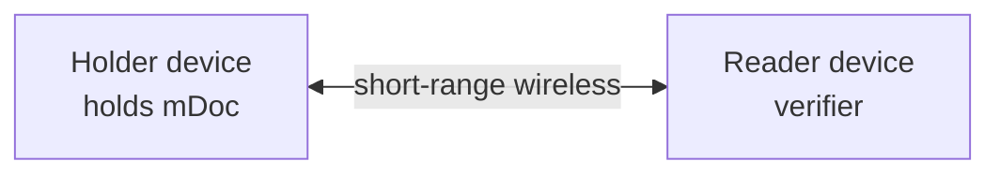
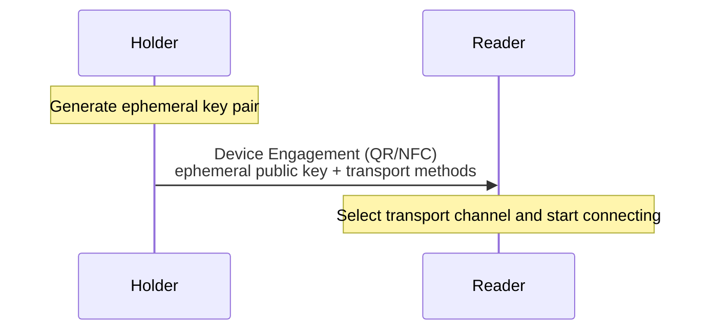
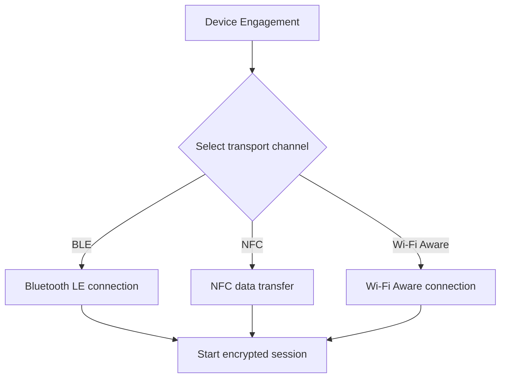
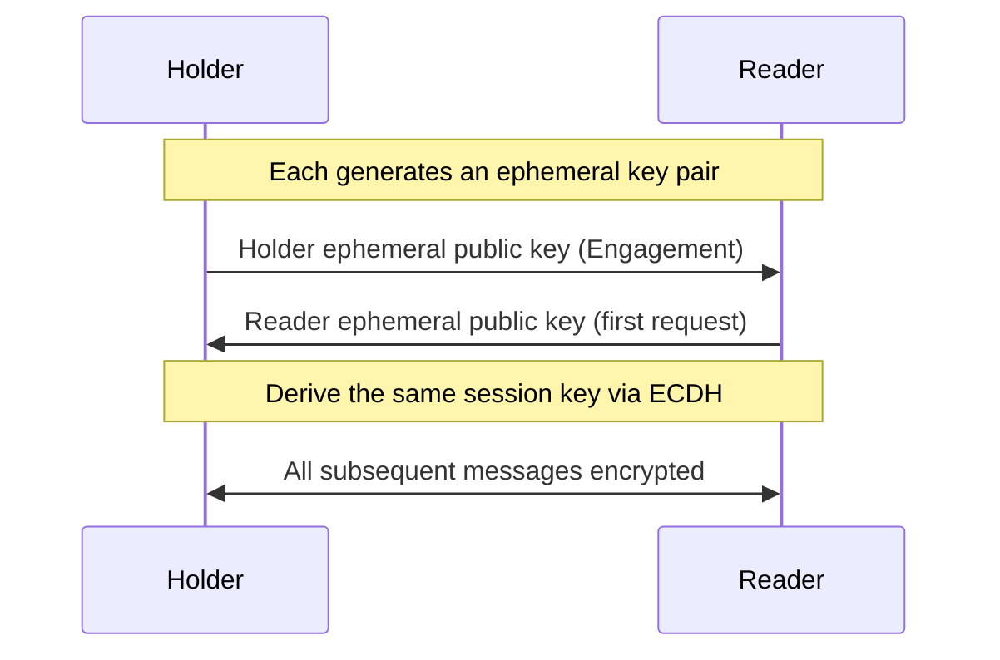
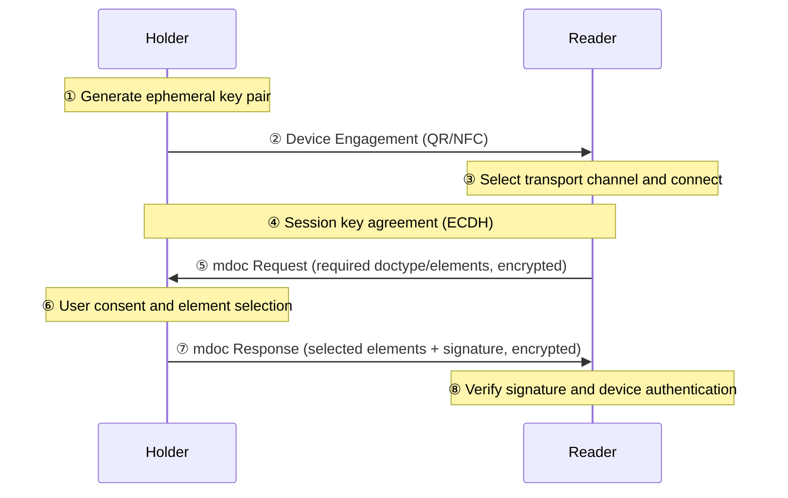

# mDoc Proximity Presentation

| Item | Content |
|------|------|
| Subject | ISO 18013-5 Proximity Presentation: Device Engagement, Transport Channels, Session Encryption |
| Author | Open Source Development Team |
| Date | 2026-06-01 |
| Version | v1.0.0 |

## Change History

| Version | Date | Changes |
|------|------|-----------|
| v1.0.0 | 2026-06-01 | Initial version |

## Table of Contents

1. [What Is Proximity Presentation](#1-what-is-proximity-presentation)
2. [Participants: Holder and Reader](#2-participants-holder-and-reader)
3. [Device Engagement](#3-device-engagement)
4. [Transport Channels](#4-transport-channels)
5. [Session Encryption](#5-session-encryption)
6. [End-to-End Presentation Flow](#6-end-to-end-presentation-flow)
7. [Request and Response Structures](#7-request-and-response-structures)

---

## 1. What Is Proximity Presentation

**Proximity presentation** is a method of presenting credentials in which two devices communicate
directly when they are physically close, without any internet connection. It is the core scenario of ISO 18013-5.

For example, when a police officer verifies a mobile driver's license (mDL),
the driver's phone and the officer's device **touch via NFC or connect over BLE**
and exchange data directly. No server or internet connection is required.

The characteristics of proximity presentation are as follows.

- **Offline**: Direct device-to-device communication without a network
- **Short-range wireless**: Uses near-field channels such as NFC, BLE, and Wi-Fi Aware
- **Session security**: Encrypts the communication content with a one-time session key

---

## 2. Participants: Holder and Reader

Proximity presentation involves two roles.

| Role | Description | Alternative Names |
|------|------|----------|
| **Holder (mdoc)** | The holder device that stores and presents the credential | mDL holder, device |
| **Reader (mdoc reader)** | The verifier device that requests and verifies the credential | mDL reader, verifier |

This document explains how the two devices meet (Engagement), over which channel they connect (Transport),
and how they exchange data securely (Session Encryption).

---

## 3. Device Engagement

**Device Engagement** is the "first handshake" by which the two devices begin communicating.
It is the step in which the Holder passes to the Reader the information needed to connect to it.

The key information carried in Device Engagement is as follows.

| Item | Description |
|------|------|
| **Version** | The version of the Engagement structure |
| **Security** | The Holder's **ephemeral public key**, used for session encryption |
| **DeviceRetrievalMethods** | The list of supported transport channels (BLE/NFC/Wi-Fi Aware) and connection parameters |

Engagement information is typically delivered to the Reader through the following media.

- **QR code**: The Holder displays a QR code and the Reader scans it
- **NFC**: The two devices are tapped together to transfer the information

---

## 4. Transport Channels

After Engagement, the actual data is exchanged over a **short-range wireless transport channel**.
ISO 18013-5 defines several channels, and an implementation supports some of them.

| Channel | Characteristics | Notes |
|------|------|------|
| **BLE** (Bluetooth Low Energy) | The most widely used channel. Stable with good compatibility | Operates in a Central/Peripheral role |
| **NFC** | Fast initiation with a single tap. Switches (handover) to another channel when the data volume is large | Short range, fast start |
| **Wi-Fi Aware** | Advantageous for high-speed, high-volume transfers | Subject to platform support constraints |

For BLE, there are two modes depending on which side drives the connection.

- **Peripheral Server mode**: The Holder becomes the GATT server and accepts the Reader's connection.
- **Central Client mode**: The Holder actively connects to the Reader (Peripheral).

> Whatever the channel, the data exchanged over it is protected by the same **session encryption**.
> The channel is merely a "means of transport"; the essence of security lies in the session layer.

---

## 5. Session Encryption

All communication in proximity presentation is **encrypted with a one-time session key**.
This key is created by exchanging both parties' **ephemeral keys**.

The flow is as follows.

1. The Holder creates an ephemeral key pair and delivers its public key inside the Device Engagement.
2. The Reader also creates an ephemeral key pair and includes its public key in the first request.
3. Both parties perform a **key agreement (ECDH)** using the other party's ephemeral public key and their own
   ephemeral private key, deriving the same session key.
4. From then on, every message is encrypted with this session key.

Because this approach **generates a new key for each session**, even if one session's key is exposed,
other sessions are unaffected (forward secrecy).
In addition, both parties' keys and the Engagement information are bound into a value called the
**SessionTranscript**, which becomes the basis for
[Device Authentication](mdoc_verification_and_trust.md).

---

## 6. End-to-End Presentation Flow

---

## 7. Request and Response Structures

| Message | Key Content |
|--------|----------|
| **DeviceRequest** | The `docType` requested by the Reader and the list of data elements per namespace. "Show me what" |
| **DeviceResponse** | The documents returned by the Holder. `IssuerSigned`, containing only the requested elements, plus the device signature `DeviceSigned` |

The DeviceResponse contains, as is, the **IssuerSigned** (issuer signature + MSO) and
**DeviceSigned** (proof of device possession) described in the [mDoc Overview](mdoc_overview.md).
The Reader receives these and verifies integrity, authenticity, and device authentication.
The details of verification are covered in [mDoc Verification and Trust Model](mdoc_verification_and_trust.md).

> The same mDoc data model is delivered as DeviceRequest/DeviceResponse in proximity presentation,
> and as the VP Token of [OID4VP](../oid4vp/oid4vp_overview.md) in online presentation.
> In other words, **only the delivery path differs; the credential structure and verification principles are identical**.
