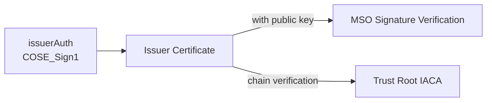
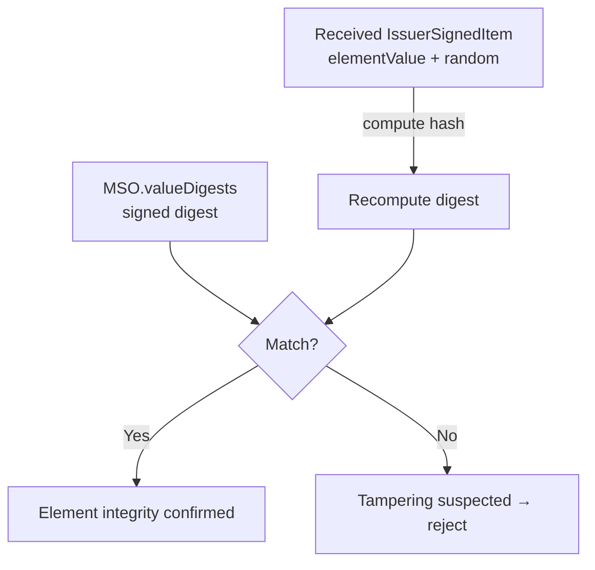
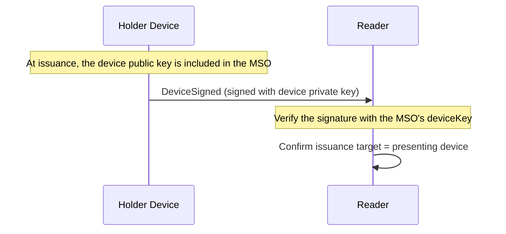
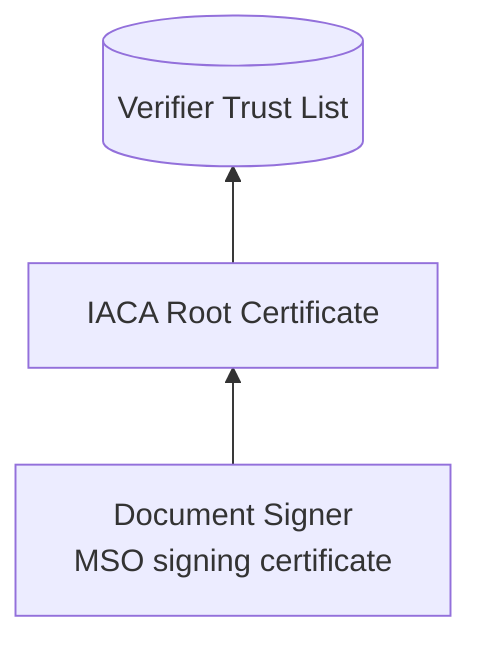
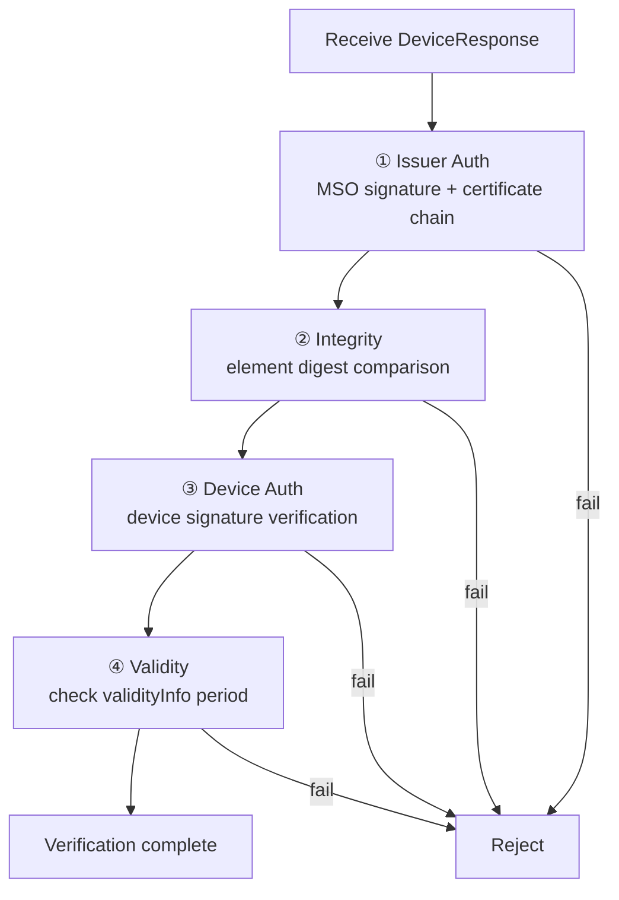

# mDoc Verification and Trust Model

| Item | Content |
|------|------|
| Subject | mDoc verification procedure, Device/Issuer authentication, trust framework, online presentation integration |
| Author | Open Source Development Team |
| Date | 2026-06-01 |
| Version | v1.0.0 |

## Change History

| Version | Date | Changes |
|------|------|-----------|
| v1.0.0 | 2026-06-01 | Initial version |

## Table of Contents

1. [What Is Being Verified](#1-what-is-being-verified)
2. [Issuer Authentication](#2-issuer-authentication)
3. [Integrity Verification: Digest Comparison](#3-integrity-verification-digest-comparison)
4. [Device Authentication](#4-device-authentication)
5. [Trust Framework: IACA and Certificate Chains](#5-trust-framework-iaca-and-certificate-chains)
6. [The Complete Verification Procedure](#6-the-complete-verification-procedure)
7. [Online Presentation (ISO 18013-7) Integration](#7-online-presentation-iso-18013-7-integration)

---

## 1. What Is Being Verified

When a verifier (Reader) receives an mDoc, it must be able to answer "yes" to all four of the following questions.

| Question | Verification Item |
|------|----------|
| Is the issuer genuine? | **Issuer Authentication** (MSO signature + certificate chain) |
| Has the data been tampered with? | **Integrity verification** (digest comparison) |
| Is the presenter the legitimate holder? | **Device Authentication** (device signature) |
| Is it valid? | **Validity verification** (validity period, trust policy) |

These four are the pillars of mDoc trust. We examine each in turn below.

---

## 2. Issuer Authentication

**Issuer Authentication** confirms that the party that issued the credential is a trustworthy issuer.

The [MSO](mdoc_overview.md#5-msomobile-security-object) is a `COSE_Sign1` structure (`issuerAuth`) signed with the issuer's private key.
This signature also includes the issuer's **certificate (or certificate chain)**.

The verification steps are as follows.

1. Extract the issuer certificate from `issuerAuth`.
2. Verify the MSO signature using that certificate's public key. → *The MSO has not been tampered with and was signed by this issuer.*
3. Confirm that the certificate chains up to a trusted root. → See [Trust Framework](#5-trust-framework-iaca-and-certificate-chains)

---

## 3. Integrity Verification: Digest Comparison

Rather than signing the values of data elements directly, an mDoc signs **hashes (digests)** into the MSO
(see the [MSO description](mdoc_overview.md#5-msomobile-security-object)).
Integrity verification therefore consists of "re-hashing the received element and comparing it against the digest signed in the MSO."

Thanks to this structure, even if some elements are omitted at presentation time,
it is sufficient to **compare only the remaining elements individually**, so selective disclosure and integrity verification coexist.

---

## 4. Device Authentication

**Device Authentication** confirms that the device presenting the credential is the very device
that was bound to the credential at issuance. This is proof of the "legitimate holder."

The principle is as follows.

- At issuance, the holder device's **public key** is embedded in the MSO's `deviceKeyInfo`.
- At presentation, the device **signs the DeviceSigned with its private key**.
  This signature is bound to session information (SessionTranscript), guaranteeing that it is a response for this particular session.
- The verifier verifies the DeviceSigned signature using the public key embedded in the MSO.

There are two signing methods.

- **DeviceSignature**: Direct signature with the device private key (ECDSA, etc.)
- **DeviceMac**: A session-key-based MAC. Verified when the Reader holds the same session key.

---

## 5. Trust Framework: IACA and Certificate Chains

How do we know the issuer certificate is genuine? This is where the **PKI-based trust framework** comes into play.

| Term | Meaning |
|------|------|
| **IACA** (Issuing Authority Certificate Authority) | The top-level certificate authority (root CA) of the issuing authority. The starting point of trust. |
| **DS** (Document Signer) | The certificate that actually signs the MSO. Issued by the IACA. |
| **Trust List** | The collection of IACA root certificates that the verifier trusts. |

The verifier holds a **list of IACA root certificates** that it trusts in advance.
If the issuer certificate (DS) of a received mDoc can be **chain-verified** to one of these roots, the verifier trusts that issuer.

> Which IACAs the verifier places in its Trust List determines "which issuers to trust."
> This corresponds to the "issuer trust" referred to in OID4VP's [trust model](../oid4vp/oid4vp_overview.md#6-fundamental-principles-of-trust-and-security).

---

## 6. The Complete Verification Procedure

| Step | What Is Checked | Meaning on Failure |
|------|----------|------------|
| ① Issuer Auth | MSO signature is valid + certificate chains to a trusted root | Issuer forgery or tampering |
| ② Integrity | Each element's recomputed digest = signed digest | Data tampering |
| ③ Device Auth | Device signature is verified with the MSO's deviceKey | Holder impersonation |
| ④ Validity | Current time is within the validFrom–validUntil range | Expired/not yet effective |

---

## 7. Online Presentation (ISO 18013-7) Integration

The same mDoc verification principles apply directly to **online presentation** as well.
ISO 18013-7 defines how to present an mDoc over the internet via [OID4VP](../oid4vp/oid4vp_overview.md).

The differences from proximity presentation are as follows.

| Category | Proximity Presentation (18013-5) | Online Presentation (18013-7 + OID4VP) |
|------|-------------------|------------------------------|
| Delivery path | Short-range channels such as BLE/NFC | OID4VP over HTTPS |
| Request | DeviceRequest | OID4VP Authorization Request ([DCQL](../oid4vp/oid4vp_dcql_and_vptoken.md)) |
| Response | DeviceResponse | VP Token (encoding and embedding the DeviceResponse) |
| Session binding | SessionTranscript (ephemeral key) | A SessionTranscript composed of OID4VP's nonce and handover values |

The key point is that **the structure and verification methods of the credential (IssuerSigned/MSO) and device authentication (DeviceSigned) are identical**.
What changes is only the protocol that carries the request and response, and the way sessions are bound.

> Therefore, mDoc verification logic is reused across both proximity and online paths,
> and the verifier can handle both paths with the same trust framework (IACA Trust List).
