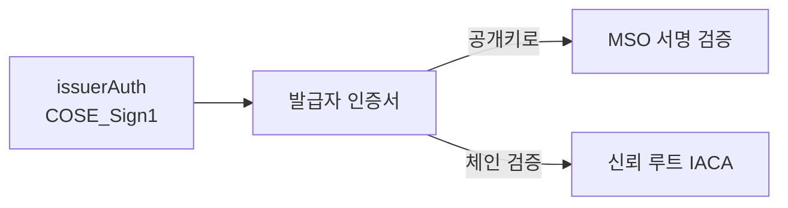
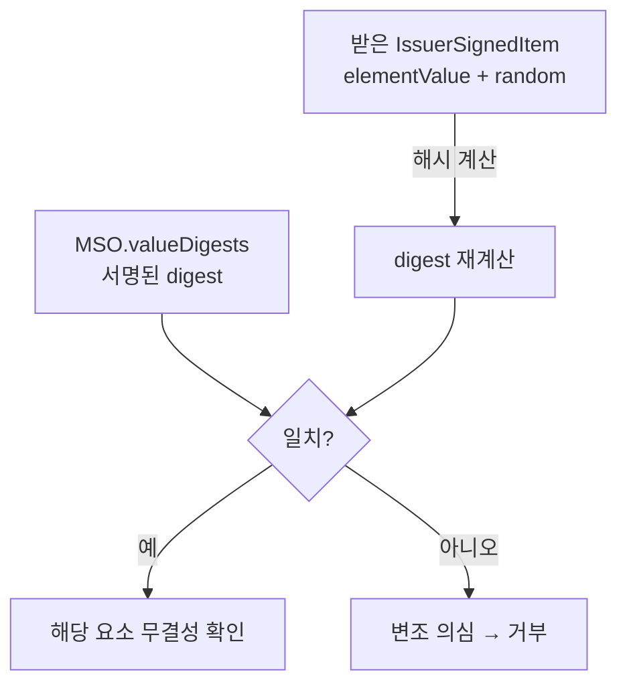
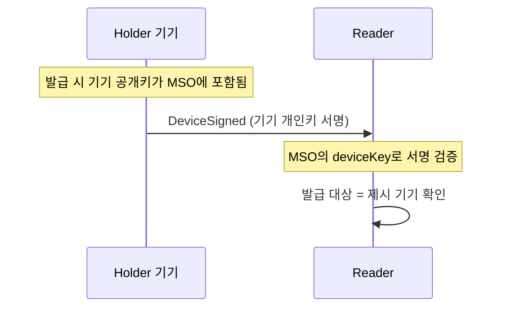
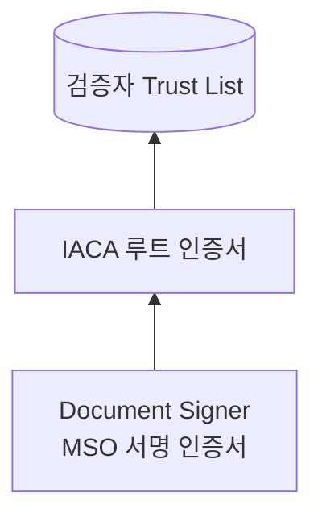
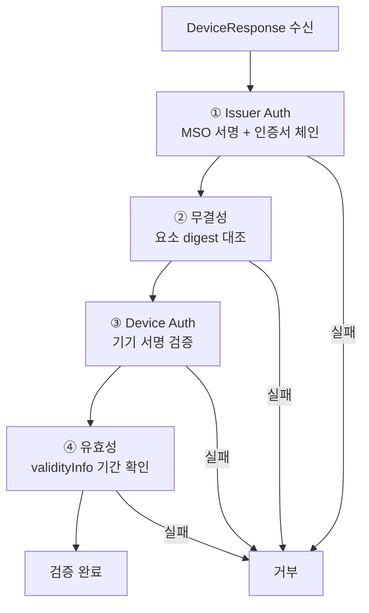

# mDoc 검증과 신뢰 모델

| 항목 | 내용 |
|------|------|
| 주제 | mDoc 검증 절차, Device/Issuer 인증, 신뢰 체계, 온라인 제시 연계 |
| 작성 | 오픈소스개발팀 |
| 일자 | 2026-06-01 |
| 버전 | v1.0.0 |

## 변경 이력

| 버전 | 일자 | 변경 내용 |
|------|------|-----------|
| v1.0.0 | 2026-06-01 | 초기 작성 |

## 목차

1. [무엇을 검증하는가](#1-무엇을-검증하는가)
2. [Issuer Authentication](#2-issuer-authentication)
3. [무결성 검증: digest 대조](#3-무결성-검증-digest-대조)
4. [Device Authentication](#4-device-authentication)
5. [신뢰 체계: IACA와 인증서 체인](#5-신뢰-체계-iaca와-인증서-체인)
6. [전체 검증 절차](#6-전체-검증-절차)
7. [온라인 제시(ISO 18013-7) 연계](#7-온라인-제시iso-18013-7-연계)

---

## 1. 무엇을 검증하는가

검증자(Reader)가 mDoc을 받았을 때, 다음 네 가지 질문에 모두 "예"라고 답할 수 있어야 한다.

| 질문 | 검증 항목 |
|------|----------|
| 발급자가 진짜인가? | **Issuer Authentication** (MSO 서명 + 인증서 체인) |
| 데이터가 변조되지 않았나? | **무결성 검증** (digest 대조) |
| 제시자가 정당한 보유자인가? | **Device Authentication** (기기 서명) |
| 유효한가? | **유효성 검증** (유효기간, 신뢰 정책) |

이 네 가지가 mDoc 신뢰의 기둥이다. 아래에서 차례로 살펴본다.

---

## 2. Issuer Authentication

**Issuer Authentication**은 자격증명을 발급한 주체가 신뢰할 수 있는 발급자임을 확인하는 것이다.

[MSO](mdoc_overview.md#5-msomobile-security-object)는 발급자의 개인키로 서명된 `COSE_Sign1` 구조(`issuerAuth`)다.
이 서명에는 발급자의 **인증서(또는 인증서 체인)** 가 함께 들어 있다.

검증 단계는 다음과 같다.

1. `issuerAuth`에서 발급자 인증서를 꺼낸다.
2. 그 인증서의 공개키로 MSO 서명을 검증한다. → *MSO가 변조되지 않았고 이 발급자가 서명했다*
3. 인증서가 신뢰할 수 있는 루트로 연결되는지 확인한다. → [신뢰 체계](#5-신뢰-체계-iaca와-인증서-체인) 참고

---

## 3. 무결성 검증: digest 대조

mDoc은 데이터 요소의 값을 직접 서명하지 않고, **해시(digest)** 를 MSO에 서명해 둔다
([MSO 설명](mdoc_overview.md#5-msomobile-security-object) 참고).
따라서 무결성 검증은 "받은 요소를 다시 해시해서, MSO에 서명된 digest와 같은지" 대조하는 것이다.

이 구조 덕분에 제시 시 일부 요소가 빠져 있어도,
**남아 있는 요소만 각각 대조**하면 되므로 선택적 공개와 무결성 검증이 양립한다.

---

## 4. Device Authentication

**Device Authentication**은 자격증명을 제시하는 기기가, 발급 시 자격증명에 바인딩된
바로 그 기기인지 확인하는 것이다. 이것이 "정당한 보유자" 증명이다.

원리는 다음과 같다.

- 발급 시, 보유자 기기의 **공개키**가 MSO의 `deviceKeyInfo`에 박제된다.
- 제시 시, 기기는 **개인키로 DeviceSigned에 서명**한다.
  이 서명은 세션 정보(SessionTranscript)와 묶여, 이번 세션에 대한 응답임을 보장한다.
- 검증자는 MSO에 박힌 공개키로 DeviceSigned 서명을 검증한다.

서명 방식은 두 가지가 있다.

- **DeviceSignature**: 기기 개인키로 직접 서명(ECDSA 등)
- **DeviceMac**: 세션 키 기반 MAC. Reader가 같은 세션 키를 가졌을 때 검증

---

## 5. 신뢰 체계: IACA와 인증서 체인

발급자 인증서가 진짜인지 어떻게 아는가? 여기서 **PKI 기반 신뢰 체계**가 작동한다.

| 용어 | 의미 |
|------|------|
| **IACA** (Issuing Authority Certificate Authority) | 발급 기관의 최상위 인증 기관(루트 CA). 신뢰의 출발점 |
| **DS** (Document Signer) | 실제 MSO에 서명하는 인증서. IACA가 발급 |
| **Trust List** | 검증자가 신뢰하는 IACA 루트 인증서들의 모음 |

검증자는 미리 신뢰하는 **IACA 루트 인증서 목록**을 보유한다.
받은 mDoc의 발급자 인증서(DS)가 이 루트들 중 하나로 **체인 검증**되면, 그 발급자를 신뢰한다.

> 검증자가 신뢰 목록(Trust List)에 어떤 IACA를 넣느냐가 "어느 발급자를 믿을지"를 결정한다.
> 이는 OID4VP의 [신뢰 모델](../oid4vp/oid4vp_overview.md#6-신뢰와-보안의-기본-원칙)에서 말하는 "발급자 신뢰"에 해당한다.

---

## 6. 전체 검증 절차

| 단계 | 확인 내용 | 실패 시 의미 |
|------|----------|------------|
| ① Issuer Auth | MSO 서명 유효 + 인증서가 신뢰 루트로 체인됨 | 발급자 위조 또는 변조 |
| ② 무결성 | 각 요소의 재계산 digest = 서명된 digest | 데이터 변조 |
| ③ Device Auth | 기기 서명이 MSO의 deviceKey로 검증됨 | 보유자 위장 |
| ④ 유효성 | 현재 시각이 validFrom~validUntil 범위 | 만료/미발효 |

---

## 7. 온라인 제시(ISO 18013-7) 연계

같은 mDoc 검증 원리가 **온라인 제시**에도 그대로 적용된다.
ISO 18013-7은 [OID4VP](../oid4vp/oid4vp_overview.md)를 통해 mDoc을 인터넷으로 제시하는 방법을 정의한다.

근접 제시와의 차이는 다음과 같다.

| 구분 | 근접 제시(18013-5) | 온라인 제시(18013-7 + OID4VP) |
|------|-------------------|------------------------------|
| 전달 경로 | BLE/NFC 등 근거리 채널 | HTTPS 위 OID4VP |
| 요청 | DeviceRequest | OID4VP Authorization Request([DCQL](../oid4vp/oid4vp_dcql_and_vptoken.md)) |
| 응답 | DeviceResponse | VP Token (DeviceResponse를 인코딩해 포함) |
| 세션 바인딩 | SessionTranscript(임시 키) | OID4VP의 nonce·handover 값으로 구성된 SessionTranscript |

핵심은, **자격증명(IssuerSigned/MSO)과 기기 인증(DeviceSigned)의 구조·검증 방식은 동일**하다는 점이다.
달라지는 것은 요청·응답을 실어 나르는 프로토콜과, 세션을 묶는 방식뿐이다.

> 따라서 mDoc 검증 로직은 근접·온라인 양쪽에서 재사용되며,
> 검증자는 동일한 신뢰 체계(IACA Trust List)로 두 경로를 모두 처리할 수 있다.
