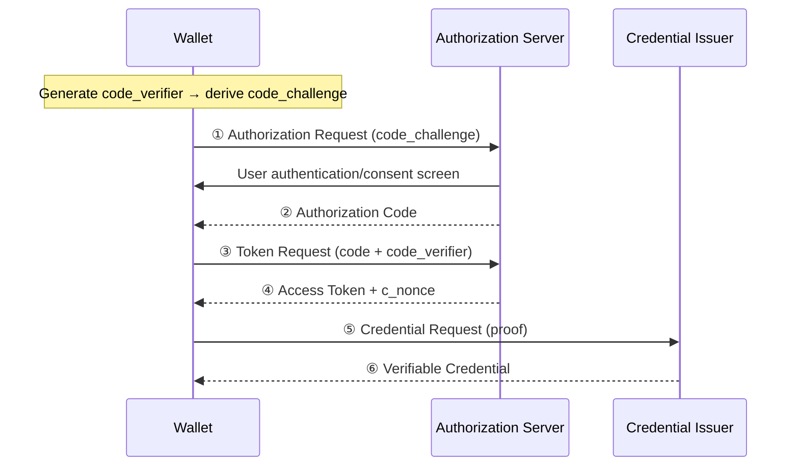
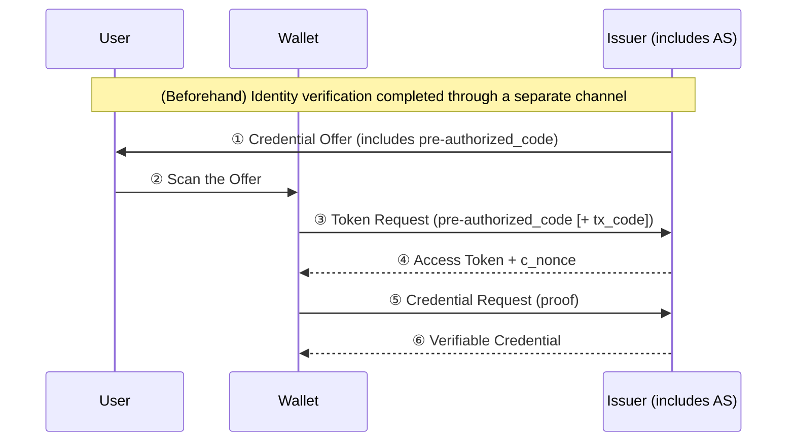
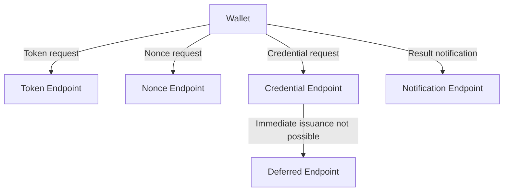
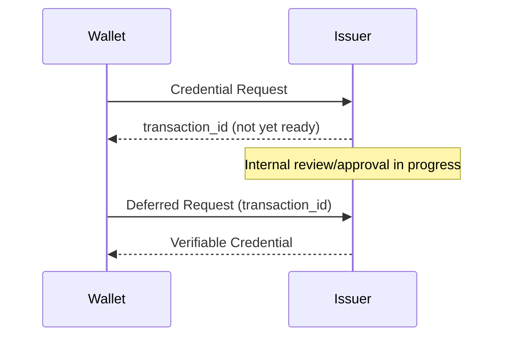

# OID4VCI Issuance Protocol Flow

| Item | Content |
|------|------|
| Subject | OID4VCI issuance flow and key endpoints |
| Author | Open Source Development Team |
| Date | 2026-06-01 |
| Version | v1.0.0 |

## Change History

| Version | Date | Changes |
|------|------|-----------|
| v1.0.0 | 2026-06-01 | Initial version |

## Table of Contents

1. [Two Issuance Flows](#1-two-issuance-flows)
2. [Authorization Code Flow](#2-authorization-code-flow)
3. [Pre-Authorized Code Flow](#3-pre-authorized-code-flow)
4. [Key Endpoints](#4-key-endpoints)
5. [Asynchronous Issuance: Deferred](#5-asynchronous-issuance-deferred)
6. [Post-Issuance Notification](#6-post-issuance-notification)
7. [Comparison of the Two Flows](#7-comparison-of-the-two-flows)

---

## 1. Two Issuance Flows

OID4VCI defines two standard flows for issuing credentials.
Which flow is used is determined by the `grants` field of the [Credential Offer](oid4vci_overview.md#4-credential-offer).

| Flow | Point of User Authentication | Representative Scenario |
|------|----------------|--------------|
| **Authorization Code Flow** | Logging in directly at the Issuer during the issuance process | The user logs in to the Issuer site to receive a credential |
| **Pre-Authorized Code Flow** | Already authenticated *before* issuance | The user is verified at a counter, kiosk, etc., and receives the credential immediately via QR code |

---

## 2. Authorization Code Flow

In this flow, the user **authenticates directly at the Issuer (authorization server)** before receiving the credential.
It follows OAuth 2.0's Authorization Code Grant as-is and uses **PKCE** for security.

Key points
- **PKCE (Proof Key for Code Exchange)**: Using the `code_verifier` created by the wallet and its hash, `code_challenge`,
  this prevents a token from being issued even if the authorization code is intercepted in transit.
- User authentication and consent take place **directly on the Issuer's screen**.

---

## 3. Pre-Authorized Code Flow

This flow assumes the user has **already completed identity verification through another channel**,
and issues the credential immediately without a separate login.
For example, after identity verification at a bank counter, scanning the QR code on the screen delivers the credential right away.

Key points
- **pre-authorized_code**: A one-time code contained in the Offer that replaces user authentication during the token request.
- **tx_code (Transaction Code)**: Optional; it can require the user to enter a PIN/code to confirm that the recipient
  is indeed the right person. (e.g., a 6-digit number received at the counter)

---

## 4. Key Endpoints

The endpoints commonly used in OID4VCI are as follows.

| Endpoint | Role |
|-----------|------|
| **Token Endpoint** | Issues an Access Token. Receives either an authorization code or a pre-authorized_code depending on the flow |
| **Nonce Endpoint** | Separately provides the one-time `c_nonce` needed to generate the proof |
| **Credential Endpoint** | Issues the actual credential. Returns the VC after verifying the wallet's proof |
| **Deferred Endpoint** | Used to receive the credential later when immediate issuance is not possible |
| **Notification Endpoint** | The wallet notifies the Issuer of the issuance result (e.g., storage success/failure) |

---

## 5. Asynchronous Issuance: Deferred

There are cases where a credential cannot be created immediately (e.g., when issuance requires review/approval).
In this case, the Credential Endpoint returns a **`transaction_id`** instead of the credential.

The wallet then, after some time has passed, requests again from the **Deferred Endpoint** using this `transaction_id`
to retrieve the completed credential.

---

## 6. Post-Issuance Notification

After issuance is complete, the wallet can inform the Issuer of the result via the **Notification Endpoint**.
For example, it conveys states such as "the credential was stored successfully" or "the user rejected it."
Through this, the Issuer can manage issuance statistics, perform follow-up processing, and so on.

---

## 7. Comparison of the Two Flows

| Aspect | Authorization Code Flow | Pre-Authorized Code Flow |
|------|------------------------|--------------------------|
| Location of user authentication | Issuer authorization screen | Beforehand (separate channel) |
| Start trigger | Wallet initiates the authorization request | Issuer provides the Offer |
| Additional security measure | PKCE | tx_code (optional) |
| Representative UX | Issuance after site login | Immediate issuance via QR at a counter/kiosk |
| Suitable situation | Online self-service issuance | Issuance after in-person identity verification |

> Regardless of the flow, the **Credential request–issuance stage after token issuance is identical**.
> For the metadata and proof structure at the core of this stage, refer to the [Metadata and Proof of Possession](oid4vci_metadata_and_proof.md) document.
