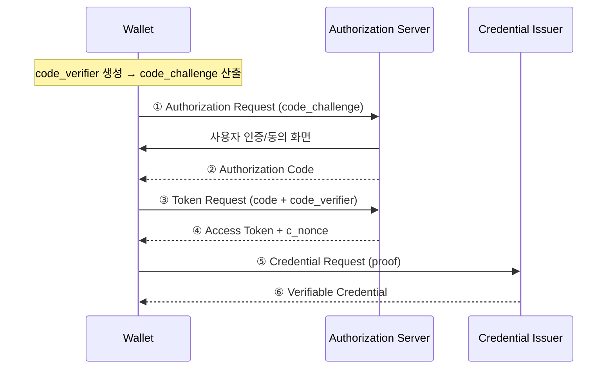
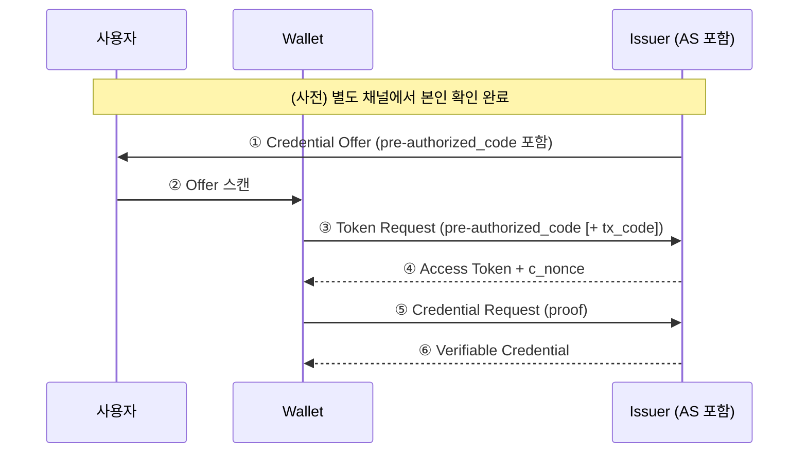
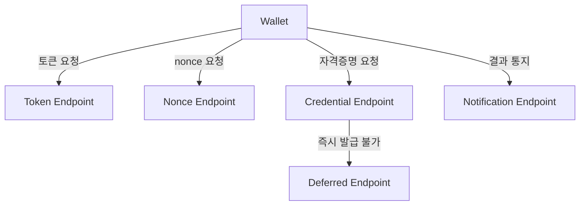
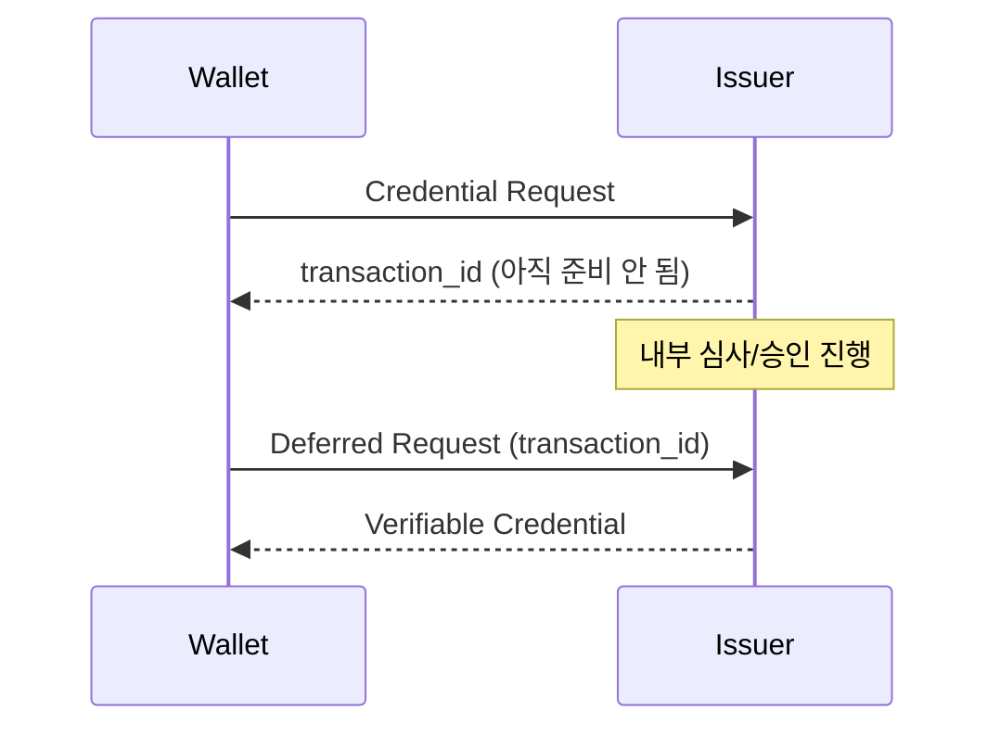

# OID4VCI 발급 프로토콜 흐름

| 항목 | 내용 |
|------|------|
| 주제 | OID4VCI 발급 흐름과 주요 엔드포인트 |
| 작성 | 오픈소스개발팀 |
| 일자 | 2026-06-01 |
| 버전 | v1.0.0 |

## 변경 이력

| 버전 | 일자 | 변경 내용 |
|------|------|-----------|
| v1.0.0 | 2026-06-01 | 초기 작성 |

## 목차

1. [두 가지 발급 흐름](#1-두-가지-발급-흐름)
2. [Authorization Code Flow](#2-authorization-code-flow)
3. [Pre-Authorized Code Flow](#3-pre-authorized-code-flow)
4. [주요 엔드포인트](#4-주요-엔드포인트)
5. [비동기 발급: Deferred](#5-비동기-발급-deferred)
6. [발급 후 통지: Notification](#6-발급-후-통지-notification)
7. [두 흐름 비교](#7-두-흐름-비교)

---

## 1. 두 가지 발급 흐름

OID4VCI는 자격증명을 발급하는 두 가지 표준 흐름을 정의한다.
어느 흐름을 사용할지는 [Credential Offer](oid4vci_overview.md#4-credential-offer)의 `grants` 필드로 결정된다.

| 흐름 | 사용자 인증 시점 | 대표 시나리오 |
|------|----------------|--------------|
| **Authorization Code Flow** | 발급 과정 중 Issuer에서 직접 로그인 | 사용자가 Issuer 사이트에 로그인하여 자격증명을 받는 경우 |
| **Pre-Authorized Code Flow** | 발급 *이전*에 이미 인증 완료 | 창구·키오스크 등에서 본인 확인 후 QR로 바로 받는 경우 |

---

## 2. Authorization Code Flow

사용자가 **Issuer(인가 서버)에서 직접 인증**한 뒤 자격증명을 받는 흐름이다.
OAuth 2.0의 Authorization Code Grant를 그대로 따르며, 보안을 위해 **PKCE**를 사용한다.

핵심 포인트
- **PKCE(Proof Key for Code Exchange)**: 지갑이 만든 `code_verifier`와 그 해시인 `code_challenge`를 이용해,
  중간에 인가 코드가 탈취되어도 토큰을 발급받지 못하게 막는다.
- 사용자 인증·동의가 **Issuer 화면에서 직접** 이루어진다.

---

## 3. Pre-Authorized Code Flow

사용자가 **다른 채널에서 이미 본인 확인을 마친 상태**라고 가정하고,
별도의 로그인 없이 곧바로 자격증명을 발급받는 흐름이다.
예를 들어 은행 창구에서 신원 확인 후, 화면의 QR을 스캔하면 바로 자격증명이 들어오는 경험을 제공한다.

핵심 포인트
- **pre-authorized_code**: Offer 안에 들어 있는 일회성 코드로, 토큰 요청 시 사용자 인증을 대체한다.
- **tx_code(Transaction Code)**: 선택 사항으로, 발급 대상이 정말 본인인지 확인하기 위해
  사용자에게 PIN/코드 입력을 요구할 수 있다. (예: 창구에서 받은 6자리 번호)

---

## 4. 주요 엔드포인트

OID4VCI에서 자주 사용되는 엔드포인트는 다음과 같다.

| 엔드포인트 | 역할 |
|-----------|------|
| **Token Endpoint** | Access Token을 발급. 흐름에 따라 인가 코드 또는 pre-authorized_code를 받음 |
| **Nonce Endpoint** | proof 생성에 필요한 일회성 `c_nonce`를 별도로 제공 |
| **Credential Endpoint** | 실제 자격증명을 발급. 지갑의 proof를 검증한 뒤 VC를 반환 |
| **Deferred Endpoint** | 즉시 발급이 어려운 경우, 나중에 자격증명을 받아가는 용도 |
| **Notification Endpoint** | 지갑이 발급 결과(저장 성공/실패 등)를 Issuer에 통지 |

---

## 5. 비동기 발급: Deferred

자격증명을 즉시 만들 수 없는 경우(예: 발급에 심사·승인이 필요한 경우)가 있다.
이때 Credential Endpoint는 자격증명 대신 **`transaction_id`** 를 반환한다.

지갑은 이후 일정 시간이 지난 뒤 **Deferred Endpoint**에 이 `transaction_id`로 다시 요청하여
완성된 자격증명을 받아간다.

---

## 6. 발급 후 통지: Notification

발급이 끝난 뒤, 지갑은 **Notification Endpoint**를 통해 결과를 Issuer에 알릴 수 있다.
예를 들어 "자격증명을 정상 저장했다", "사용자가 거부했다" 등의 상태를 전달한다.
Issuer는 이를 통해 발급 통계 관리, 후속 처리 등을 수행할 수 있다.

---

## 7. 두 흐름 비교

| 구분 | Authorization Code Flow | Pre-Authorized Code Flow |
|------|------------------------|--------------------------|
| 사용자 인증 위치 | Issuer 인가 화면 | 사전(별도 채널) |
| 시작 트리거 | 지갑이 인가 요청 시작 | Issuer가 Offer 제공 |
| 추가 보안 수단 | PKCE | tx_code(선택) |
| 대표 UX | 사이트 로그인 후 발급 | 창구/키오스크에서 QR로 즉시 발급 |
| 적합한 상황 | 온라인 셀프 발급 | 대면 본인 확인 후 발급 |

> 어떤 흐름이든 토큰 발급 이후의 **Credential 요청–발급 단계는 동일**하다.
> 이 단계의 핵심인 메타데이터·proof 구조는 [메타데이터와 보유 증명](oid4vci_metadata_and_proof.md) 문서를 참고한다.
