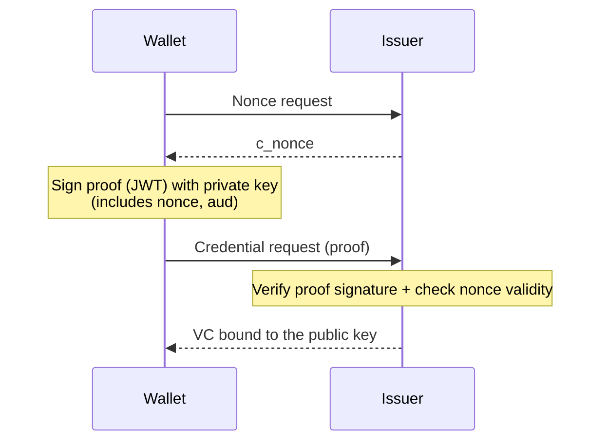

# OID4VCI Metadata and Proof of Possession

| Item | Content |
|------|------|
| Subject | Issuer metadata, Proof of Possession, credential request/response structure |
| Author | Open Source Development Team |
| Date | 2026-06-01 |
| Version | v1.0.0 |

## Change History

| Version | Date | Changes |
|------|------|-----------|
| v1.0.0 | 2026-06-01 | Initial version |

## Table of Contents

1. [Issuer Metadata](#1-issuer-metadata)
2. [Credential Configuration](#2-credential-configuration)
3. [Proof of Possession](#3-proof-of-possession)
4. [Credential Request](#4-credential-request)
5. [Credential Response](#5-credential-response)
6. [Supported Formats](#6-supported-formats)

---

## 1. Issuer Metadata

Before requesting a credential, the wallet must first know "what" the Issuer issues, "where," and "how."
This information is published as **Issuer Metadata**, which can be retrieved from a standardized well-known URL.

```
GET https://issuer.example.com/.well-known/openid-credential-issuer
```

The metadata contains the following key information.

| Field | Description |
|------|------|
| `credential_issuer` | Issuer identifier (base URL) |
| `credential_endpoint` | Credential issuance endpoint |
| `nonce_endpoint` | c_nonce issuance endpoint |
| `deferred_credential_endpoint` | Deferred issuance endpoint |
| `notification_endpoint` | Notification endpoint |
| `credential_configurations_supported` | Definitions of the credential types that can be issued (see below) |

> Information about the Authorization Server (`token_endpoint`, supported grants, etc.) is
> provided through separate well-known metadata (`/.well-known/oauth-authorization-server`).

---

## 2. Credential Configuration

`credential_configurations_supported` is a list describing the credentials that can be issued, by type.
Each entry is keyed by a unique identifier (e.g., `org.iso.18013.5.1.mDL`).

```jsonc
{
  "credential_configurations_supported": {
    "eu.europa.ec.eudi.pid_vc_sd_jwt": {
      "format": "dc+sd-jwt",          // credential format
      "vct": "...",                    // SD-JWT VC type
      "cryptographic_binding_methods_supported": ["jwk"],
      "credential_signing_alg_values_supported": ["ES256"],
      "proof_types_supported": { "jwt": { "proof_signing_alg_values_supported": ["ES256"] } },
      "claims": [ /* definitions of issuable claims */ ]
    }
  }
}
```

From this definition, the wallet determines the following.
- In which **format** (SD-JWT VC, mDoc, etc.) the credential is issued
- Which **signing algorithms** are supported
- Which **proof type/algorithm** must be used when creating a proof
- Which **claims** may be included

---

## 3. Proof of Possession

The core security mechanism of issuance is **Proof of Possession**.
The wallet proves that it holds its own key pair by presenting a **proof (JWT)** signed with that key.
The issued credential is bound to this key, allowing the wallet to later prove that it is the legitimate holder during the presentation phase.

The structure of the JWT used as a proof is as follows.

```jsonc
// Header
{
  "typ": "openid4vci-proof+jwt",
  "alg": "ES256",
  "jwk": { /* wallet's public key */ }   // or kid
}
// Payload
{
  "iss": "<wallet client id>",     // optional
  "aud": "https://issuer.example.com",  // target Issuer
  "iat": 1711843200,
  "nonce": "<c_nonce>"             // one-time nonce issued by the Issuer
}
```

Key points
- **`nonce` (c_nonce)**: Including the one-time random value issued by the Issuer is what prevents replay attacks.
- **`aud`**: Specifies which Issuer this proof is intended for, preventing it from being reused elsewhere.
- **Public key (`jwk`)**: The key to which the issued credential will be bound.



---

## 4. Credential Request

This is the request the wallet sends to the Credential Endpoint when requesting a credential.
It carries the Access Token in the `Authorization` header and includes the issuance target and proof in the body.

```http
POST /credential HTTP/1.1
Authorization: Bearer <access_token>
Content-Type: application/json

{
  "credential_configuration_id": "eu.europa.ec.eudi.pid_vc_sd_jwt",
  "proofs": {
    "jwt": ["<proof-jwt>"]
  }
}
```

| Field | Description |
|------|------|
| `credential_configuration_id` | Identifier of the credential type to be issued |
| `proofs` | A bundle of proofs of possession. One or more can be submitted per proof type |

---

## 5. Credential Response

When issuance succeeds, the Issuer returns the credential.

```jsonc
{
  "credentials": [
    { "credential": "<issued credential>" }
  ]
}
```

If immediate issuance is not possible, the Issuer returns a `transaction_id` instead of the credential, and
the wallet later re-requests it via the [Deferred Endpoint](oid4vci_issuance_flow.md#5-asynchronous-issuance-deferred).

```jsonc
{
  "transaction_id": "8xLOxBtZp8"
}
```

---

## 6. Supported Formats

OID4VCI is independent of the credential format, and multiple formats can be handled with the same issuance procedure.
The representative formats are as follows.

| Format Identifier | Description | Detailed Document |
|------------|------|----------|
| `dc+sd-jwt` | SD-JWT-based VC. Supports selective disclosure | [SD-JWT VC Overview](../sdjwt/sdjwt_overview.md) |
| `mso_mdoc` | ISO 18013-5 mDoc. Based on CBOR/COSE | [mDoc Overview](../mdoc/mdoc_overview.md) |

Even when the format differs, the **skeleton** of the token issuance, proof submission, and credential request/response procedures between the wallet and the Issuer remains the same.
The only thing that changes is the **internal representation** of the issued credential.

> The procedure for "presenting" an issued credential to a verifier is covered in [OID4VP](../oid4vp/oid4vp_overview.md).
