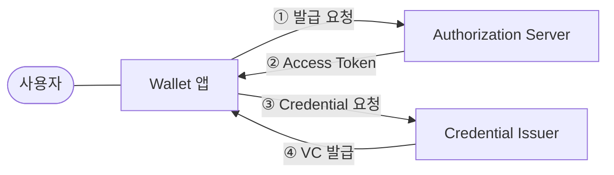
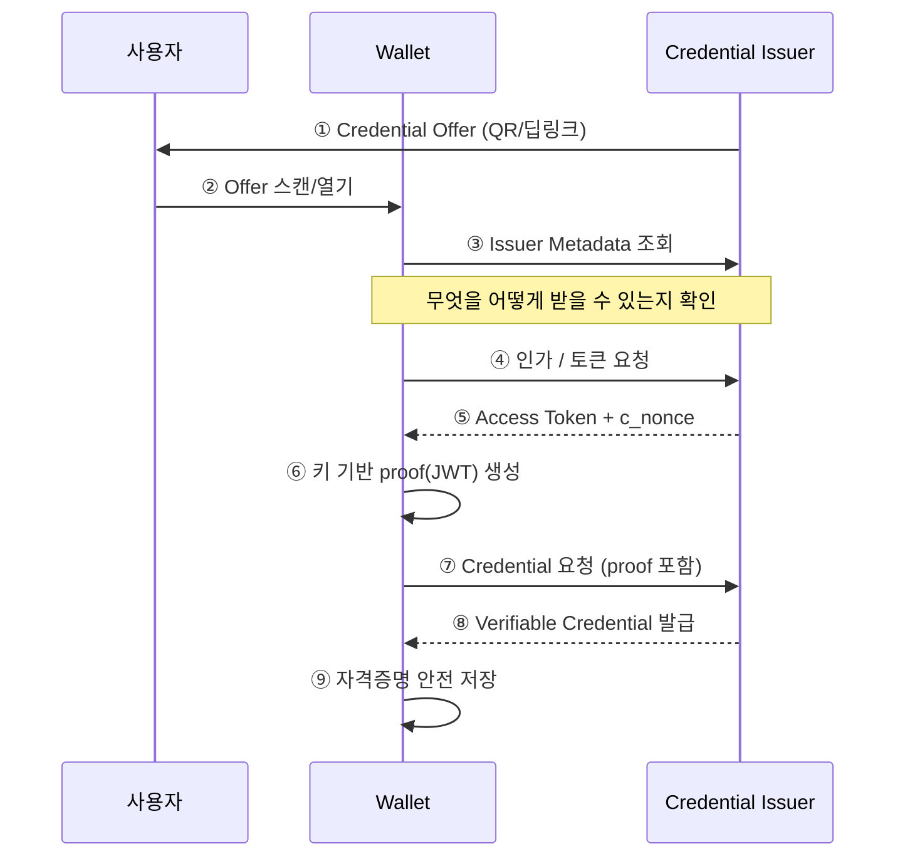

# OID4VCI 개요

| 항목 | 내용 |
|------|------|
| 주제 | OID4VCI(OpenID for Verifiable Credential Issuance) 개요 |
| 작성 | 오픈소스개발팀 |
| 일자 | 2026-06-01 |
| 버전 | v1.0.0 |

## 변경 이력

| 버전 | 일자 | 변경 내용 |
|------|------|-----------|
| v1.0.0 | 2026-06-01 | 초기 작성 |

## 목차

1. [OID4VCI란 무엇인가](#1-oid4vci란-무엇인가)
2. [핵심 역할(Roles)](#2-핵심-역할roles)
3. [핵심 개념](#3-핵심-개념)
4. [Credential Offer](#4-credential-offer)
5. [전체 그림: 발급 절차 한눈에 보기](#5-전체-그림-발급-절차-한눈에-보기)
6. [관련 표준](#6-관련-표준)

---

## 1. OID4VCI란 무엇인가

**OID4VCI(OpenID for Verifiable Credential Issuance)** 는 디지털 자격증명(Verifiable Credential, VC)을
**발급자(Issuer)** 가 **사용자의 지갑(Wallet)** 에 안전하게 전달하기 위한 프로토콜이다.
검증 가능한 자격증명을 "어떻게 발급할 것인가"를 정의하며, OAuth 2.0 위에서 동작한다.

쉽게 비유하면, 현실 세계에서 행정기관이 신분증을 발급해 지갑에 넣어주는 과정을
**온라인에서 표준화된 방식으로 재현**한 것이 OID4VCI다.

OID4VCI는 다음과 같은 특징을 가진다.

- **OAuth 2.0 기반**: 인가(Authorization)와 토큰 발급 절차를 OAuth 2.0의 흐름을 그대로 활용한다.
- **자격증명 포맷 독립적**: SD-JWT VC, ISO mDoc, W3C VC 등 다양한 포맷을 동일한 절차로 발급할 수 있다.
- **보유 증명(Proof of Possession)**: 지갑이 키를 실제로 보유하고 있음을 증명하게 하여, 자격증명이 올바른 주체에게 바인딩되도록 한다.

> OID4VCI는 "발급(Issuance)"을, [OID4VP](../oid4vp/oid4vp_overview.md)는 "제시(Presentation)"를 담당한다.
> 두 표준은 한 쌍으로 동작하여 발급–보관–제시의 전체 생애주기를 완성한다.

---

## 2. 핵심 역할(Roles)

OID4VCI에는 세 가지 주요 역할이 있다.

| 역할 | 설명 |
|------|------|
| **Credential Issuer** | 자격증명을 생성·서명하여 발급하는 주체. 발급에 필요한 엔드포인트와 메타데이터를 제공한다. |
| **Wallet** | 사용자를 대신해 자격증명을 요청·수신·보관하는 애플리케이션(주로 모바일 앱). |
| **(Authorization Server)** | 인가와 액세스 토큰 발급을 담당. 보통 Issuer와 함께 제공되며 논리적으로 분리될 수 있다. |



> Authorization Server와 Credential Issuer는 같은 서버에서 함께 제공되는 경우가 많지만,
> 표준상으로는 별개의 역할이다. 메타데이터를 통해 둘의 위치를 각각 알 수 있다.

---

## 3. 핵심 개념

### 3.1 Verifiable Credential (VC)
발급자가 서명한, 변조 검증이 가능한 디지털 자격증명이다. 신분증, 운전면허, 졸업증명 등이 될 수 있다.
포맷에 따라 [SD-JWT VC](../sdjwt/sdjwt_overview.md) 또는 [mDoc](../mdoc/mdoc_overview.md) 등으로 표현된다.

### 3.2 Credential Configuration
Issuer가 발급할 수 있는 자격증명의 "종류"에 대한 정의다.
포맷, 포함 가능한 클레임(claim), 지원하는 서명 알고리즘 등을 메타데이터로 기술한다.
지갑은 이 정보를 보고 "무엇을, 어떤 형식으로 받을 수 있는지" 판단한다.

### 3.3 Proof of Possession (보유 증명)
지갑이 자신의 키쌍을 실제로 보유하고 있음을 증명하는 절차다.
지갑은 자격증명을 요청할 때, 자신의 공개키와 서명을 담은 **proof(JWT)** 를 함께 제출한다.
발급된 자격증명은 이 키에 바인딩되어, 나중에 제시 시 "이 자격증명의 정당한 보유자"임을 증명할 수 있게 된다.

### 3.4 c_nonce (Challenge Nonce)
재전송 공격(replay attack)을 막기 위해 Issuer가 발급하는 일회성 난수다.
지갑은 proof를 만들 때 이 nonce를 포함시켜, "지금 이 순간 발급받기 위해 만든 증명"임을 보장한다.

---

## 4. Credential Offer

**Credential Offer(자격증명 제안)** 는 발급 절차의 출발점이다.
Issuer가 지갑에게 "이런 자격증명을 발급해줄 수 있는데 받겠는가?"를 제안하는 데이터다.

Credential Offer는 보통 **QR 코드**나 **딥링크(deep link)** 형태로 사용자에게 전달된다.

```
openid-credential-offer://?credential_offer={...}
```

주요 구성 요소는 다음과 같다.

| 필드 | 설명 |
|------|------|
| `credential_issuer` | 자격증명을 발급할 Issuer의 URL |
| `credential_configuration_ids` | 발급 대상 자격증명 종류의 식별자 목록 |
| `grants` | 어떤 흐름(Authorization Code / Pre-Authorized Code)으로 발급받을지에 대한 정보 |

`grants`에 어떤 값이 들어 있느냐에 따라 이어지는 발급 흐름이 결정된다.
구체적인 흐름은 [발급 프로토콜 흐름](oid4vci_issuance_flow.md) 문서에서 다룬다.

---

## 5. 전체 그림: 발급 절차 한눈에 보기

아래는 OID4VCI 발급의 가장 일반적인 흐름을 단순화한 것이다.



각 단계의 세부 내용은 다음 문서에서 다룬다.

- 인가·토큰·발급 흐름 → [발급 프로토콜 흐름](oid4vci_issuance_flow.md)
- 메타데이터·proof·요청/응답 구조 → [메타데이터와 보유 증명](oid4vci_metadata_and_proof.md)

---

## 6. 관련 표준

| 표준 | 설명 | 링크 |
|------|------|------|
| OID4VCI 1.0 | OpenID for Verifiable Credential Issuance | <https://openid.net/specs/openid-4-verifiable-credential-issuance-1_0.html> |
| OAuth 2.0 | 인가 프레임워크 (RFC 6749) | <https://datatracker.ietf.org/doc/html/rfc6749> |
| PKCE | Proof Key for Code Exchange (RFC 7636) | <https://datatracker.ietf.org/doc/html/rfc7636> |
