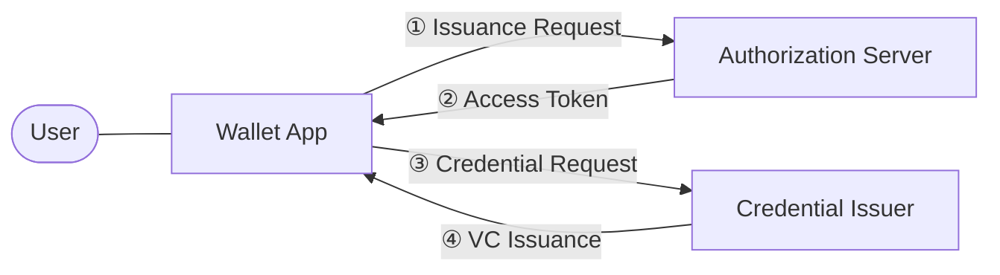
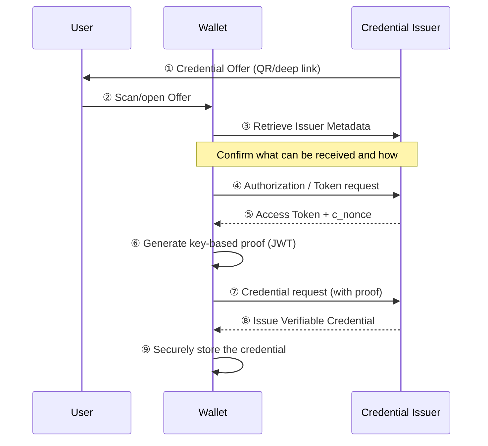

# OID4VCI Overview

| Item | Content |
|------|------|
| Subject | OID4VCI (OpenID for Verifiable Credential Issuance) Overview |
| Author | Open Source Development Team |
| Date | 2026-06-01 |
| Version | v1.0.0 |

## Change History

| Version | Date | Changes |
|------|------|-----------|
| v1.0.0 | 2026-06-01 | Initial version |

## Table of Contents

1. [What Is OID4VCI](#1-what-is-oid4vci)
2. [Core Roles](#2-core-roles)
3. [Core Concepts](#3-core-concepts)
4. [Credential Offer](#4-credential-offer)
5. [The Big Picture: Issuance Flow at a Glance](#5-the-big-picture-issuance-flow-at-a-glance)
6. [Related Standards](#6-related-standards)

---

## 1. What Is OID4VCI

**OID4VCI (OpenID for Verifiable Credential Issuance)** is a protocol that allows an
**Issuer** to securely deliver a digital credential (Verifiable Credential, VC) to a
**user's Wallet**. It defines "how to issue" verifiable credentials and operates on top of OAuth 2.0.

As a simple analogy, OID4VCI is a **standardized online reproduction** of the real-world
process in which a government agency issues an ID card and places it into your wallet.

OID4VCI has the following characteristics.

- **Based on OAuth 2.0**: It reuses OAuth 2.0's flows directly for authorization and token issuance procedures.
- **Credential-format independent**: Various formats such as SD-JWT VC, ISO mDoc, and W3C VC can be issued through the same procedure.
- **Proof of Possession**: It requires the Wallet to prove that it actually holds the key, ensuring that the credential is bound to the correct subject.

> OID4VCI handles "Issuance," while [OID4VP](../oid4vp/oid4vp_overview.md) handles "Presentation."
> The two standards work together as a pair, completing the full lifecycle of issuance, storage, and presentation.

---

## 2. Core Roles

OID4VCI has three primary roles.

| Role | Description |
|------|------|
| **Credential Issuer** | The entity that creates, signs, and issues credentials. It provides the endpoints and metadata required for issuance. |
| **Wallet** | An application (typically a mobile app) that requests, receives, and stores credentials on behalf of the user. |
| **(Authorization Server)** | Responsible for authorization and access token issuance. It is usually provided together with the Issuer but can be logically separated. |



> The Authorization Server and the Credential Issuer are often provided on the same server,
> but they are separate roles in the standard. The location of each can be discovered through metadata.

---

## 3. Core Concepts

### 3.1 Verifiable Credential (VC)
A digital credential signed by the issuer whose integrity can be verified against tampering. It can be an ID card, driver's license, diploma, and so on.
Depending on the format, it is represented as a [SD-JWT VC](../sdjwt/sdjwt_overview.md), an [mDoc](../mdoc/mdoc_overview.md), or similar.

### 3.2 Credential Configuration
This is the definition of the "type" of credential that an Issuer can issue.
It describes the format, the claims that can be included, the supported signature algorithms, and so on as metadata.
The Wallet uses this information to determine "what it can receive and in what form."

### 3.3 Proof of Possession
This is the procedure by which the Wallet proves that it actually holds its own key pair.
When requesting a credential, the Wallet submits a **proof (JWT)** containing its public key and signature.
The issued credential is bound to this key, so that later, at presentation time, the Wallet can prove that it is the "legitimate holder of this credential."

### 3.4 c_nonce (Challenge Nonce)
This is a one-time random value issued by the Issuer to prevent replay attacks.
When creating the proof, the Wallet includes this nonce to guarantee that it is "a proof created for issuance at this very moment."

---

## 4. Credential Offer

A **Credential Offer** is the starting point of the issuance procedure.
It is the data with which the Issuer proposes to the Wallet, "I can issue you this kind of credential—would you like to receive it?"

The Credential Offer is usually delivered to the user as a **QR code** or a **deep link**.

```
openid-credential-offer://?credential_offer={...}
```

The main components are as follows.

| Field | Description |
|------|------|
| `credential_issuer` | The URL of the Issuer that will issue the credential |
| `credential_configuration_ids` | The list of identifiers of the credential types to be issued |
| `grants` | Information about which flow (Authorization Code / Pre-Authorized Code) to use for issuance |

The values contained in `grants` determine the issuance flow that follows.
The specific flows are covered in the [Issuance Protocol Flow](oid4vci_issuance_flow.md) document.

---

## 5. The Big Picture: Issuance Flow at a Glance

Below is a simplified view of the most common OID4VCI issuance flow.



The details of each step are covered in the following documents.

- Authorization, token, and issuance flow → [Issuance Protocol Flow](oid4vci_issuance_flow.md)
- Metadata, proof, and request/response structure → [Metadata and Proof of Possession](oid4vci_metadata_and_proof.md)

---

## 6. Related Standards

| Standard | Description | Link |
|------|------|------|
| OID4VCI 1.0 | OpenID for Verifiable Credential Issuance | <https://openid.net/specs/openid-4-verifiable-credential-issuance-1_0.html> |
| OAuth 2.0 | Authorization Framework (RFC 6749) | <https://datatracker.ietf.org/doc/html/rfc6749> |
| PKCE | Proof Key for Code Exchange (RFC 7636) | <https://datatracker.ietf.org/doc/html/rfc7636> |
