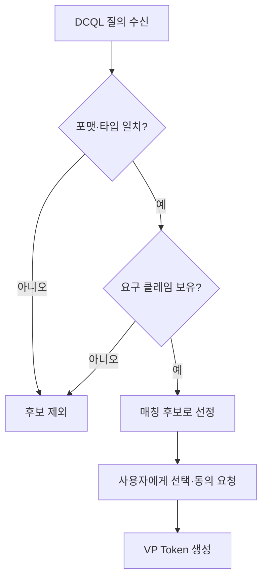
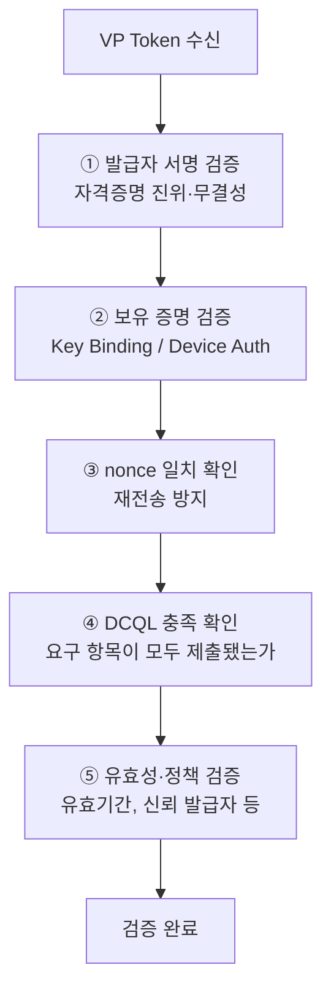

# OID4VP DCQL과 VP Token

| 항목 | 내용 |
|------|------|
| 주제 | DCQL 질의 언어, VP Token 구조, 제시 검증 |
| 작성 | 오픈소스개발팀 |
| 일자 | 2026-06-01 |
| 버전 | v1.0.0 |

## 변경 이력

| 버전 | 일자 | 변경 내용 |
|------|------|-----------|
| v1.0.0 | 2026-06-01 | 초기 작성 |

## 목차

1. [DCQL이란](#1-dcql이란)
2. [DCQL 질의 구조](#2-dcql-질의-구조)
3. [지갑의 매칭 과정](#3-지갑의-매칭-과정)
4. [VP Token 구조](#4-vp-token-구조)
5. [검증자의 검증 절차](#5-검증자의-검증-절차)
6. [요약](#6-요약)

---

## 1. DCQL이란

**DCQL(Digital Credentials Query Language)** 은 검증자가
"어떤 자격증명에서, 어떤 클레임을, 어떤 조건으로 원하는지"를 표현하는 **질의 언어**다.
JSON 형태로 작성되며, OID4VP의 Authorization Request에 `dcql_query`로 담긴다.

DCQL은 다음을 가능하게 한다.

- 여러 포맷(SD-JWT VC, mDoc 등) 중 원하는 포맷 지정
- 특정 클레임만 선택적으로 요구 (선택적 공개와 결합)
- 여러 자격증명을 조합하여 요구 (예: 신분증 + 자격증)

> DCQL은 과거의 Presentation Exchange(PE)를 대체하는, 더 간결하고 명시적인 질의 모델이다.

---

## 2. DCQL 질의 구조

DCQL은 크게 **credentials**(요구하는 자격증명 목록)와
**credential_sets**(여러 자격증명의 조합 규칙)로 구성된다.

```jsonc
{
  "credentials": [
    {
      "id": "pid",                  // 이 질의 항목의 식별자
      "format": "dc+sd-jwt",        // 원하는 포맷
      "meta": { "vct_values": ["..."] },
      "claims": [
        { "path": ["family_name"] },
        { "path": ["given_name"] },
        { "path": ["age_over_18"] }
      ]
    }
  ]
}
```

| 필드 | 설명 |
|------|------|
| `id` | 질의 항목 식별자. 응답의 VP Token이 이 id에 매핑된다 |
| `format` | 원하는 자격증명 포맷 (`dc+sd-jwt`, `mso_mdoc` 등) |
| `meta` | 포맷별 추가 조건 (SD-JWT의 `vct`, mDoc의 `doctype` 등) |
| `claims` | 요구하는 클레임 경로(`path`) 목록 |

mDoc을 요구할 때는 `path`가 네임스페이스와 요소명으로 표현된다.

```jsonc
{
  "format": "mso_mdoc",
  "meta": { "doctype_value": "org.iso.18013.5.1.mDL" },
  "claims": [
    { "path": ["org.iso.18013.5.1", "family_name"] },
    { "path": ["org.iso.18013.5.1", "age_over_18"] }
  ]
}
```

---

## 3. 지갑의 매칭 과정

지갑은 DCQL 질의를 받으면, 보관 중인 자격증명 중 조건에 맞는 것을 찾는다.



매칭 후 지갑은 사용자에게 **무엇을 누구에게 제출하는지** 보여주고 동의를 받는다.
이때 선택적 공개가 가능한 포맷(SD-JWT VC, mDoc)은 **요구된 클레임만** 추려서 제출한다.

---

## 4. VP Token 구조

**VP Token**은 지갑이 검증자에게 돌려주는 제시 결과물이다.
DCQL 질의의 각 `id`에 대응하는 자격증명 제시가 매핑되는 구조를 가진다.

```jsonc
{
  "vp_token": {
    "pid": "<제시된 자격증명>"
    // 여러 항목을 요구했다면 id별로 각각 매핑
  }
}
```

`id`에 매핑되는 값의 실제 형태는 포맷에 따라 다르다.

| 포맷 | VP Token 항목의 형태 |
|------|---------------------|
| SD-JWT VC | `SD-JWT~선택된 Disclosure들~Key Binding JWT` 문자열 |
| mDoc | CBOR로 인코딩된 DeviceResponse (Base64url) |

각 포맷의 내부 구조는 다음 문서를 참고한다.
- [SD-JWT VC 제시와 검증](../sdjwt/sdjwt_presentation_and_verification.md)
- [mDoc 검증과 신뢰 모델](../mdoc/mdoc_verification_and_trust.md)

---

## 5. 검증자의 검증 절차

검증자는 VP Token을 받으면 다음을 순서대로 확인한다.



| 단계 | 확인 내용 |
|------|----------|
| ① 발급자 서명 | 자격증명이 신뢰하는 발급자가 서명했고 변조되지 않았는가 |
| ② 보유 증명 | 제출자가 자격증명에 바인딩된 키/기기를 보유했는가 |
| ③ nonce | 이번 요청에 대한 응답이 맞는가 (재전송 아님) |
| ④ DCQL 충족 | 요구한 자격증명·클레임이 빠짐없이 제출됐는가 |
| ⑤ 유효성·정책 | 유효기간, 폐기 여부, 발급자 신뢰 정책을 만족하는가 |

다섯 단계를 모두 통과해야 제시가 유효한 것으로 인정된다.

---

## 6. 요약

- **DCQL**은 검증자가 원하는 자격증명·클레임을 표현하는 질의 언어다.
- **지갑**은 DCQL에 매칭되는 자격증명을 찾아, 사용자 동의 아래 필요한 클레임만 추려 제시한다.
- **VP Token**은 DCQL의 `id`별로 제시를 담으며, 실제 형태는 포맷에 따라 다르다.
- **검증자**는 발급자 서명 → 보유 증명 → nonce → DCQL 충족 → 유효성의 순서로 검증한다.
