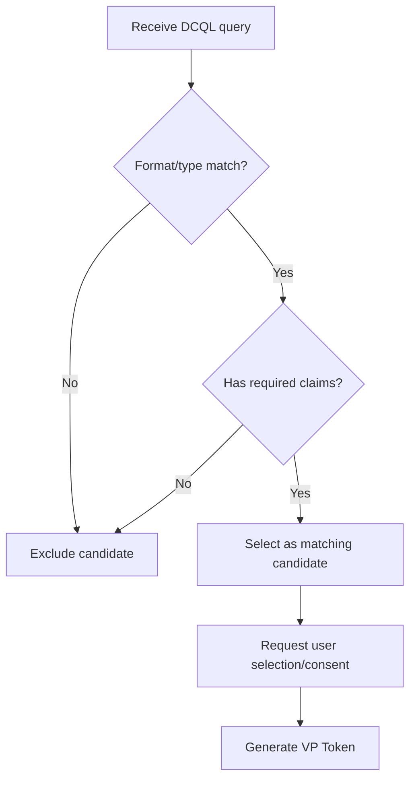
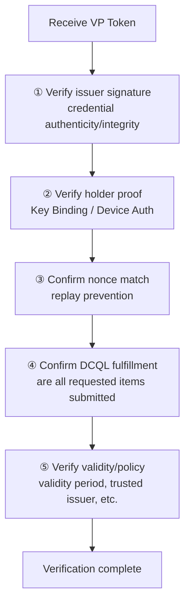

# OID4VP DCQL and VP Token

| Item | Content |
|------|------|
| Subject | DCQL query language, VP Token structure, presentation verification |
| Author | Open Source Development Team |
| Date | 2026-06-01 |
| Version | v1.0.0 |

## Change History

| Version | Date | Changes |
|------|------|-----------|
| v1.0.0 | 2026-06-01 | Initial version |

## Table of Contents

1. [What is DCQL](#1-what-is-dcql)
2. [DCQL Query Structure](#2-dcql-query-structure)
3. [The Wallet's Matching Process](#3-the-wallets-matching-process)
4. [VP Token Structure](#4-vp-token-structure)
5. [The Verifier's Verification Procedure](#5-the-verifiers-verification-procedure)
6. [Summary](#6-summary)

---

## 1. What is DCQL

**DCQL (Digital Credentials Query Language)** is a **query language** that lets a verifier
express "from which credential, which claims, under what conditions" it wants.
It is written in JSON and carried in the OID4VP Authorization Request as `dcql_query`.

DCQL makes the following possible.

- Specifying a desired format among multiple formats (SD-JWT VC, mDoc, etc.)
- Selectively requesting only specific claims (combined with selective disclosure)
- Requesting a combination of multiple credentials (e.g., ID document + certificate)

> DCQL is a more concise and explicit query model that replaces the earlier Presentation Exchange (PE).

---

## 2. DCQL Query Structure

DCQL is broadly composed of **credentials** (the list of requested credentials) and
**credential_sets** (rules for combining multiple credentials).

```jsonc
{
  "credentials": [
    {
      "id": "pid",                  // identifier of this query item
      "format": "dc+sd-jwt",        // desired format
      "meta": { "vct_values": ["..."] },
      "claims": [
        { "path": ["family_name"] },
        { "path": ["given_name"] },
        { "path": ["age_over_18"] }
      ]
    }
  ]
}
```

| Field | Description |
|------|------|
| `id` | Query item identifier. The VP Token in the response is mapped to this id |
| `format` | Desired credential format (`dc+sd-jwt`, `mso_mdoc`, etc.) |
| `meta` | Format-specific additional conditions (`vct` for SD-JWT, `doctype` for mDoc, etc.) |
| `claims` | List of requested claim paths (`path`) |

When requesting an mDoc, the `path` is expressed as a namespace and an element name.

```jsonc
{
  "format": "mso_mdoc",
  "meta": { "doctype_value": "org.iso.18013.5.1.mDL" },
  "claims": [
    { "path": ["org.iso.18013.5.1", "family_name"] },
    { "path": ["org.iso.18013.5.1", "age_over_18"] }
  ]
}
```

---

## 3. The Wallet's Matching Process

When the wallet receives a DCQL query, it searches the credentials it holds for ones that meet the conditions.



After matching, the wallet shows the user **what is being submitted and to whom** and obtains consent.
At this point, formats that support selective disclosure (SD-JWT VC, mDoc) submit **only the requested claims**.

---

## 4. VP Token Structure

The **VP Token** is the presentation result that the wallet returns to the verifier.
It has a structure in which the credential presentation corresponding to each `id` in the DCQL query is mapped.

```jsonc
{
  "vp_token": {
    "pid": "<presented credential>"
    // if multiple items were requested, each is mapped by id
  }
}
```

The actual form of the value mapped to an `id` differs by format.

| Format | Form of the VP Token item |
|------|---------------------|
| SD-JWT VC | `SD-JWT~selected Disclosures~Key Binding JWT` string |
| mDoc | CBOR-encoded DeviceResponse (Base64url) |

Refer to the following documents for the internal structure of each format.
- [SD-JWT VC Presentation and Verification](../sdjwt/sdjwt_presentation_and_verification.md)
- [mDoc Verification and Trust Model](../mdoc/mdoc_verification_and_trust.md)

---

## 5. The Verifier's Verification Procedure

When the verifier receives the VP Token, it checks the following in order.



| Step | What is checked |
|------|----------|
| ① Issuer signature | Was the credential signed by a trusted issuer and not tampered with |
| ② Holder proof | Does the submitter hold the key/device bound to the credential |
| ③ nonce | Is this the response to this request (not a replay) |
| ④ DCQL fulfillment | Were the requested credentials/claims all submitted without omission |
| ⑤ Validity/policy | Does it satisfy the validity period, revocation status, and issuer trust policy |

A presentation is recognized as valid only when it passes all five steps.

---

## 6. Summary

- **DCQL** is a query language by which a verifier expresses the credentials/claims it wants.
- The **wallet** finds credentials matching the DCQL, and, with the user's consent, presents only the necessary claims.
- The **VP Token** carries a presentation for each DCQL `id`, and its actual form differs by format.
- The **verifier** verifies in the order of issuer signature → holder proof → nonce → DCQL fulfillment → validity.
