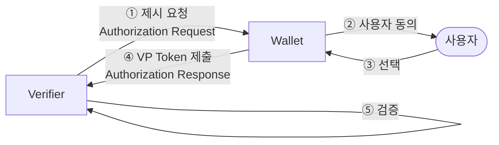
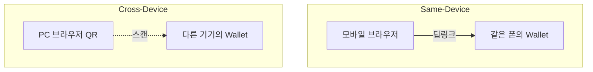
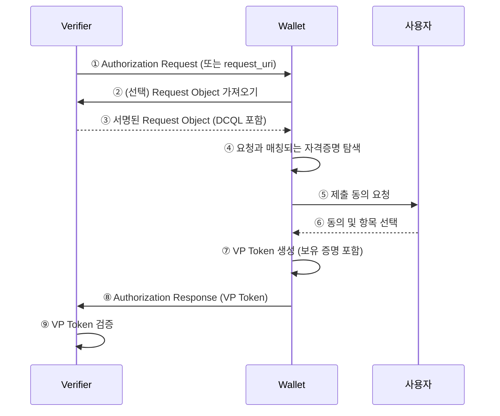

# OID4VP 개요

| 항목 | 내용 |
|------|------|
| 주제 | OID4VP(OpenID for Verifiable Presentations) 개요 |
| 작성 | 오픈소스개발팀 |
| 일자 | 2026-06-01 |
| 버전 | v1.0.0 |

## 변경 이력

| 버전 | 일자 | 변경 내용 |
|------|------|-----------|
| v1.0.0 | 2026-06-01 | 초기 작성 |

## 목차

1. [OID4VP란 무엇인가](#1-oid4vp란-무엇인가)
2. [핵심 역할(Roles)](#2-핵심-역할roles)
3. [핵심 개념](#3-핵심-개념)
4. [Same-Device와 Cross-Device](#4-same-device와-cross-device)
5. [전체 그림: 제시 절차 한눈에 보기](#5-전체-그림-제시-절차-한눈에-보기)
6. [신뢰와 보안의 기본 원칙](#6-신뢰와-보안의-기본-원칙)
7. [관련 표준](#7-관련-표준)

---

## 1. OID4VP란 무엇인가

**OID4VP(OpenID for Verifiable Presentations)** 는 지갑(Wallet)이 보관 중인 자격증명을
**검증자(Verifier)** 에게 안전하게 **제시(Present)** 하기 위한 프로토콜이다.
자격증명을 "어떻게 보여주고 검증할 것인가"를 정의하며, OAuth 2.0 / OpenID Connect의 흐름 위에서 동작한다.

[OID4VCI](../oid4vci/oid4vci_overview.md)가 자격증명을 "발급"받는 단계라면,
OID4VP는 이미 발급받아 보관 중인 자격증명을 필요한 곳에 "제출"하는 단계다.

OID4VP의 핵심 가치는 다음과 같다.

- **선택적 제출**: 검증자가 요구하는 항목만, 사용자의 동의 아래 선택적으로 제출할 수 있다.
- **포맷 독립성**: SD-JWT VC, mDoc 등 다양한 자격증명 포맷을 동일한 절차로 제시할 수 있다.
- **위변조 검증 가능**: 검증자는 발급자 서명을 통해 자격증명의 진위를, 보유 증명을 통해 제출자의 정당성을 확인한다.

---

## 2. 핵심 역할(Roles)

| 역할 | 설명 |
|------|------|
| **Verifier (Relying Party)** | 자격증명 제시를 요구하고 그 진위를 검증하는 주체. 예: 온라인 서비스, 출입 시스템 |
| **Wallet** | 사용자의 자격증명을 보관하고, 검증자의 요청에 따라 제시하는 애플리케이션 |
| **사용자(Holder)** | 자격증명의 보유자. 어떤 항목을 제출할지 동의·결정한다 |

---

## 3. 핵심 개념

### 3.1 Authorization Request (제시 요청)
검증자가 지갑에게 "이런 자격증명/항목을 보여달라"고 요청하는 메시지다.
무엇을 요구하는지(질의)와, 응답을 어디로 어떻게 보낼지(응답 모드)가 담긴다.

### 3.2 VP Token (Verifiable Presentation Token)
지갑이 검증자에게 돌려주는 "제시 결과물"이다.
요청된 자격증명(또는 그 일부)과, 보유자가 실제 보유자임을 증명하는 서명이 포함된다.

### 3.3 DCQL (Digital Credentials Query Language)
검증자가 "어떤 포맷의, 어떤 클레임을" 원하는지 표현하는 질의 언어다.
자세한 내용은 [DCQL과 VP Token](oid4vp_dcql_and_vptoken.md) 문서에서 다룬다.

### 3.4 Key Binding / Device Binding
제출된 자격증명이 정말 그 보유자의 것인지 증명하는 장치다.
SD-JWT VC는 **Key Binding JWT**로, mDoc은 **Device Authentication**으로 이를 수행한다.

---

## 4. Same-Device와 Cross-Device

OID4VP는 사용자가 처한 환경에 따라 두 가지 시나리오를 지원한다.

| 구분 | 설명 | 대표 UX |
|------|------|---------|
| **Same-Device** | 검증자 화면과 지갑이 같은 기기에 있음 | 모바일 웹에서 버튼을 누르면 같은 폰의 지갑 앱이 열림 |
| **Cross-Device** | 검증자 화면과 지갑이 다른 기기에 있음 | PC 화면의 QR 코드를 폰의 지갑으로 스캔 |

두 경우 모두 프로토콜의 본질은 동일하며, 단지 **Authorization Request가 전달되는 매체**(딥링크 vs QR)와
응답을 돌려주는 방식만 달라진다.

---

## 5. 전체 그림: 제시 절차 한눈에 보기

세부 흐름과 응답 모드는 [제시 프로토콜 흐름](oid4vp_presentation_flow.md)에서,
질의·검증 구조는 [DCQL과 VP Token](oid4vp_dcql_and_vptoken.md)에서 다룬다.

---

## 6. 신뢰와 보안의 기본 원칙

OID4VP에서 검증자가 안전하게 자격증명을 받기 위해, 다음 세 가지 신뢰 축이 작동한다.

| 신뢰 축 | 무엇을 보장하는가 | 수단 |
|---------|-----------------|------|
| **발급자 신뢰** | 자격증명이 진짜이고 변조되지 않았다 | 발급자 서명 검증 |
| **보유자 신뢰** | 제출자가 정당한 보유자다 | Key Binding / Device Authentication |
| **요청 신뢰** | 요청이 정당한 검증자에게서 왔다 | 서명된 요청(JAR), nonce |

세 가지를 모두 확인해야 "진짜 자격증명을, 진짜 주인이, 이번 요청에 응답해 제출했다"는 것이 성립한다.

---

## 7. 관련 표준

| 표준 | 설명 | 링크 |
|------|------|------|
| OID4VP 1.0 | OpenID for Verifiable Presentations | <https://openid.net/specs/openid-4-verifiable-presentations-1_0.html> |
| JAR | JWT-Secured Authorization Request (RFC 9101) | <https://datatracker.ietf.org/doc/html/rfc9101> |
| OAuth 2.0 | 인가 프레임워크 (RFC 6749) | <https://datatracker.ietf.org/doc/html/rfc6749> |
