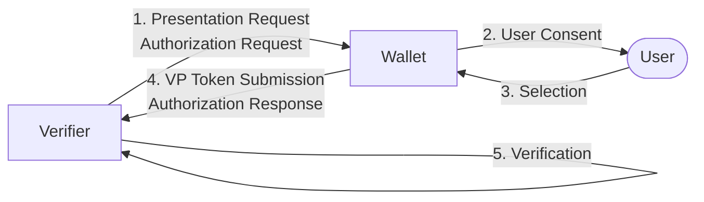
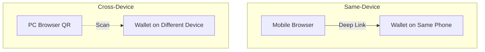
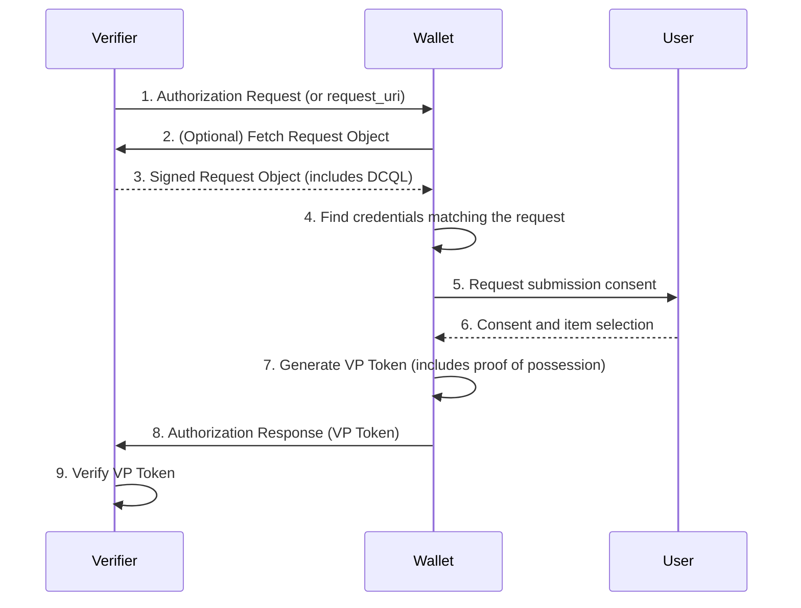

# OID4VP Overview

| Item | Content |
|------|------|
| Subject | OID4VP (OpenID for Verifiable Presentations) Overview |
| Author | Open Source Development Team |
| Date | 2026-06-01 |
| Version | v1.0.0 |

## Change History

| Version | Date | Changes |
|------|------|-----------|
| v1.0.0 | 2026-06-01 | Initial version |

## Table of Contents

1. [What Is OID4VP](#1-what-is-oid4vp)
2. [Core Roles](#2-core-roles)
3. [Core Concepts](#3-core-concepts)
4. [Same-Device and Cross-Device](#4-same-device-and-cross-device)
5. [The Big Picture: Presentation Flow at a Glance](#5-the-big-picture-presentation-flow-at-a-glance)
6. [Trust and Security Fundamentals](#6-trust-and-security-fundamentals)
7. [Related Standards](#7-related-standards)

---

## 1. What Is OID4VP

**OID4VP (OpenID for Verifiable Presentations)** is a protocol for a **Wallet** to securely
**present** the credentials it holds to a **Verifier**.
It defines "how to show and verify credentials" and operates on top of the OAuth 2.0 / OpenID Connect flows.

If [OID4VCI](../oid4vci/oid4vci_overview.md) is the stage of "issuing" credentials,
OID4VP is the stage of "submitting" already-issued credentials wherever they are needed.

The core values of OID4VP are as follows.

- **Selective disclosure**: Only the items the verifier requests can be submitted selectively, with the user's consent.
- **Format independence**: Various credential formats such as SD-JWT VC and mDoc can be presented through the same procedure.
- **Tamper verification**: The verifier confirms the authenticity of a credential through the issuer's signature, and the legitimacy of the submitter through proof of possession.

---

## 2. Core Roles

| Role | Description |
|------|------|
| **Verifier (Relying Party)** | The party that requests credential presentation and verifies its authenticity. Examples: online services, access control systems |
| **Wallet** | The application that stores the user's credentials and presents them in response to a verifier's request |
| **User (Holder)** | The holder of the credentials. Consents to and decides which items to submit |

---

## 3. Core Concepts

### 3.1 Authorization Request
The message in which the verifier asks the wallet to "show me this credential/these items."
It contains what is being requested (the query) and where and how to send the response (the response mode).

### 3.2 VP Token (Verifiable Presentation Token)
The "presentation result" that the wallet returns to the verifier.
It includes the requested credential (or part of it) and a signature proving that the holder is the actual holder.

### 3.3 DCQL (Digital Credentials Query Language)
A query language with which the verifier expresses "which claims, in which format" it wants.
Details are covered in the [DCQL and VP Token](oid4vp_dcql_and_vptoken.md) document.

### 3.4 Key Binding / Device Binding
The mechanism that proves a submitted credential truly belongs to its holder.
SD-JWT VC accomplishes this with a **Key Binding JWT**, and mDoc with **Device Authentication**.

---

## 4. Same-Device and Cross-Device

OID4VP supports two scenarios depending on the user's environment.

| Category | Description | Representative UX |
|------|------|---------|
| **Same-Device** | The verifier screen and the wallet are on the same device | Pressing a button on the mobile web opens the wallet app on the same phone |
| **Cross-Device** | The verifier screen and the wallet are on different devices | Scanning a QR code on a PC screen with the wallet on a phone |

In both cases the essence of the protocol is identical; only the **medium through which the Authorization Request is delivered** (deep link vs. QR) and the way the response is returned differ.

---

## 5. The Big Picture: Presentation Flow at a Glance

The detailed flow and response modes are covered in [Presentation Protocol Flow](oid4vp_presentation_flow.md),
and the query and verification structure in [DCQL and VP Token](oid4vp_dcql_and_vptoken.md).

---

## 6. Trust and Security Fundamentals

For a verifier to receive credentials securely in OID4VP, the following three axes of trust operate.

| Trust Axis | What It Guarantees | Means |
|---------|-----------------|------|
| **Issuer trust** | The credential is genuine and has not been tampered with | Issuer signature verification |
| **Holder trust** | The submitter is the legitimate holder | Key Binding / Device Authentication |
| **Request trust** | The request comes from a legitimate verifier | Signed request (JAR), nonce |

All three must be confirmed to establish that "a genuine credential was submitted by its genuine owner in response to this request."

---

## 7. Related Standards

| Standard | Description | Link |
|------|------|------|
| OID4VP 1.0 | OpenID for Verifiable Presentations | <https://openid.net/specs/openid-4-verifiable-presentations-1_0.html> |
| JAR | JWT-Secured Authorization Request (RFC 9101) | <https://datatracker.ietf.org/doc/html/rfc9101> |
| OAuth 2.0 | Authorization Framework (RFC 6749) | <https://datatracker.ietf.org/doc/html/rfc6749> |
