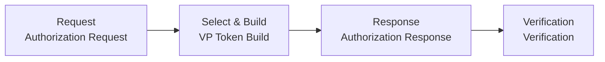
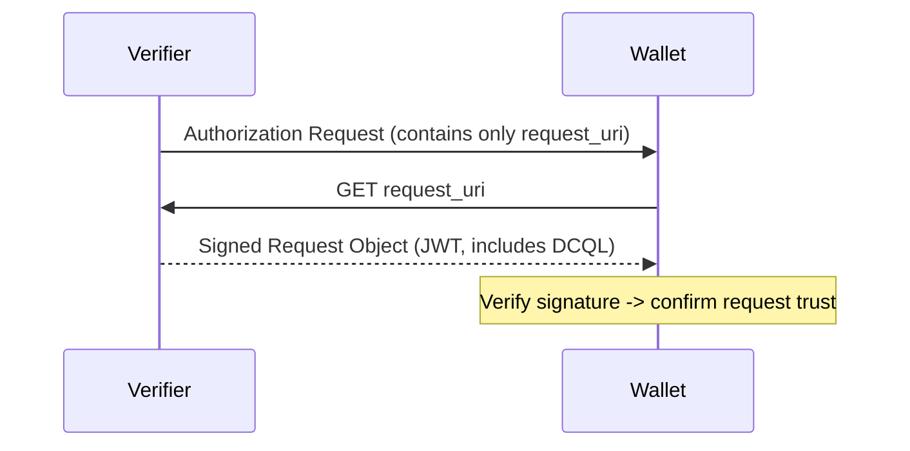
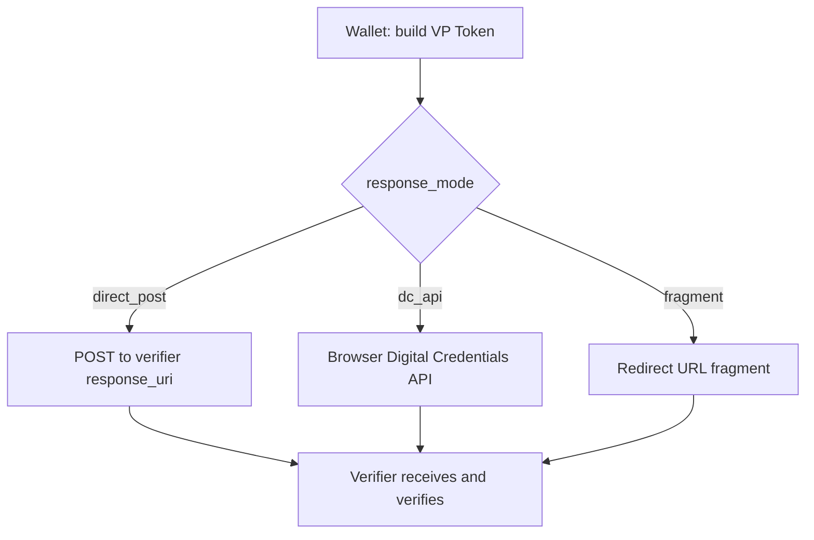
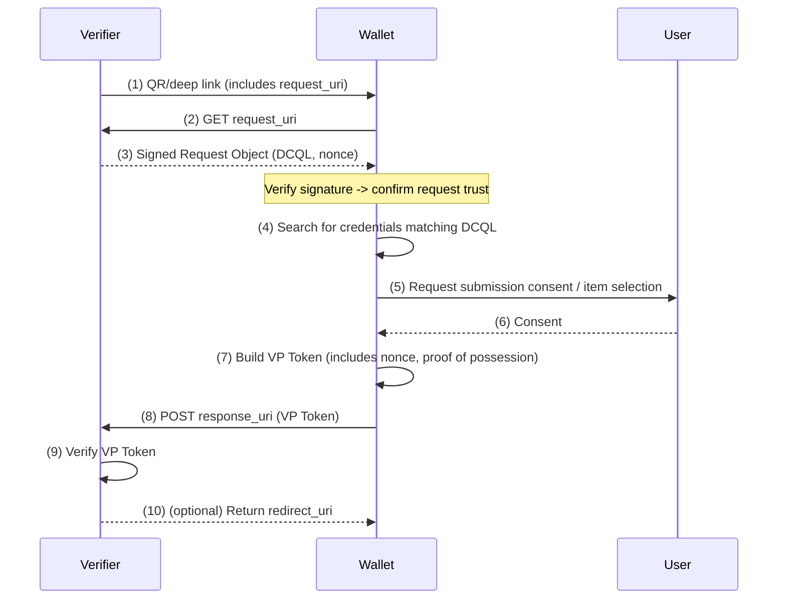

# OID4VP Presentation Protocol Flow

| Item | Content |
|------|------|
| Subject | OID4VP presentation flow, Authorization Request/Response, response modes |
| Author | Open Source Development Team |
| Date | 2026-06-01 |
| Version | v1.0.0 |

## Change History

| Version | Date | Changes |
|------|------|-----------|
| v1.0.0 | 2026-06-01 | Initial version |

## Table of Contents

1. [Presentation Flow Overview](#1-presentation-flow-overview)
2. [Authorization Request](#2-authorization-request)
3. [request_uri and JAR](#3-request_uri-and-jar)
4. [Authorization Response and Response Modes](#4-authorization-response-and-response-modes)
5. [nonce and Replay Prevention](#5-nonce-and-replay-prevention)
6. [Full Sequence](#6-full-sequence)

---

## 1. Presentation Flow Overview

The OID4VP presentation flow is broadly divided into three stages.

1. **Request**: The verifier conveys to the wallet what it wants.
2. **Select & Build**: The wallet finds credentials matching the request, obtains user consent, and builds a VP Token.
3. **Response**: The wallet delivers the VP Token to the verifier, which then verifies it.

---

## 2. Authorization Request

This is the first message the verifier sends to the wallet. The main parameters are as follows.

| Parameter | Description |
|----------|------|
| `client_id` | Identifier of the verifier (Relying Party) |
| `response_type` | Usually `vp_token` |
| `response_mode` | How the response is to be returned (e.g., `direct_post`) |
| `dcql_query` | A [DCQL](oid4vp_dcql_and_vptoken.md) query describing which credentials/claims are wanted |
| `nonce` | A one-time random value for replay prevention |
| `response_uri` | The verifier endpoint to which the response is sent |
| `client_metadata` | The verifier's metadata (response encryption key, etc.) |

The request can be carried directly as URL parameters, but due to length and security concerns it is usually retrieved separately by the wallet via **`request_uri`**.

---

## 3. request_uri and JAR

Exposing request parameters directly in the URL carries length limits and tampering risks. To address this, OID4VP uses **`request_uri`** and **JAR (JWT-Secured Authorization Request)**.

- **request_uri**: Instead of providing the request body directly, the verifier passes only a URL from which it can be fetched. The wallet accesses this URL to retrieve the actual request (Request Object).
- **JAR**: The fetched Request Object takes the form of a **JWT signed** with the verifier's key. The wallet verifies this signature to confirm that the request came from a legitimate verifier and has not been tampered with.

There are two ways to fetch the `request_uri`: **GET** and **POST**. With the POST method, the wallet can also send along its own metadata and so on.

---

## 4. Authorization Response and Response Modes

After building the VP Token, the wallet sends a response to the verifier. The request's **`response_mode`** determines how it is sent.

| Response Mode | Description | Primary Use |
|-----------|------|----------|
| **`direct_post`** | The wallet sends the VP Token to the verifier's `response_uri` via **HTTP POST** | Cross-Device, server-to-server processing |
| **`direct_post.jwt`** | Same as `direct_post`, but the response is **encrypted (JWE)** before sending | When response confidentiality is required |
| **`dc_api`** | The response is delivered through the browser's **Digital Credentials API** | Same-Device web integration |
| **`fragment`** | The response is carried in the fragment (`#`) of the redirect URL | Simple redirect-based |

In most server-driven scenarios, **`direct_post`** is used by default. When a modern browser-integrated method is needed, **`dc_api`** is used.

---

## 5. nonce and Replay Prevention

In OID4VP, the **nonce** is a key security element. The verifier generates a new `nonce` for each request and sends it, and the wallet includes this value when building the VP Token.

This allows the verifier to confirm that the received VP Token is a **response to this particular request**. It is a mechanism that prevents **replay attacks**, in which a previously captured VP Token is reused.

> The nonce is bound in different locations depending on the credential format.
> For SD-JWT VC it is a claim of the Key Binding JWT, while for mDoc it is reflected in the session/SessionTranscript.
> For details, refer to [DCQL and VP Token](oid4vp_dcql_and_vptoken.md) and the documentation for each format.

---

## 6. Full Sequence

Below is a typical Cross-Device flow using `request_uri` + `direct_post`.

