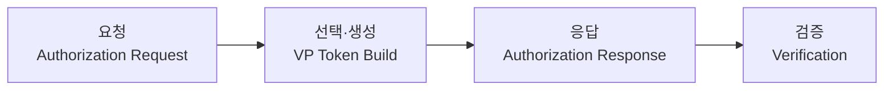
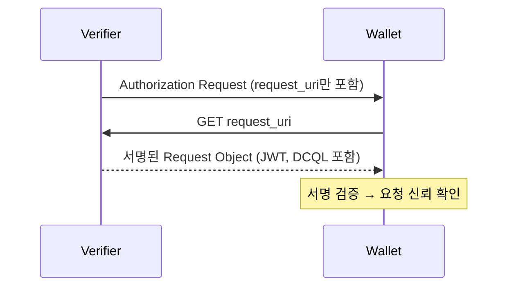
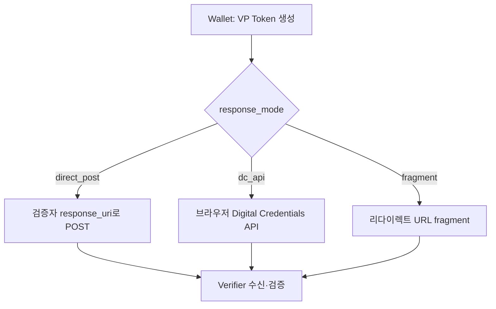
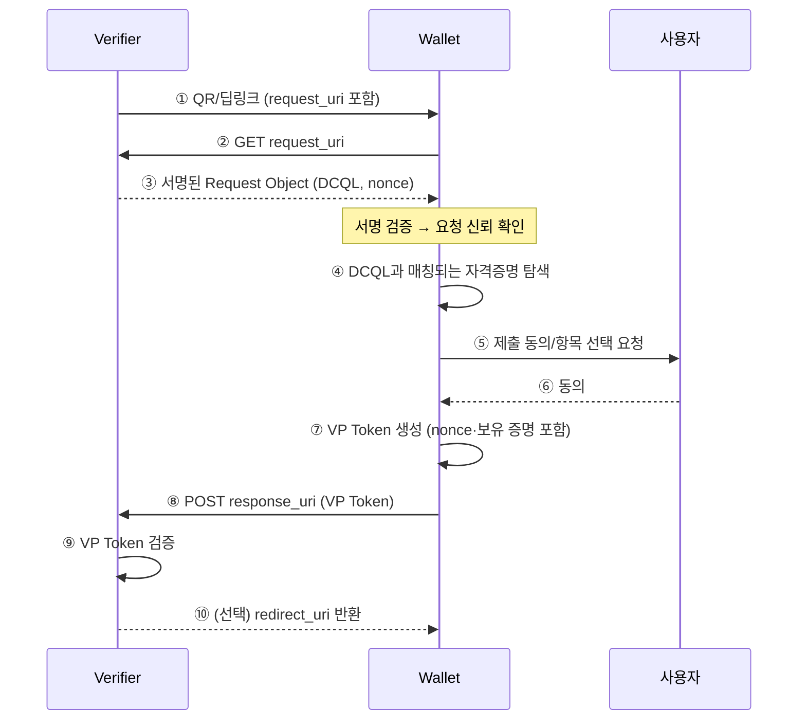

# OID4VP 제시 프로토콜 흐름

| 항목 | 내용 |
|------|------|
| 주제 | OID4VP 제시 흐름, Authorization Request/Response, 응답 모드 |
| 작성 | 오픈소스개발팀 |
| 일자 | 2026-06-01 |
| 버전 | v1.0.0 |

## 변경 이력

| 버전 | 일자 | 변경 내용 |
|------|------|-----------|
| v1.0.0 | 2026-06-01 | 초기 작성 |

## 목차

1. [제시 흐름 개요](#1-제시-흐름-개요)
2. [Authorization Request](#2-authorization-request)
3. [request_uri와 JAR](#3-request_uri와-jar)
4. [Authorization Response와 응답 모드](#4-authorization-response와-응답-모드)
5. [nonce와 재전송 방지](#5-nonce와-재전송-방지)
6. [전체 시퀀스](#6-전체-시퀀스)

---

## 1. 제시 흐름 개요

OID4VP의 제시 흐름은 크게 세 단계로 나뉜다.

1. **요청(Request)**: 검증자가 무엇을 원하는지 지갑에 전달한다.
2. **선택·생성(Select & Build)**: 지갑이 요청에 맞는 자격증명을 찾고, 사용자 동의를 받아 VP Token을 만든다.
3. **응답(Response)**: 지갑이 VP Token을 검증자에게 전달하고, 검증자가 이를 검증한다.

---

## 2. Authorization Request

검증자가 지갑에 보내는 첫 메시지다. 주요 파라미터는 다음과 같다.

| 파라미터 | 설명 |
|----------|------|
| `client_id` | 검증자(Relying Party)의 식별자 |
| `response_type` | 보통 `vp_token` |
| `response_mode` | 응답을 어떤 방식으로 돌려받을지 (예: `direct_post`) |
| `dcql_query` | 어떤 자격증명/클레임을 원하는지에 대한 [DCQL](oid4vp_dcql_and_vptoken.md) 질의 |
| `nonce` | 재전송 방지를 위한 일회성 난수 |
| `response_uri` | 응답을 전송할 검증자 엔드포인트 |
| `client_metadata` | 검증자의 메타데이터(응답 암호화 키 등) |

요청은 URL 파라미터로 직접 담길 수도 있지만, 길이·보안 문제로 보통은
**`request_uri`** 를 통해 지갑이 별도로 가져오는 방식을 쓴다.

---

## 3. request_uri와 JAR

요청 파라미터를 URL에 그대로 노출하면 길이 제한과 변조 위험이 있다.
이를 해결하기 위해 OID4VP는 **`request_uri`** 와 **JAR(JWT-Secured Authorization Request)** 를 사용한다.

- **request_uri**: 검증자는 요청 본문을 직접 주는 대신, 그것을 가져올 수 있는 URL만 전달한다.
  지갑은 이 URL에 접속해 실제 요청(Request Object)을 받아온다.
- **JAR**: 가져온 Request Object는 검증자의 키로 **서명된 JWT** 형태다.
  지갑은 이 서명을 검증해, 요청이 정당한 검증자에게서 왔고 변조되지 않았음을 확인한다.

`request_uri`를 가져오는 방식은 **GET**과 **POST** 두 가지가 있다.
POST 방식에서는 지갑이 자신의 메타데이터 등을 함께 전달할 수 있다.

---

## 4. Authorization Response와 응답 모드

지갑은 VP Token을 만든 뒤 검증자에게 응답을 보낸다.
어떤 방식으로 보낼지는 요청의 **`response_mode`** 가 결정한다.

| 응답 모드 | 설명 | 주 사용처 |
|-----------|------|----------|
| **`direct_post`** | 지갑이 VP Token을 검증자의 `response_uri`로 **HTTP POST** 전송 | Cross-Device, 서버 간 처리 |
| **`direct_post.jwt`** | `direct_post`와 같되, 응답을 **암호화(JWE)** 하여 전송 | 응답 기밀성이 필요한 경우 |
| **`dc_api`** | 브라우저의 **Digital Credentials API**를 통해 응답 전달 | Same-Device 웹 통합 |
| **`fragment`** | 리다이렉트 URL의 fragment(`#`)에 응답을 실어 전달 | 단순 리다이렉트 기반 |

대부분의 서버-주도 시나리오에서는 **`direct_post`** 가 기본으로 쓰인다.
브라우저에 통합된 최신 방식이 필요하면 **`dc_api`** 를 사용한다.

---

## 5. nonce와 재전송 방지

OID4VP에서 **nonce**는 핵심 보안 요소다.
검증자는 요청마다 새로운 `nonce`를 생성해 보내고, 지갑은 이 값을 VP Token 생성 시 포함한다.

이렇게 하면 검증자는 받은 VP Token이 **이번 요청에 대한 응답**임을 확인할 수 있다.
과거에 캡처한 VP Token을 재사용하는 **재전송 공격(replay attack)** 을 막는 장치다.

> nonce는 자격증명 포맷에 따라 다른 위치에 묶인다.
> SD-JWT VC는 Key Binding JWT의 클레임으로, mDoc은 세션/SessionTranscript에 반영된다.
> 자세한 내용은 [DCQL과 VP Token](oid4vp_dcql_and_vptoken.md) 및 각 포맷 문서를 참고한다.

---

## 6. 전체 시퀀스

아래는 `request_uri` + `direct_post`를 사용하는 전형적인 Cross-Device 흐름이다.

