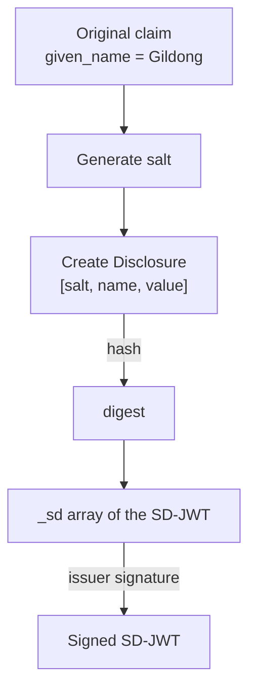

# SD-JWT Issuance and Disclosure Generation

| Item | Content |
|------|------|
| Subject | SD-JWT Issuance, Disclosure Generation, Salt·Hash·Decoy |
| Author | Open Source Development Team |
| Date | 2026-06-01 |
| Version | v1.0.0 |

## Change History

| Version | Date | Changes |
|------|------|-----------|
| v1.0.0 | 2026-06-01 | Initial version |

## Table of Contents

1. [Overview of the Issuance Phase](#1-overview-of-the-issuance-phase)
2. [Creating Disclosures](#2-creating-disclosures)
3. [The Role of Salt](#3-the-role-of-salt)
4. [Digest Calculation and the _sd Array](#4-digest-calculation-and-the-_sd-array)
5. [Nested Structures and Array Elements](#5-nested-structures-and-array-elements)
6. [Decoy Digest](#6-decoy-digest)
7. [Preparing for Key Binding: cnf](#7-preparing-for-key-binding-cnf)
8. [Issuance Output](#8-issuance-output)

---

## 1. Overview of the Issuance Phase

The issuer decides which of the claims to include in the credential should be made **selectively disclosable**.
Those claims are not stored as their values but are transformed into a **Disclosure + digest** form and embedded in the SD-JWT.



The key point is that the issuer **signs the digest, not the value itself**.
Thanks to this, the signature remains valid even when some Disclosures are removed later.

---

## 2. Creating Disclosures

Each selectively disclosable claim is transformed into a fragment called a **Disclosure**.
A Disclosure is a string produced by **Base64url-encoding** an array that contains the following three elements.

```
[ <salt>, <claim name>, <claim value> ]
```

Example:

```
Original:    "given_name": "Gildong"
Array:       ["aQ7s9...zX", "given_name", "Gildong"]
Disclosure(Base64url): "WyJhUTdzOS4uLnpYIiwgImdpdmVuX25hbWUiLCAiR2lsZG9uZyJd"
```

| Element | Description |
|------|------|
| `salt` | A random value newly generated for each claim (see below) |
| Claim name | e.g., `given_name`. (Array-element Disclosures have no name → [Section 5](#5-nested-structures-and-array-elements)) |
| Claim value | The actual value |

---

## 3. The Role of Salt

Each Disclosure includes a **random salt that is freshly generated per claim**.
Salt is critically important for security.

Without salt, a verifier or attacker could precompute the digests of common values and
guess hidden values through **comparison (a dictionary attack)**.
For example, the digest of `age_over_18 = true` would always be the same, so hiding it would be pointless.

By mixing salt into each Disclosure, the digest changes every time even for identical values, so
**the original value cannot be derived from the digest alone unless the value is disclosed.**

```
Without salt:   hash("given_name","Gildong")        → always identical, guessable
With salt:      hash("aQ7s9...","given_name","Gildong") → different every time, not guessable
```

> Salt must be **sufficiently long and unpredictable**. Typically, a random value of at least 128 bits is Base64url-encoded for use.

---

## 4. Digest Calculation and the _sd Array

Hashing each Disclosure string with the **hash function specified in `_sd_alg` (usually SHA-256)** produces a digest.
The digests of the hidden claims are collected into the **`_sd`** array of the SD-JWT body.

```jsonc
{
  "iss": "https://issuer.example.com",
  "vct": "https://example.com/identity_credential",
  "_sd_alg": "sha-256",
  "_sd": [
    "X9yH0Ajr2pQ...",   // digest of given_name
    "n4hmF7y2kLm...",   // digest of birth_date
    "Pz3...decoy..."    // decoy (see Section 6)
  ],
  "address": "Seoul",   // always-disclosed claims are kept in plaintext
  "cnf": { "jwk": { /* holder public key */ } }
}
```

At this point, the **`_sd` array is shuffled** so that one cannot infer
which claim is hidden from the position of a digest.
Also, claims that may always be disclosed (e.g., `iss`, `vct`) are left as plaintext.

---

## 5. Nested Structures and Array Elements

Selective disclosure applies not only to simple claims but also to **nested objects and array elements**.

- **Object properties**: A nested `_sd` array is placed inside the parent object to hide individual properties.
- **Array elements**: Individual items of an array are replaced with the form `{ "...": "<digest>" }` to hide them.
  In this case, the Disclosure consists of **two elements without a name**, like `[salt, value]`.

```jsonc
// Example of selective disclosure of array elements
"nationalities": [
  { "...": "Qg3...digest..." },   // hidden element
  "KR"                              // disclosed element
]
```

This enables fine-grained control such as "disclose only one of multiple nationalities."

---

## 6. Decoy Digest

A **decoy digest** is a **fake digest** unrelated to any actual claim.
A few of them are randomly mixed into the `_sd` array.

The purpose is to **conceal the number of hidden claims**.
Without decoys, a verifier could tell "how many claims are hidden" from the number of `_sd` entries.
Mixing in decoys makes the actual count unknowable, strengthening privacy.

```
_sd = [ real digest, real digest, decoy, real digest, decoy ]
        └────────── cannot tell how many are real ──────────┘
```

Since a decoy has no corresponding Disclosure, it does not match during verification and is simply ignored.

---

## 7. Preparing for Key Binding: cnf

The issuer embeds the holder's public key into the SD-JWT body as a **`cnf` (confirmation)** claim.

```jsonc
"cnf": { "jwk": { "kty": "EC", "crv": "P-256", "x": "...", "y": "..." } }
```

This public key is used to verify the **Key Binding JWT** that the holder creates during the presentation phase.
In other words, at issuance time it is established that "the legitimate holder of this credential is the owner of this key."
The holder public key is the same key delivered as the [proof of possession](../oid4vci/oid4vci_metadata_and_proof.md#3-proof-of-possession)
during OID4VCI issuance.

---

## 8. Issuance Output

Once issuance is complete, the holder (wallet) receives the following.

```
<SD-JWT>~<Disclosure 1>~<Disclosure 2>~ ... ~<Disclosure N>~
```

- At the front: the SD-JWT body signed by the issuer
- After it: **all possible Disclosures** (all are attached at this point)
- At the end: an empty slot (ends with `~`) — there is no KB-JWT yet

The wallet stores this entire string securely.
When presenting it later, it **keeps only the Disclosures to be disclosed** and attaches a KB-JWT,
a process covered in [SD-JWT Presentation and Verification](sdjwt_presentation_and_verification.md).
