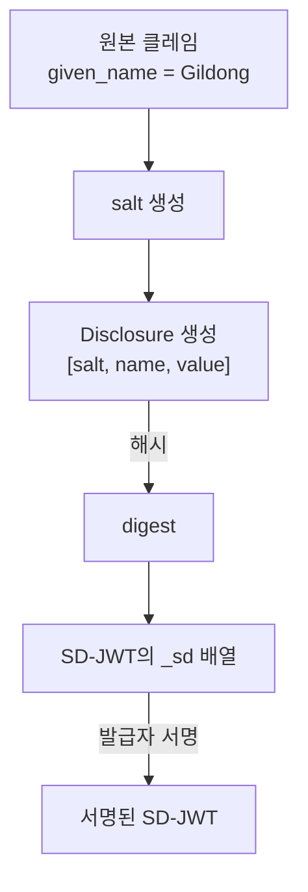

# SD-JWT 발급과 Disclosure 생성

| 항목 | 내용 |
|------|------|
| 주제 | SD-JWT 발급, Disclosure 생성, Salt·Hash·Decoy |
| 작성 | 오픈소스개발팀 |
| 일자 | 2026-06-01 |
| 버전 | v1.0.0 |

## 변경 이력

| 버전 | 일자 | 변경 내용 |
|------|------|-----------|
| v1.0.0 | 2026-06-01 | 초기 작성 |

## 목차

1. [발급 단계 개요](#1-발급-단계-개요)
2. [Disclosure 만들기](#2-disclosure-만들기)
3. [Salt의 역할](#3-salt의-역할)
4. [digest 계산과 _sd 배열](#4-digest-계산과-_sd-배열)
5. [중첩 구조와 배열 요소](#5-중첩-구조와-배열-요소)
6. [Decoy Digest](#6-decoy-digest)
7. [Key Binding 준비: cnf](#7-key-binding-준비-cnf)
8. [발급 결과물](#8-발급-결과물)

---

## 1. 발급 단계 개요

발급자는 자격증명에 담을 클레임 중, **선택적 공개 대상**으로 만들 클레임을 정한다.
그 클레임들은 값이 아니라 **Disclosure + digest** 형태로 변환되어 SD-JWT에 담긴다.



핵심은 발급자가 **값 자체가 아니라 digest를 서명**한다는 점이다.
이 덕분에 나중에 일부 Disclosure를 빼도 서명이 유효하게 유지된다.

---

## 2. Disclosure 만들기

각 선택적 공개 클레임은 **Disclosure**라는 조각으로 변환된다.
Disclosure는 다음 3요소를 담은 배열을 **Base64url로 인코딩**한 문자열이다.

```
[ <salt>, <클레임 이름>, <클레임 값> ]
```

예시:

```
원본:    "given_name": "Gildong"
배열:    ["aQ7s9...zX", "given_name", "Gildong"]
Disclosure(Base64url): "WyJhUTdzOS4uLnpYIiwgImdpdmVuX25hbWUiLCAiR2lsZG9uZyJd"
```

| 요소 | 설명 |
|------|------|
| `salt` | 클레임마다 새로 만드는 무작위 값 (아래 참고) |
| 클레임 이름 | `given_name` 등. (배열 요소 Disclosure는 이름이 없다 → [5장](#5-중첩-구조와-배열-요소)) |
| 클레임 값 | 실제 값 |

---

## 3. Salt의 역할

각 Disclosure에는 **클레임마다 새로 생성된 무작위 salt**가 들어간다.
salt는 보안상 매우 중요하다.

salt가 없다면, 검증자나 공격자가 흔한 값의 digest를 미리 계산해 두고
**대조(사전 공격)** 로 숨겨진 값을 추측할 수 있다.
예를 들어 `age_over_18 = true`의 digest는 항상 같을 것이므로, 숨겨도 의미가 없어진다.

salt를 각 Disclosure에 섞으면 같은 값이라도 digest가 매번 달라지므로,
**값을 공개하지 않는 한 digest만으로는 원본을 알 수 없다.**

```
salt 없음:   hash("given_name","Gildong")        → 항상 동일, 추측 가능
salt 있음:   hash("aQ7s9...","given_name","Gildong") → 매번 달라짐, 추측 불가
```

> salt는 **충분히 길고 예측 불가능**해야 한다. 보통 128비트 이상의 난수를 Base64url로 인코딩해 쓴다.

---

## 4. digest 계산과 _sd 배열

각 Disclosure 문자열을 **`_sd_alg`에 지정된 해시 함수(보통 SHA-256)** 로 해시하면 digest가 나온다.
숨김 처리된 클레임들의 digest는 SD-JWT 본문의 **`_sd`** 배열에 모인다.

```jsonc
{
  "iss": "https://issuer.example.com",
  "vct": "https://example.com/identity_credential",
  "_sd_alg": "sha-256",
  "_sd": [
    "X9yH0Ajr2pQ...",   // given_name의 digest
    "n4hmF7y2kLm...",   // birth_date의 digest
    "Pz3...decoy..."    // decoy (6장 참고)
  ],
  "address": "Seoul",   // 항상 공개되는 클레임은 평문으로
  "cnf": { "jwk": { /* 보유자 공개키 */ } }
}
```

이때 **`_sd` 배열은 순서를 섞어** 둔다. 그래야 digest의 위치로부터
어떤 클레임이 숨겨졌는지 유추할 수 없다.
또한 항상 공개해도 되는 클레임(예: `iss`, `vct`)은 평문으로 그대로 둔다.

---

## 5. 중첩 구조와 배열 요소

선택적 공개는 단순 클레임뿐 아니라 **중첩 객체와 배열 요소**에도 적용된다.

- **객체 속성**: 부모 객체 안에 다시 `_sd` 배열을 두어, 속성 단위로 숨긴다.
- **배열 요소**: 배열의 개별 항목을 `{ "...": "<digest>" }` 형태로 치환해 숨긴다.
  이 경우 Disclosure는 `[salt, 값]`처럼 **이름 없이 2요소**로 구성된다.

```jsonc
// 배열 요소 선택적 공개 예시
"nationalities": [
  { "...": "Qg3...digest..." },   // 숨겨진 요소
  "KR"                              // 공개 요소
]
```

이를 통해 "여러 국적 중 하나만 공개" 같은 세밀한 제어가 가능하다.

---

## 6. Decoy Digest

**Decoy(미끼) digest**는 실제 클레임과 무관한 **가짜 digest**다.
`_sd` 배열에 무작위로 몇 개를 섞어 넣는다.

목적은 **숨겨진 클레임의 개수를 감추는 것**이다.
decoy가 없으면 검증자는 `_sd` 항목 수로 "숨겨진 클레임이 몇 개인지" 알 수 있다.
decoy를 섞으면 실제 개수를 알 수 없게 되어 프라이버시가 강화된다.

```
_sd = [ 진짜 digest, 진짜 digest, decoy, 진짜 digest, decoy ]
        └────────── 몇 개가 진짜인지 알 수 없음 ──────────┘
```

decoy는 대응하는 Disclosure가 없으므로, 검증 시 매칭되지 않고 그냥 무시된다.

---

## 7. Key Binding 준비: cnf

발급자는 SD-JWT 본문에 보유자의 공개키를 **`cnf`(confirmation)** 클레임으로 박아 둔다.

```jsonc
"cnf": { "jwk": { "kty": "EC", "crv": "P-256", "x": "...", "y": "..." } }
```

이 공개키는 제시 단계에서 보유자가 만드는 **Key Binding JWT** 검증에 사용된다.
즉, 발급 시점에 "이 자격증명의 정당한 보유자는 이 키의 소유자"라고 못 박는 것이다.
보유자 공개키는 OID4VCI 발급 시 [보유 증명(proof)](../oid4vci/oid4vci_metadata_and_proof.md#3-proof-of-possession)으로
전달된 키와 동일하다.

---

## 8. 발급 결과물

발급이 끝나면 보유자(지갑)는 다음을 받는다.

```
<SD-JWT>~<Disclosure 1>~<Disclosure 2>~ ... ~<Disclosure N>~
```

- 맨 앞: 발급자가 서명한 SD-JWT 본문
- 그 뒤: **가능한 모든 Disclosure** (이 시점엔 전부 첨부됨)
- 맨 끝: 빈 자리(`~`로 끝남) — 아직 KB-JWT는 없음

지갑은 이 전체를 안전하게 저장한다.
나중에 제시할 때 **공개할 Disclosure만 남기고** KB-JWT를 붙이는데,
그 과정은 [SD-JWT 제시와 검증](sdjwt_presentation_and_verification.md)에서 다룬다.
