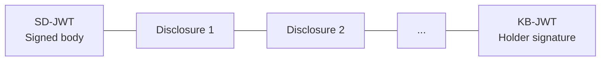
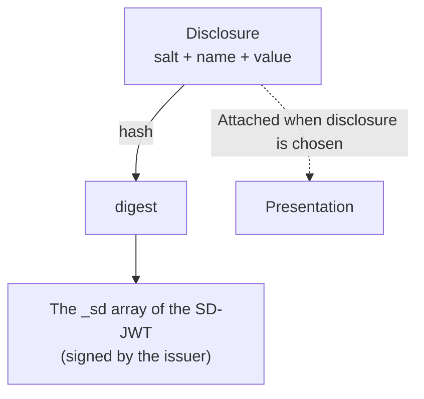
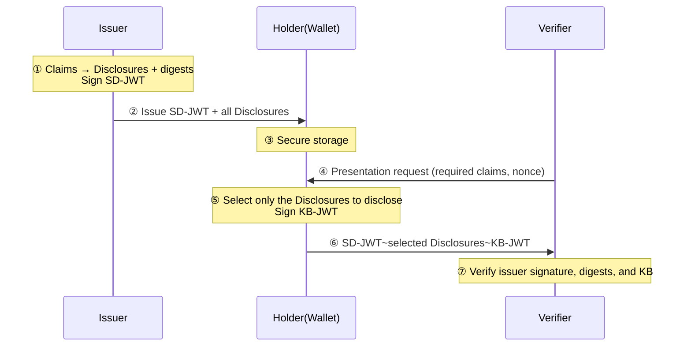

# SD-JWT VC Overview

| Item | Content |
|------|------|
| Subject | SD-JWT VC Overview and Selective Disclosure |
| Author | Open Source Development Team |
| Date | 2026-06-01 |
| Version | v1.0.0 |

## Change History

| Version | Date | Changes |
|------|------|-----------|
| v1.0.0 | 2026-06-01 | Initial version |

## Table of Contents

1. [What Is SD-JWT VC](#1-what-is-sd-jwt-vc)
2. [Why Selective Disclosure](#2-why-selective-disclosure)
3. [Overall Structure](#3-overall-structure)
4. [Core Components](#4-core-components)
5. [How Selective Disclosure Works](#5-how-selective-disclosure-works)
6. [Lifecycle at a Glance](#6-lifecycle-at-a-glance)
7. [Related Standards](#7-related-standards)

---

## 1. What Is SD-JWT VC

**SD-JWT VC (Selective Disclosure JWT Verifiable Credential)** is a
JWT-based credential format that supports **selective disclosure**.

With a regular JWT, presenting the token reveals every claim inside it as-is.
By contrast, with SD-JWT the **holder can choose which claims to disclose and which to keep hidden**.
For example, you can show only "whether the person is an adult" from an ID document while hiding the date of birth and address.

The advantages of SD-JWT VC are as follows.

- **Data minimization**: Only the items needed for verification are disclosed, protecting privacy.
- **JOSE ecosystem compatibility**: It operates on top of familiar JWT/JWS technology.
- **Holder binding**: Through Key Binding, only the legitimate holder can present the credential.

> SD-JWT is a general mechanism defined by the IETF, while **SD-JWT VC** is a profile that
> specializes it for credential use (e.g., specifying the credential type via `vct`).

---

## 2. Why Selective Disclosure

Real-world ID documents are "all or nothing." Even when checking your age at a bar,
your name, address, and license number are all exposed. In the digital world, this can be improved.

| Approach | Disclosure Scope |
|------|----------|
| Regular JWT | **All** claims inside the token are exposed |
| SD-JWT | Only the claims **selected** by the holder are exposed; the rest stay hidden |

Selective disclosure is a technical implementation of the **data minimization principle** of "proving only as much as necessary."

---

## 3. Overall Structure

An SD-JWT is a string formed by joining several parts with **tildes (`~`)**.

```
<SD-JWT>~<Disclosure 1>~<Disclosure 2>~...~<Key Binding JWT>
```



| Part | Description |
|------|------|
| **SD-JWT** | The JWT body signed by the issuer. Hidden claims are included as **hashes (digests)** |
| **Disclosure** | A fragment containing the "original value" of a hidden claim. Only those to be disclosed are attached |
| **KB-JWT** | The Key Binding JWT signed by the holder at presentation time (exists only in the presentation stage) |

> Right after issuance, all possible Disclosures are attached, and there is only a trailing `~` (no KB-JWT).
> At presentation time, the holder **keeps only the Disclosures to be disclosed** and appends the KB-JWT.

---

## 4. Core Components

### 4.1 SD-JWT Body
This is a JWT signed by the issuer. Hidden claims are included not as values but as **digests**,
which are collected in a special `_sd` array.

```jsonc
{
  "iss": "https://issuer.example.com",
  "vct": "https://example.com/identity_credential",
  "_sd": [                       // List of digests of the hidden claims
    "X9yH0Ajr...", "n4hmF7y2..."
  ],
  "_sd_alg": "sha-256",          // Digest hash algorithm
  "cnf": { "jwk": { /* Holder public key */ } }  // For Key Binding
}
```

### 4.2 Disclosure
This is a fragment that allows the original value of a single hidden claim to be recovered.
It is the Base64url encoding of a `[salt, claim name, value]` array.

```
["<random salt>", "given_name", "Gildong"]   →  Base64url encoding
```

### 4.3 Key Binding JWT (cnf)
The **`cnf`** claim in the SD-JWT body contains the holder's public key.
At presentation time, the holder signs a **KB-JWT** with the corresponding private key to prove that they are the legitimate holder.

---

## 5. How Selective Disclosure Works

The key point is that **"the issuer signs the hash of a value, not the value itself."**



- At issuance: Each claim is turned into a `[salt, name, value]` (Disclosure), and its **hash is placed into `_sd` and signed**.
- At presentation: **Only the Disclosures of the claims to be disclosed are attached**.
- At verification: The attached Disclosures are hashed and checked against the digests in `_sd` for a match.

Thanks to this structure, even if the holder omits some Disclosures,
the **issuer's signature remains valid**. This is because what is signed is not the "values" but the "list of hashes."

---

## 6. Lifecycle at a Glance



- ①②: [SD-JWT Issuance and Disclosure Creation](sdjwt_issuance_and_disclosure.md)
- ⑤⑥⑦: [SD-JWT Presentation and Verification](sdjwt_presentation_and_verification.md)

---

## 7. Related Standards

| Standard | Description | Link |
|------|------|------|
| SD-JWT | Selective Disclosure for JWTs (IETF) | <https://datatracker.ietf.org/doc/draft-ietf-oauth-selective-disclosure-jwt/> |
| SD-JWT VC | SD-JWT-based Verifiable Credentials | <https://datatracker.ietf.org/doc/draft-ietf-oauth-sd-jwt-vc/> |
| JWS | JSON Web Signature (RFC 7515) | <https://datatracker.ietf.org/doc/html/rfc7515> |
