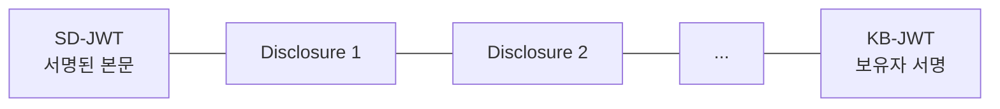
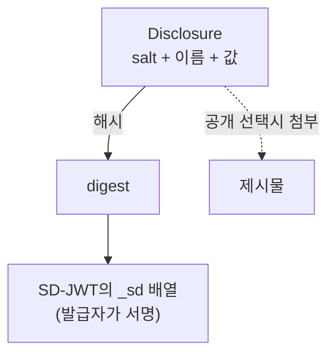
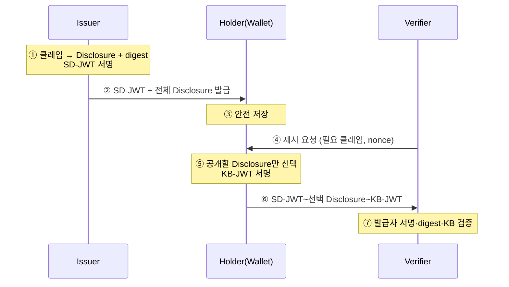

# SD-JWT VC 개요

| 항목 | 내용 |
|------|------|
| 주제 | SD-JWT VC 개요와 선택적 공개(Selective Disclosure) |
| 작성 | 오픈소스개발팀 |
| 일자 | 2026-06-01 |
| 버전 | v1.0.0 |

## 변경 이력

| 버전 | 일자 | 변경 내용 |
|------|------|-----------|
| v1.0.0 | 2026-06-01 | 초기 작성 |

## 목차

1. [SD-JWT VC란](#1-sd-jwt-vc란)
2. [왜 선택적 공개인가](#2-왜-선택적-공개인가)
3. [전체 구조](#3-전체-구조)
4. [핵심 구성 요소](#4-핵심-구성-요소)
5. [선택적 공개의 원리](#5-선택적-공개의-원리)
6. [생애주기 한눈에 보기](#6-생애주기-한눈에-보기)
7. [관련 표준](#7-관련-표준)

---

## 1. SD-JWT VC란

**SD-JWT VC(Selective Disclosure JWT Verifiable Credential)** 는
**선택적 공개**가 가능한, JWT 기반 자격증명 포맷이다.

일반 JWT는 토큰을 보여주면 그 안의 모든 클레임이 그대로 드러난다.
반면 SD-JWT는 **어떤 클레임을 공개하고 어떤 클레임을 숨길지 보유자가 선택**할 수 있다.
예를 들어 신분증에서 "성인 여부"만 보여주고 생년월일·주소는 숨길 수 있다.

SD-JWT VC의 장점은 다음과 같다.

- **최소 공개(data minimization)**: 검증에 필요한 항목만 공개해 프라이버시를 보호한다.
- **JOSE 생태계 호환**: 익숙한 JWT/JWS 기술 위에서 동작한다.
- **보유자 바인딩**: Key Binding을 통해 정당한 보유자만 제시할 수 있다.

> SD-JWT는 IETF가 정의한 일반 메커니즘이고, **SD-JWT VC**는 이를 자격증명 용도로
> 구체화한 프로파일이다(`vct`로 자격증명 타입을 지정하는 등).

---

## 2. 왜 선택적 공개인가

현실의 신분증은 "전부 아니면 전무"다. 술집에서 나이를 확인할 때도
이름·주소·면허번호가 모두 노출된다. 디지털에서는 이를 개선할 수 있다.

| 방식 | 공개 범위 |
|------|----------|
| 일반 JWT | 토큰 안의 **모든** 클레임이 노출 |
| SD-JWT | 보유자가 **선택한** 클레임만 노출, 나머지는 숨김 |

선택적 공개는 "필요한 만큼만 증명한다"는 **최소 공개 원칙**을 기술적으로 구현한 것이다.

---

## 3. 전체 구조

SD-JWT는 여러 부분을 **물결표(`~`)** 로 이어 붙인 문자열이다.

```
<SD-JWT>~<Disclosure 1>~<Disclosure 2>~...~<Key Binding JWT>
```



| 부분 | 설명 |
|------|------|
| **SD-JWT** | 발급자가 서명한 JWT 본문. 숨겨진 클레임은 **해시(digest)** 형태로 들어 있다 |
| **Disclosure** | 숨겨진 클레임의 "원본 값"을 담은 조각. 공개할 것만 첨부한다 |
| **KB-JWT** | 보유자가 제시 시점에 서명하는 Key Binding JWT (제시 단계에서만 존재) |

> 발급 직후에는 가능한 모든 Disclosure가 붙어 있고, 마지막 `~`만 있다(KB-JWT 없음).
> 제시 시점에 보유자가 **공개할 Disclosure만 남기고** KB-JWT를 덧붙인다.

---

## 4. 핵심 구성 요소

### 4.1 SD-JWT 본문
발급자가 서명한 JWT다. 숨김 처리된 클레임은 값이 아니라 **digest**로 들어가며,
특별한 `_sd` 배열에 모인다.

```jsonc
{
  "iss": "https://issuer.example.com",
  "vct": "https://example.com/identity_credential",
  "_sd": [                       // 숨겨진 클레임들의 digest 목록
    "X9yH0Ajr...", "n4hmF7y2..."
  ],
  "_sd_alg": "sha-256",          // digest 해시 알고리즘
  "cnf": { "jwk": { /* 보유자 공개키 */ } }  // Key Binding용
}
```

### 4.2 Disclosure
숨겨진 클레임 하나의 원본을 복원할 수 있는 조각이다.
`[salt, 클레임 이름, 값]` 배열을 Base64url로 인코딩한 것이다.

```
["<random salt>", "given_name", "Gildong"]   →  Base64url 인코딩
```

### 4.3 Key Binding JWT (cnf)
SD-JWT 본문의 **`cnf`** 클레임에는 보유자의 공개키가 들어 있다.
제시 시 보유자는 대응하는 개인키로 **KB-JWT**를 서명해, 자신이 정당한 보유자임을 증명한다.

---

## 5. 선택적 공개의 원리

핵심은 **"발급자는 값이 아니라 값의 해시를 서명한다"** 는 점이다.



- 발급 시: 각 클레임을 `[salt, 이름, 값]`(Disclosure)으로 만들고, 그 **해시를 `_sd`에 넣어 서명**한다.
- 제시 시: 공개할 클레임의 **Disclosure만 첨부**한다.
- 검증 시: 첨부된 Disclosure를 해시해서 `_sd`의 digest와 일치하는지 확인한다.

이 구조 덕분에 보유자가 일부 Disclosure를 빼더라도,
**발급자 서명은 그대로 유효**하다. 서명 대상이 "값"이 아니라 "해시 목록"이기 때문이다.

---

## 6. 생애주기 한눈에 보기



- ①②: [SD-JWT 발급과 Disclosure 생성](sdjwt_issuance_and_disclosure.md)
- ⑤⑥⑦: [SD-JWT 제시와 검증](sdjwt_presentation_and_verification.md)

---

## 7. 관련 표준

| 표준 | 설명 | 링크 |
|------|------|------|
| SD-JWT | Selective Disclosure for JWTs (IETF) | <https://datatracker.ietf.org/doc/draft-ietf-oauth-selective-disclosure-jwt/> |
| SD-JWT VC | SD-JWT-based Verifiable Credentials | <https://datatracker.ietf.org/doc/draft-ietf-oauth-sd-jwt-vc/> |
| JWS | JSON Web Signature (RFC 7515) | <https://datatracker.ietf.org/doc/html/rfc7515> |
