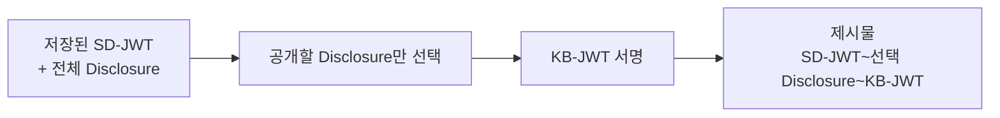
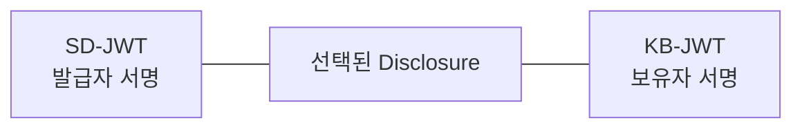
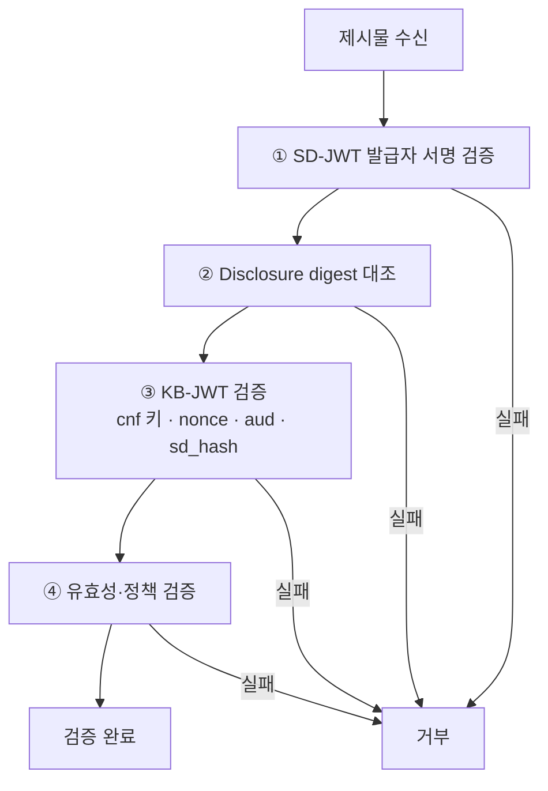
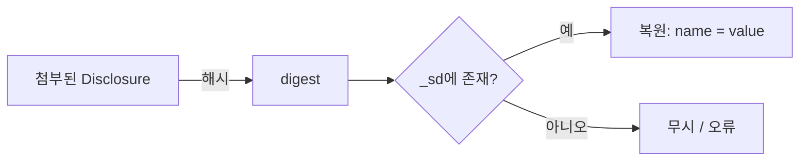

# SD-JWT 제시와 검증

| 항목 | 내용 |
|------|------|
| 주제 | Key Binding JWT, 선택적 공개 제시, 검증 절차 |
| 작성 | 오픈소스개발팀 |
| 일자 | 2026-06-01 |
| 버전 | v1.0.0 |

## 변경 이력

| 버전 | 일자 | 변경 내용 |
|------|------|-----------|
| v1.0.0 | 2026-06-01 | 초기 작성 |

## 목차

1. [제시 단계 개요](#1-제시-단계-개요)
2. [공개할 Disclosure 선택](#2-공개할-disclosure-선택)
3. [Key Binding JWT](#3-key-binding-jwt)
4. [제시물 구성](#4-제시물-구성)
5. [검증자의 검증 절차](#5-검증자의-검증-절차)
6. [숨겨진 클레임 복원](#6-숨겨진-클레임-복원)
7. [요약](#7-요약)

---

## 1. 제시 단계 개요

보유자(지갑)는 검증자의 요청을 받으면, 저장해 둔 SD-JWT에서
**공개할 클레임만 골라** 제시물을 구성한다. 이 과정은 두 가지 행위로 이뤄진다.

1. **선택**: 요청된(그리고 사용자가 동의한) 클레임의 Disclosure만 남긴다.
2. **바인딩**: 자신이 정당한 보유자임을 증명하는 **Key Binding JWT(KB-JWT)** 를 서명해 붙인다.



---

## 2. 공개할 Disclosure 선택

발급 시 보유자는 모든 Disclosure를 받아 보관한다.
제시 시에는 **검증자가 요구한 클레임에 해당하는 Disclosure만** 남기고 나머지는 버린다.

```
저장본:  SD-JWT~D(name)~D(birth_date)~D(age_over_18)~D(address)~

요청:    age_over_18 만 필요

제시본:  SD-JWT~D(age_over_18)~KB-JWT
```

빠진 Disclosure에 해당하는 클레임은 검증자에게 **digest로만 보일 뿐 원본 값은 알 수 없다.**
SD-JWT 본문 자체는 발급자 서명이 그대로 유지되므로, 일부를 빼도 무결성은 깨지지 않는다.

> 어떤 클레임을 요구하는지는 OID4VP의 [DCQL](../oid4vp/oid4vp_dcql_and_vptoken.md) 질의로 전달된다.

---

## 3. Key Binding JWT

**KB-JWT(Key Binding JWT)** 는 보유자가 제시 시점에 **자신의 개인키로 서명**하는 JWT다.
"이 SD-JWT의 정당한 보유자가, 이번 요청에 응답해 직접 제시한다"는 것을 증명한다.

```jsonc
// Header
{ "typ": "kb+jwt", "alg": "ES256" }
// Payload
{
  "nonce": "<검증자가 준 nonce>",   // 재전송 방지
  "aud": "<검증자 식별자>",          // 이 제시의 수신자
  "iat": 1711843200,                 // 제시 시각
  "sd_hash": "<제시되는 SD-JWT+Disclosure 전체의 해시>"
}
```

| 클레임 | 역할 |
|--------|------|
| `nonce` | 검증자가 발급한 일회성 값. 과거 제시물 재사용(재전송)을 막는다 |
| `aud` | 이 제시물이 향하는 검증자. 다른 곳에 재사용되지 못하게 한다 |
| `sd_hash` | 함께 제시되는 SD-JWT와 선택된 Disclosure 전체의 해시. 제시물 변조를 막는다 |

KB-JWT는 발급 시 SD-JWT에 박아 둔 **`cnf` 공개키**로 검증된다.
즉 개인키를 가진 정당한 보유자만 유효한 KB-JWT를 만들 수 있다.

---

## 4. 제시물 구성

최종 제시물은 다음과 같은 형태다.

```
<SD-JWT>~<선택한 Disclosure들>~<KB-JWT>
```



발급 직후의 저장본과 비교하면 차이는 두 가지다.
- Disclosure가 **요구된 것만** 남았다.
- 맨 끝에 **KB-JWT가 추가**되었다.

이 제시물은 [OID4VP](../oid4vp/oid4vp_overview.md)의 VP Token에 담겨 검증자에게 전달된다.

---

## 5. 검증자의 검증 절차

검증자는 제시물을 받아 다음 순서로 검증한다.



| 단계 | 확인 내용 | 실패 시 의미 |
|------|----------|------------|
| ① 발급자 서명 | SD-JWT가 신뢰 발급자의 서명이고 변조되지 않음 | 위조/변조 |
| ② digest 대조 | 첨부된 각 Disclosure의 해시가 `_sd`의 digest와 일치 | 클레임 변조 |
| ③ KB-JWT | `cnf` 공개키로 서명 검증 + nonce·aud·sd_hash 확인 | 보유자 위장/재전송 |
| ④ 유효성 | 유효기간, 발급자 신뢰, `vct` 등 정책 만족 | 만료/정책 위반 |

네 단계를 모두 통과해야 제시가 유효한 것으로 인정된다.
이는 OID4VP가 말하는 [세 가지 신뢰 축](../oid4vp/oid4vp_overview.md#6-신뢰와-보안의-기본-원칙)
(발급자·보유자·요청)과 정확히 대응한다.

---

## 6. 숨겨진 클레임 복원

검증자는 첨부된 Disclosure로부터 클레임 값을 복원한다. 절차는 다음과 같다.

1. 각 Disclosure를 해시해 digest를 구한다.
2. 그 digest가 SD-JWT의 `_sd` 배열에 있는지 확인한다.
3. 있으면, Disclosure를 디코딩해 `[salt, 이름, 값]`에서 **이름·값**을 꺼내 클레임으로 복원한다.



`_sd`에 매칭되지 않는 Disclosure는 받아들이면 안 된다(주입 공격 방지).
반대로 제시되지 않은 digest(미공개 클레임, [decoy](sdjwt_issuance_and_disclosure.md#6-decoy-digest))는
값을 알 수 없으므로 그대로 무시된다.

---

## 7. 요약

- **제시**는 "공개할 Disclosure만 선택 + KB-JWT 서명"의 두 행위로 구성된다.
- **KB-JWT**는 `cnf` 키 기반으로 보유자를, `nonce`로 신선도를, `sd_hash`로 무결성을 보장한다.
- **검증**은 발급자 서명 → digest 대조 → KB-JWT → 유효성의 순서로 진행된다.
- 빠진 클레임은 digest로만 남아 값이 드러나지 않으므로, **선택적 공개와 무결성이 동시에 성립**한다.
