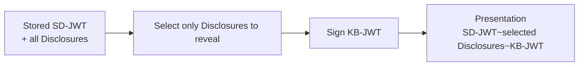
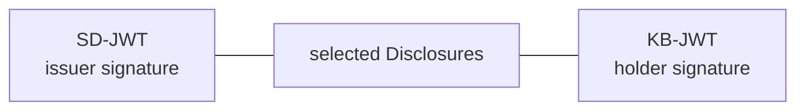
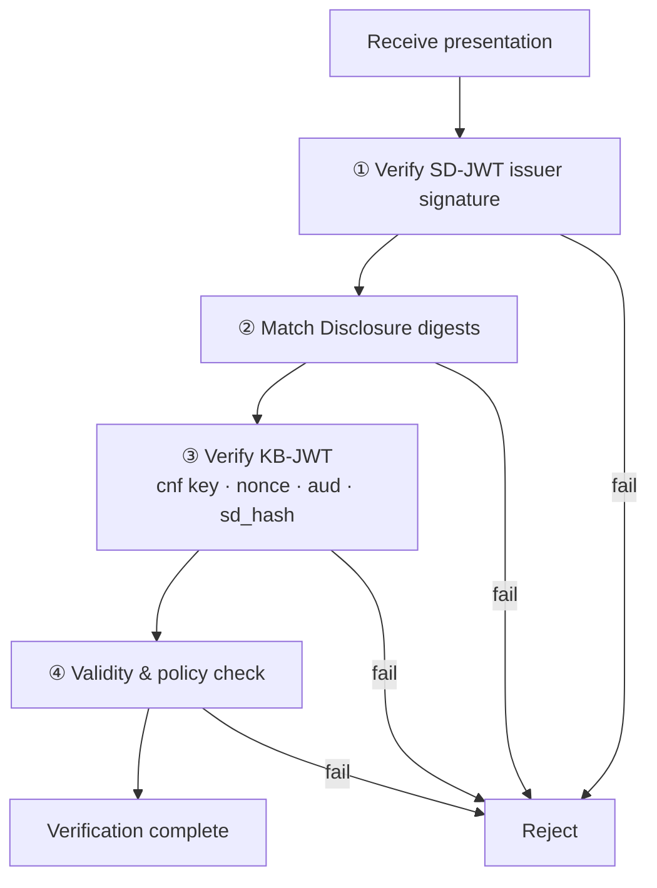
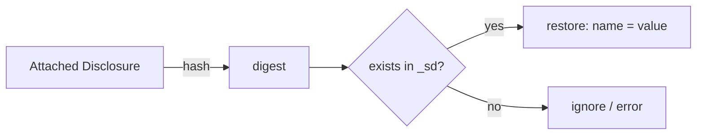

# SD-JWT Presentation and Verification

| Item | Content |
|------|---------|
| Subject | Key Binding JWT, Selective Disclosure Presentation, Verification Procedure |
| Author | Open Source Development Team |
| Date | 2026-06-01 |
| Version | v1.0.0 |

## Change History

| Version | Date | Changes |
|---------|------|---------|
| v1.0.0 | 2026-06-01 | Initial version |

## Table of Contents

1. [Overview of the Presentation Phase](#1-overview-of-the-presentation-phase)
2. [Selecting Disclosures to Reveal](#2-selecting-disclosures-to-reveal)
3. [Key Binding JWT](#3-key-binding-jwt)
4. [Composing the Presentation](#4-composing-the-presentation)
5. [The Verifier's Verification Procedure](#5-the-verifiers-verification-procedure)
6. [Restoring Hidden Claims](#6-restoring-hidden-claims)
7. [Summary](#7-summary)

---

## 1. Overview of the Presentation Phase

When the holder (wallet) receives a request from a verifier, it composes a presentation by
**selecting only the claims to reveal** from the stored SD-JWT. This process consists of two actions.

1. **Selection**: Keep only the Disclosures for the requested (and user-consented) claims.
2. **Binding**: Sign and attach a **Key Binding JWT (KB-JWT)** that proves the holder is the legitimate owner.



---

## 2. Selecting Disclosures to Reveal

At issuance, the holder receives and stores all Disclosures.
At presentation time, it keeps **only the Disclosures corresponding to the claims requested by the verifier** and discards the rest.

```
Stored:        SD-JWT~D(name)~D(birth_date)~D(age_over_18)~D(address)~

Request:       only age_over_18 is needed

Presentation:  SD-JWT~D(age_over_18)~KB-JWT
```

For claims whose Disclosure is omitted, the verifier **sees only a digest and cannot know the original value.**
Since the SD-JWT body itself retains the issuer's signature, removing some Disclosures does not break integrity.

> Which claims are requested is conveyed via the OID4VP [DCQL](../oid4vp/oid4vp_dcql_and_vptoken.md) query.

---

## 3. Key Binding JWT

The **KB-JWT (Key Binding JWT)** is a JWT that the holder **signs with its own private key** at presentation time.
It proves that "the legitimate holder of this SD-JWT is presenting it directly in response to this request."

```jsonc
// Header
{ "typ": "kb+jwt", "alg": "ES256" }
// Payload
{
  "nonce": "<nonce given by the verifier>",   // replay prevention
  "aud": "<verifier identifier>",              // the recipient of this presentation
  "iat": 1711843200,                           // presentation time
  "sd_hash": "<hash of the entire presented SD-JWT + Disclosures>"
}
```

| Claim | Role |
|-------|------|
| `nonce` | A one-time value issued by the verifier. Prevents reuse (replay) of past presentations |
| `aud` | The verifier this presentation is directed to. Prevents reuse elsewhere |
| `sd_hash` | The hash of the SD-JWT together with all selected Disclosures presented alongside it. Prevents tampering with the presentation |

The KB-JWT is verified using the **`cnf` public key** embedded in the SD-JWT at issuance.
That is, only the legitimate holder possessing the private key can produce a valid KB-JWT.

---

## 4. Composing the Presentation

The final presentation has the following form.

```
<SD-JWT>~<selected Disclosures>~<KB-JWT>
```



Compared to the stored copy right after issuance, there are two differences.
- Only the **requested Disclosures** remain.
- A **KB-JWT is appended** at the very end.

This presentation is carried in the VP Token of [OID4VP](../oid4vp/oid4vp_overview.md) and delivered to the verifier.

---

## 5. The Verifier's Verification Procedure

The verifier receives the presentation and verifies it in the following order.



| Step | What is checked | Meaning of failure |
|------|-----------------|--------------------|
| ① Issuer signature | The SD-JWT is signed by a trusted issuer and has not been tampered with | Forgery/tampering |
| ② Digest matching | The hash of each attached Disclosure matches a digest in `_sd` | Claim tampering |
| ③ KB-JWT | Signature verified with the `cnf` public key + nonce·aud·sd_hash checked | Holder impersonation/replay |
| ④ Validity | Validity period, issuer trust, `vct`, and other policies are satisfied | Expired/policy violation |

A presentation is recognized as valid only if it passes all four steps.
This corresponds exactly to the [three axes of trust](../oid4vp/oid4vp_overview.md#6-trust-and-security-fundamentals)
(issuer, holder, request) described by OID4VP.

---

## 6. Restoring Hidden Claims

The verifier restores claim values from the attached Disclosures. The procedure is as follows.

1. Hash each Disclosure to obtain its digest.
2. Check whether that digest exists in the SD-JWT's `_sd` array.
3. If it does, decode the Disclosure and extract the **name and value** from `[salt, name, value]` to restore the claim.



A Disclosure that does not match anything in `_sd` must not be accepted (injection attack prevention).
Conversely, digests that are not presented (undisclosed claims, [decoy](sdjwt_issuance_and_disclosure.md#6-decoy-digest))
have unknown values and are simply ignored.

---

## 7. Summary

- **Presentation** consists of two actions: "select only the Disclosures to reveal + sign a KB-JWT."
- **The KB-JWT** guarantees the holder via the `cnf` key, freshness via the `nonce`, and integrity via the `sd_hash`.
- **Verification** proceeds in the order: issuer signature → digest matching → KB-JWT → validity.
- Omitted claims remain only as digests so their values are not revealed, meaning **selective disclosure and integrity hold simultaneously**.
