# OID4VC PoC Project Installation and Running Guide

This document describes how to install and run the OID4VC PoC project. Follow the steps below to proceed.

---

## 1. System Requirements

To install and run the OID4VC PoC project, the following requirements must be met.

- **MacOS or Linux**
- **Java 21**
- **Gradle 7.0 or higher** (including Gradle Wrapper)
- **Git installed**
- **Bash support**

### Optional (For mobile app testing)
- **Android Studio and Android SDK** (for Android app testing)
- **Xcode and iOS SDK** (for iOS app testing)

---

## 2. Project Clone

Clone the OID4VC PoC project to your local environment. Enter the following command in the terminal to download the project.

```bash
git clone https://github.com/OmniOneID/poc-oid4vc.git
cd poc-oid4vc
```

---

## 3. Project Structure

The OID4VC PoC project is organized with the following structure:

```
poc-oid4vc
├── source/
│   ├── apps/                          # Test mobile apps
│   │   ├── android-app/               # Android wallet app
│   │   └── ios-app/                   # iOS wallet app
│   └── servers/                       # Backend servers
│       ├── issuer-server/             # Issuer server (includes Authorization)
│       └── verifier-server/           # Verifier server
├── docs/                              # Documentation folder
│   └── api/
│       ├── issuer-server/             # Issuer SDK integration guide and API docs
│       └── verifier-server/           # Verifier SDK integration guide and API docs
```

---

## 4. Backend Server Running

The OID4VC PoC project consists of 2 backend servers. Each server is implemented based on Spring Boot and includes SDKs as submodules.

| Server | Role | Included SDKs |
| :--- | :--- | :--- |
| **Issuer Server** | VC issuance and OAuth 2.0 authorization per OID4VCI standard | `did-oid4vci-sdk-server`, `did-oid4vc-authorization-sdk-server`, `did-oid4vc-formatter-sdk-server` |
| **Verifier Server** | VP verification per OID4VP standard | `did-oid4vp-sdk-server`, `did-oid4vc-formatter-sdk-server` |

> **Note**: For detailed configuration of each server (application.yml, metadata, DB setup, SDK integration, etc.), refer to the **SDK Integration Guides** below.
> - Issuer Server: [OID4VCI SDK Integration Guide](../api/issuer-server/OID4VCI_SDK-INTEGRATION_GUIDE.md)
> - Verifier Server: [OID4VP SDK Integration Guide](../api/verifier-server/OID4VP_SDK-INTEGRATION_GUIDE.md)

### 4.1. Common Configuration

Before running all servers, navigate to the source folder:

```bash
cd source/servers
```

### 4.2. Running Issuer Server

**Role**: Issues VC (Verifiable Credential) according to the OID4VCI standard and manages OAuth 2.0 based authentication/authorization.

#### 4.2.1. Running Using IDE (Recommended)

1. Open the `source/servers/issuer-server` folder as a project in an IDE such as IntelliJ IDEA or Eclipse.
2. The IDE's Gradle build system will automatically download the dependencies.
3. Verify the profile settings and detailed configuration in `application.yml`.
   - For detailed configuration, refer to [OID4VCI SDK Integration Guide](../api/issuer-server/OID4VCI_SDK-INTEGRATION_GUIDE.md).
4. Set up the Run Configuration as follows:
   - Main Class: `com.example.did.oid4vc.issuer.IssuerApplication`
   - Working directory: `source/servers/issuer-server`
5. Click the Run button to start the server.
6. Verify normal operation by confirming the message "Started IssuerApplication in ... seconds" in the console.

#### 4.2.2. Running via Console Command

```bash
cd issuer-server

# Grant execution permission to Gradle Wrapper
chmod 755 ./gradlew

# Build the project
./gradlew clean build

# Run the JAR file
java -jar build/libs/issuer-server-1.0.0.jar
```

**Default Port**: `8080`

#### 4.2.3. Access via Browser

Once the Issuer Server is running normally, access the following address in your browser.

```
http://<current_IP>:8080/oid4vci/test
```

For example, if running in a local environment:

```
http://localhost:8080/oid4vci/test
```

You can see the initial test page as shown below.

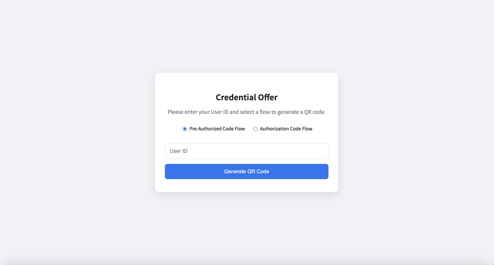

### 4.3. Running Verifier Server

**Role**: Verifies VP (Verifiable Presentation) according to the OID4VP standard.

#### 4.3.1. Running Using IDE (Recommended)

1. Open the `source/servers/verifier-server` folder as a project in a separate IDE window or tab.
2. The IDE's Gradle build system will automatically download the dependencies.
3. Verify the profile settings and detailed configuration in `application.yml`.
   - For detailed configuration, refer to [OID4VP SDK Integration Guide](../api/verifier-server/OID4VP_SDK-INTEGRATION_GUIDE.md).
4. Set up the Run Configuration as follows:
   - Main Class: `com.example.did.oid4vc.verifier.VerifierApplication`
   - Working directory: `source/servers/verifier-server`
5. Click the Run button to start the server.
6. Verify normal operation by confirming the message "Started VerifierApplication in ... seconds" in the console.

#### 4.3.2. Running via Console Command

```bash
cd verifier-server

# Grant execution permission to Gradle Wrapper
chmod 755 ./gradlew

# Build the project
./gradlew clean build

# Run the JAR file
java -jar build/libs/verifier-example-server-3.0.0.jar
```

**Default Port**: `8081`

#### 4.3.3. Access via Browser

Once the Verifier Server is running normally, access the following address in your browser.

```
http://<current_IP>:8081/oid4vp/test
```

For example, if running in a local environment:

```
http://localhost:8081/oid4vp/test
```

You can see the initial test page as shown below.

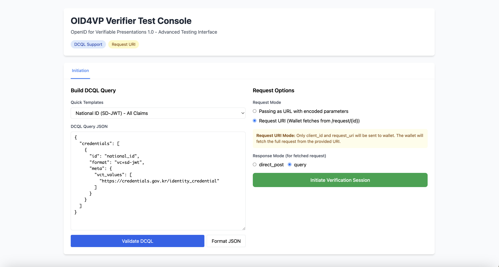

---

## 5. Running Test Apps

### 5.1. Running Android App

#### Prerequisites
- Android Studio installed
- Android SDK installed (minimum API level 21 or higher)
- Android emulator or actual Android device

#### Running Method

1. Launch Android Studio.
2. Select **File → Open** to open the `source/apps/android-app` folder.
3. Wait for Android Studio to load the Gradle project and download dependencies.
4. Click the green ▶ button at the top menu.
5. Select an emulator or connected device.
6. The app will be installed and run.

#### Initial Screen
You can see the initial app screen as shown below.

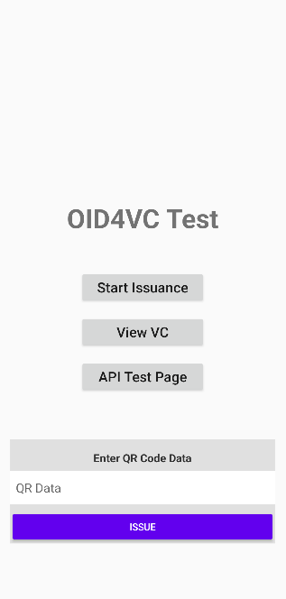

#### API Test Server Connection Settings

To connect the Android app to the backend server for API testing:

Generally configure as follows:
   - Issuer Server: `http://10.0.2.2:8080`

> **Tip**: To access localhost on the host machine from an emulator, use `10.0.2.2`.

> **Note**: You must change the default IP addresses of the backend servers to `10.0.2.2` in the server settings.

### 5.2. Running iOS App

#### Prerequisites
- Xcode installed (only available on macOS)
- iOS SDK installed
- iOS simulator or actual iOS device

#### Running Method

1. Launch Xcode.
2. Select **File → Open** to open the `source/apps/ios-app` folder.
3. When opening the project in the Xcode window, select the `.xcodeproj` or `.xcworkspace` file.
4. Select the target simulator or device in the Scheme selection area at the top.
5. Select **Product → Run** or press Command + R.
6. The app will be built and run on the simulator or device.

#### Initial Screen
You can see the initial app screen as shown below.

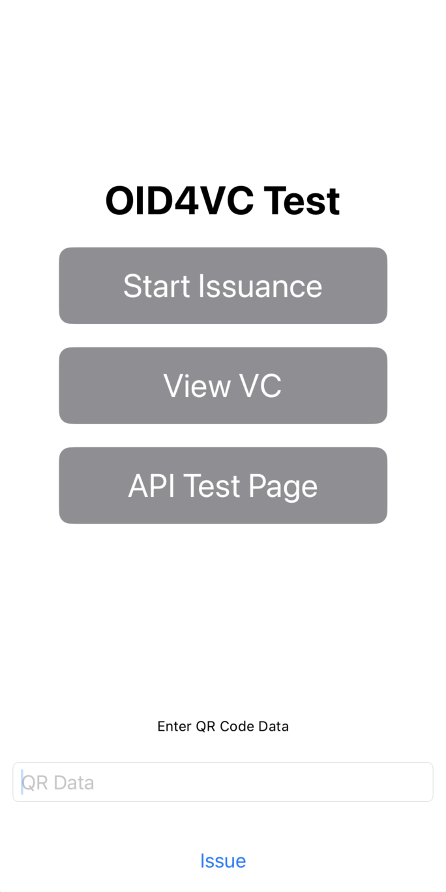

#### API Test Server Connection Settings

To connect the iOS app to the backend server for API testing:

Generally configure as follows:
   - Issuer Server: `http://localhost:8080`

> **Tip**: From the iOS simulator, you can directly use `localhost` or `127.0.0.1` to access the host machine's localhost.

> **Note**: You must change the default IP addresses of the backend servers to `localhost` or `127.0.0.1` in the server settings.

---

## 6. OID4VC Testing Procedure

Once the backend servers and test apps are running, you can now perform OID4VC testing.
Based on the Android app, you can perform testing following the procedure below.

### 6.1. OID4VCI Testing Procedure

OID4VCI operates through two main flows: `Authorization Code` and `Pre-Authorized Code` Flow. Based on the `Pre-Authorized Code` Flow, you can perform OID4VCI testing following the procedure below.

#### 6.1.1. Generate Credential Offer from Issuer Server

1. Access the following address in your browser.

```groovy
http://<current_IP>:8080/oid4vci/test

// For example, if running in a local environment: http://localhost:8080/oid4vci/test
```

2. The initial test page will be displayed. To generate a `Credential Offer`, enter an arbitrary `User ID` and click `Generate QR Code`.

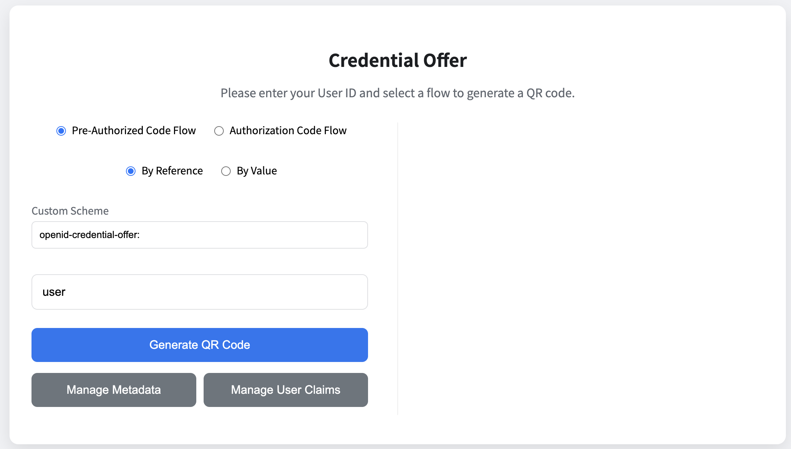

3. Next, a QR Code corresponding to the `Credential Offer` will be generated as shown below. However, QR scanning may not work smoothly when the test app runs on an emulator, so copy the data below `Full Offer URI (qrData)`.

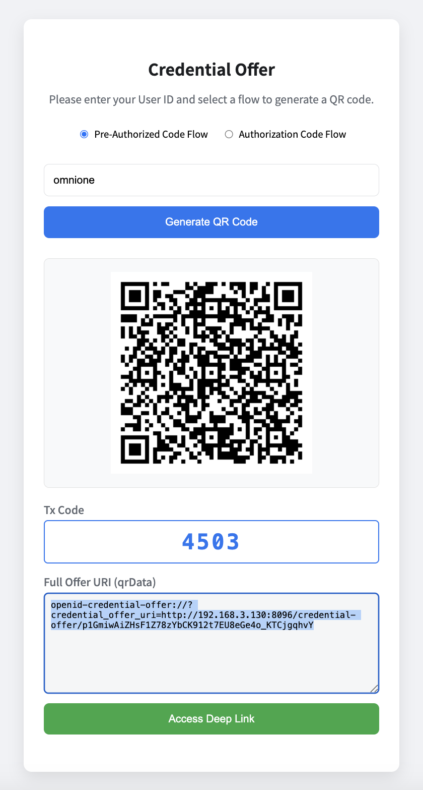

#### 6.1.2. Start Issuance

1. In the Android emulator running the test app, paste the copied data below `Enter QR Code Data` at the bottom and click `Issue`.

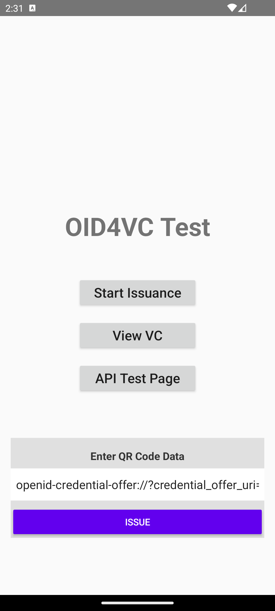

2. When the `Please register a PIN` screen appears, enter the 4-digit `Tx Code` from the Issuer test page as is.

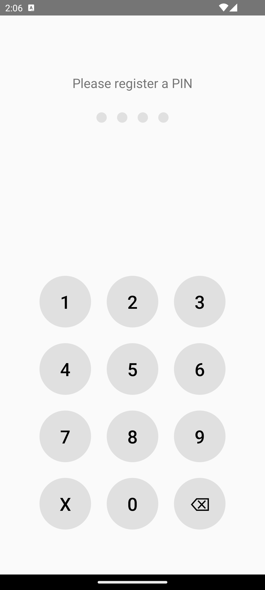

3. Next, when the `Select Issued Credential` popup appears, select `NationalID` and click `CONFIRM`. (SD-JWT VC issuance)

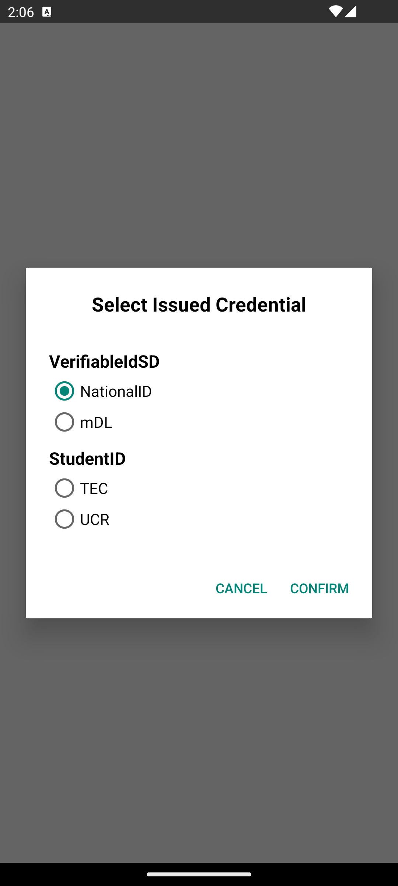

4. After that, VC issuance is completed.

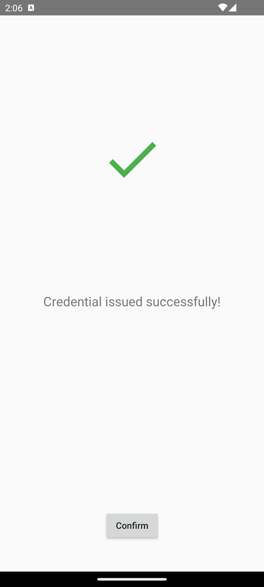

#### 6.1.3. View VC

1. Click `View VC` in the test app.


2. Information such as claims for the issued VC will be displayed normally as shown below.

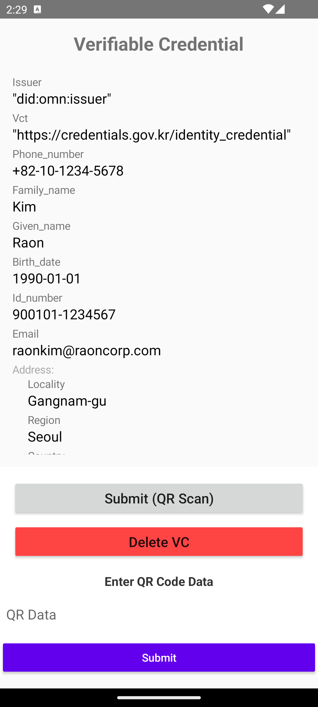

3. If VC issuance did not proceed normally or if `View VC` is clicked before issuing a VC, an alert and error screen will be displayed as shown below.

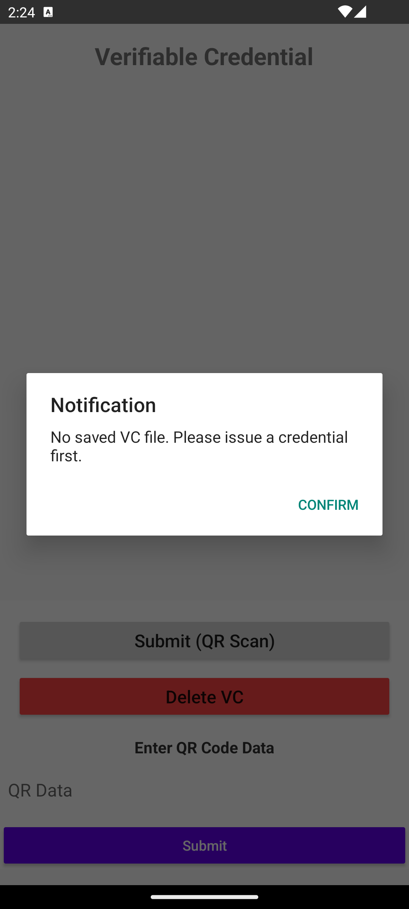

### 6.2. OID4VP Testing Procedure

After successfully issuing `SD-JWT VC` through the OID4VCI testing procedure above, you can proceed with OID4VP testing.
OID4VP operates through two main flows: `Same Device` and `Cross Device` Flow.
Based on the `Cross Device` Flow, you can perform OID4VP testing following the procedure below.

#### 6.2.1. Generate Authorization Request from Verifier Server

1. Access the following address in your browser.

```groovy
http://<current_IP>:8081/oid4vp/test

// For example, if running in a local environment: http://localhost:8081/oid4vp/test
```

2. The initial test page will be displayed. To generate an `Authorization Request`, click `Initiate Verification Session`.


3. Next, a QR Code corresponding to the `Authorization Request` will be generated as shown below. However, QR scanning may not work smoothly when the test app runs on an emulator, so copy the data below `Authorization Request URL`.

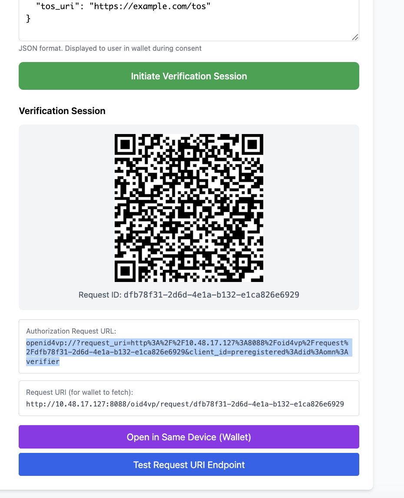

#### 6.2.2. View and Submit VC

1. Click `View VC` in the test app running on the Android emulator.


2. Information about the issued VC will be displayed normally as shown below. Paste the copied data below `Enter QR Code Data` at the bottom of the test app and click `Submit`.

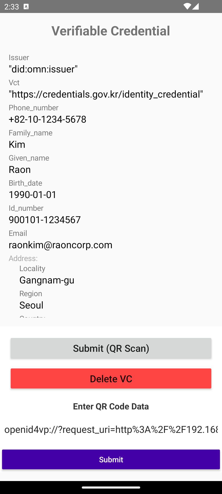

3. After that, VP submission is completed normally. The appearance of the screen below means that signature verification and other processes for the submitted `SD-JWT VP Token` have been completed normally on the Verifier server.

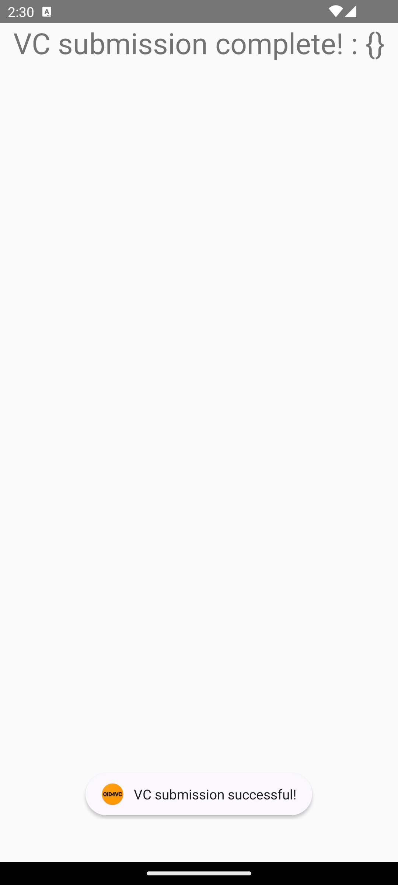

---

## 7. Detailed Documentation References

The basic installation and running of the OID4VC project is complete. For detailed configuration and operation of each component, refer to the following documentation.

### 7.1. SDK Integration Guides

| Server | Guide | Description |
| :--- | :--- | :--- |
| **Issuer Server** | [OID4VCI SDK Integration Guide](../api/issuer-server/OID4VCI_SDK-INTEGRATION_GUIDE.md) | build.gradle, application.yml, metadata, DB setup, Provider, etc. |
| **Verifier Server** | [OID4VP SDK Integration Guide](../api/verifier-server/OID4VP_SDK-INTEGRATION_GUIDE.md) | build.gradle, application.yml, storage mode settings, Repository, Controller, etc. |

### 7.2. Backend Server Documentation

| Server | Description | Documentation |
| :--- | :--- | :--- |
| **Issuer Server** | VC issuance server per OID4VCI standard (includes Authorization) | [README](../../source/servers/issuer-server/README.md) |
| **Verifier Server** | VP verification server per OID4VP standard | [README](../../source/servers/verifier-server/README.md) |

### 7.3. API Documentation

| Server | Documentation | Error Codes |
| :--- | :--- | :--- |
| **Issuer Server** | [Server API](../api/issuer-server/OID4VCI_SDK-SERVER_API.md) | [OID4VCI SDK Errors](../api/issuer-server/OID4VCISDKError.md), [Formatter SDK Errors](../api/issuer-server/FormatterSDKError.md) |
| **Verifier Server** | [Server API](../api/verifier-server/OID4VP_SDK-SERVER_API.md) | [OID4VP SDK Errors](../api/verifier-server/OID4VPSDKError.md), [Formatter SDK Errors](../api/verifier-server/FormatterSDKError.md) |

### 7.4. Test App Documentation

| App | Description | Documentation |
| :--- | :--- | :--- |
| **Android App** | Android-based OID4VC sample application | [README](../../source/apps/android-app/README.md) |
| **iOS App** | iOS-based OID4VC sample application | [README](../../source/apps/ios-app/README.md) |

---

## Appendix A. Notes on EUDI Wallet Interoperability

Refer to the following notes when testing the Open DID Issuer/Verifier servers with the [EUDI Wallet](https://github.com/eu-digital-identity-wallet/eudi-app-android-wallet-ui).

### A.1. HTTPS Configuration

The EUDI Wallet only supports HTTPS communication, so the Open DID Issuer/Verifier servers must be served over HTTPS.
In a local development environment, you can use a tunneling tool such as [ngrok](https://ngrok.com/) to easily set up HTTPS endpoints.

```bash
# Create an HTTPS tunnel for the Issuer Server (port 8080)
ngrok http 8080

# Create an HTTPS tunnel for the Verifier Server (port 8081)
ngrok http 8081
```

After running ngrok, apply the generated URL (e.g., `https://xxxx.ngrok-free.app`) to your server configuration.

### A.2. Trust Configuration for EUDI Wallet

A custom build of the EUDI Wallet app is required so that it can trust the Open DID Issuer/Verifier servers. Refer to the guide below to perform the build.

- [EUDI Wallet Android - How to Build](https://github.com/eu-digital-identity-wallet/eudi-app-android-wallet-ui/blob/main/wiki/how_to_build.md)

### A.3. EUDI Wallet Version Used for Testing

The interoperability tests for this project were performed with the following version of the EUDI Wallet.

| Item | Details |
| :--- | :--- |
| **Release** | [Demo_Version=2026.02.35-Demo_Build=35](https://github.com/eu-digital-identity-wallet/eudi-app-android-wallet-ui/releases/tag/Wallet%2FDemo_Version%3D2026.02.35-Demo_Build%3D35) |
| **Commit** | [`bb00869`](https://github.com/eu-digital-identity-wallet/eudi-app-android-wallet-ui/commit/bb008698fe48fcd3f7224d516aca0748fb1566f3) |

---
