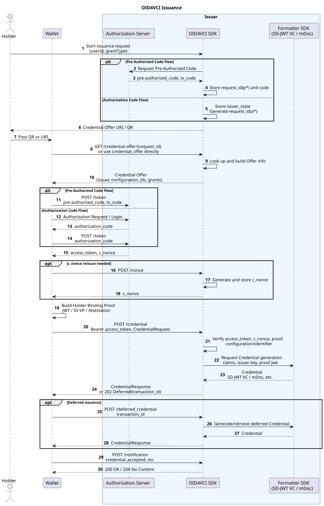

---
puppeteer:
    pdf:
        format: A4
        displayHeaderFooter: true
        landscape: false
        scale: 0.8
        margin:
            top: 1.2cm
            right: 1cm
            bottom: 1cm
            left: 1cm
    image:
        quality: 100
        fullPage: false
---

OID4VCI Issuance
==

- Subject : OID4VCI Issuance Protocol
- Author : Open Source Development Team
- Date : 2026-06-01
- Version : v1.0.0

| Version | Date       | Change |
| ------- | ---------- | ------ |
| v1.0.0 | 2026-06-01 | Initial version |

<br>

Table of Contents
---

<!-- TOC tocDepth:2..4 chapterDepth:2..6 -->

- [1. Overview](#1-overview)
    - [1.1. Reference Documents and Analysis Targets](#11-reference-documents-and-analysis-targets)
- [2. Common Items](#2-common-items)
    - [2.1. Roles](#21-roles)
    - [2.2. Supported Credential Formats](#22-supported-credential-formats)
    - [2.3. Key Endpoints](#23-key-endpoints)
    - [2.4. Data Types and Constants](#24-data-types-and-constants)
- [3. Preparation Procedure](#3-preparation-procedure)
    - [3.1. Issuer Metadata Configuration](#31-issuer-metadata-configuration)
    - [3.2. Credential Configuration Setup](#32-credential-configuration-setup)
    - [3.3. User Claims and Signing Key Configuration](#33-user-claims-and-signing-key-configuration)
- [4. Issuance Procedure](#4-issuance-procedure)
    - [4.1. Credential Offer Generation](#41-credential-offer-generation)
    - [4.2. Credential Offer Delivery](#42-credential-offer-delivery)
    - [4.3. Access Token Issuance](#43-access-token-issuance)
    - [4.4. Nonce Issuance](#44-nonce-issuance)
    - [4.5. Credential Issuance Request](#45-credential-issuance-request)
    - [4.6. Deferred Credential Retrieval](#46-deferred-credential-retrieval)
    - [4.7. Credential Status Notification](#47-credential-status-notification)
- [5. Key Data Structures](#5-key-data-structures)
    - [5.1. CredentialOfferResponse](#51-credentialofferresponse)
    - [5.2. TokenRequest](#52-tokenrequest)
    - [5.3. TokenResponse](#53-tokenresponse)
    - [5.4. CredentialRequest](#54-credentialrequest)
    - [5.5. CredentialResponse](#55-credentialresponse)
    - [5.6. IssuerMetadataResponse](#56-issuermetadataresponse)

<!-- /TOC -->

<div style="page-break-after: always;"></div>

## 1. Overview

This document organizes the OpenID for Verifiable Credential Issuance (OID4VCI) issuance flow from the perspectives of protocol, API, and data format.

The issuance flow is as follows.

1. Issuer pre-configuration
    - Register Issuer Metadata
    - Register Credential Configuration
    - Configure user claims and the Issuer signing key provider
1. Issuance initiation
    - The Issuer or a test screen generates a Credential Offer URI
    - The Wallet receives the Offer via an `openid-credential-offer://` URI or a QR code
1. Authorization
    - Use the Pre-Authorized Code Flow or the Authorization Code Flow
    - The Wallet obtains an Access Token and a `c_nonce` from the Token Endpoint
1. Credential issuance
    - The Wallet calls the Credential Endpoint including a Holder Binding Proof
    - The Issuer validates the Access Token, Proof, `c_nonce`, and Credential Configuration
    - The Issuer generates a Credential in the configured format, such as SD-JWT VC or MSO mDoc
1. Follow-up processing
    - For deferred issuance, the Deferred Credential Endpoint is queried
    - The Wallet may notify the storage result to the Notification Endpoint

### 1.1. Reference Documents and Analysis Targets

| Reference | Document Name | Location |
| --------- | ------------- | -------- |
| [OID4VCI] | OpenID for Verifiable Credential Issuance 1.0 | https://openid.net/specs/openid-4-verifiable-credential-issuance-1_0.html |

<div style="page-break-after: always;"></div>

## 2. Common Items

### 2.1. Roles

| Role | Description |
| ---- | ----------- |
| Issuer | The entity that issues Credentials, providing the Metadata, Offer, and Credential Endpoints. |
| Authorization Server | Exchanges a Pre-Authorized Code or Authorization Code for an Access Token. It can be configured as a separate module or as the `/token` endpoint within the Issuer. |
| Wallet | Receives the Credential Offer and performs Token and Credential issuance requests. |
| Holder | The subject of the Credential, who generates the Holder Binding Proof through the Wallet. |

### 2.2. Supported Credential Formats

The actual Credential generator is selected according to the `format` value of the Credential Configuration.

| Format | Description |
| ------ | ----------- |
| `dc+sd-jwt` | A Credential based on SD-JWT VC. It supports selective disclosure and Key Binding. |
| `mso_mdoc` | A Credential based on ISO/IEC 18013-5 mDoc. Used for issuing mDoc documents such as mDL and PID. |
| OpenDID VC | OpenDID VC family formats can be generated depending on the generator registration status of the Formatter SDK. |

### 2.3. Key Endpoints

Issuer endpoints are dynamically registered by reading the endpoint values from the Metadata. The default examples are as follows.

| API | Method | Endpoint | Description |
| --- | ------ | -------- | ----------- |
| Retrieve Credential Offer | `GET` | `/credential-offer/{request_id}` | Returns the Credential Offer corresponding to the Offer Request ID. |
| Retrieve Issuer Metadata | `GET` | `/.well-known/openid-credential-issuer` | Returns the Issuer capabilities, endpoints, and Credential Configuration. |
| Issue Access Token | `POST` | `/token` | Exchanges a Pre-Authorized Code or similar for an Access Token. |
| Issue Credential | `POST` | `/credential` | Validates the Access Token and Proof and issues a Credential. |
| Retrieve Deferred Credential | `POST` | `/deferred_credential` | Retrieves the Credential of a deferred issuance transaction. |
| Issue Nonce | `POST` | `/nonce` | Issues a `c_nonce` to be used for Proof validation. |
| Notification | `POST` | `/notification` | Receives the Wallet's Credential storage result. |
| Retrieve Credential Identifier | `GET` | `/get-credential-identifier` | Returns the list of Identifiers mapped to a Credential Configuration ID. |

### 2.4. Data Types and Constants

Items not defined here refer to `[OID4VCI]`.

```c#
def enum GRANT_TYPE: "OID4VCI grant type"
{
    "authorization_code" : "Authorization Code Flow"
    "urn:ietf:params:oauth:grant-type:pre-authorized_code": "Pre-Authorized Code Flow"
}

def enum OFFER_DELIVERY: "Credential Offer delivery method"
{
    "credential_offer"    : "by value method that includes the Offer as a value in the URI"
    "credential_offer_uri": "by reference method that delivers an Offer retrieval URI"
}

def enum PROOF_TYPE: "Holder Binding Proof type"
{
    "jwt"        : "JWT proof"
    "di_vp"      : "Data Integrity VP proof"
    "attestation": "Attestation proof"
}
```

<div style="page-break-after: always;"></div>

## 3. Preparation Procedure

Before performing OID4VCI issuance, the Issuer prepares the following information.

1. Issuer Metadata
    - Issuer identifier
    - Credential, Nonce, Deferred, and Notification endpoints
    - Supported Credential Configurations
    - Supported Grants and encryption policies
1. Credential Configuration
    - Credential Configuration ID
    - Credential format
    - Credential Identifier
    - Proof Type and signing algorithm
    - Display information and Credential Definition
1. Data providers
    - `UserDataProvider`: Provides the user claims to be included in the Credential
    - `KeyDataProvider`: Provides the Issuer signing key and Credential Schema information
    - `CredentialConfigurationSource`: Retrieves the Credential Configuration from the Metadata/settings

### 3.1. Issuer Metadata Configuration

The Wallet retrieves the Issuer Metadata to check the capabilities and endpoints of the issuance server.

```json
{
  "credential_issuer": "http://localhost:8080",
  "credential_offer_endpoint": "http://localhost:8080/credential-offer",
  "credential_endpoint": "http://localhost:8080/credential",
  "nonce_endpoint": "http://localhost:8080/nonce",
  "deferred_credential_endpoint": "http://localhost:8080/deferred_credential",
  "notification_endpoint": "http://localhost:8080/notification",
  "credential_configurations_supported": {
    "UniversityDegree_JWT": {
      "format": "jwt_vc_json",
      "scope": "UniversityDegree",
      "proof_types_supported": {
        "jwt": {
          "proof_signing_alg_values_supported": ["ES256"]
        }
      }
    }
  }
}
```

### 3.2. Credential Configuration Setup

The Credential Configuration defines which Credentials the Wallet can request.

| Item | Description |
| ---- | ----------- |
| `credential_configuration_id` | The configuration identifier to use in the issuance request |
| `format` | The Credential format |
| `scope` | The OAuth scope that can be used in the Authorization Code Flow |
| `credential_definition` | The W3C VC family Credential type definition |
| `doctype` | The mDoc family document type |
| `proof_types_supported` | The Proof types and algorithms the Wallet can submit |
| `cryptographic_binding_methods_supported` | The Holder Binding method |

### 3.3. User Claims and Signing Key Configuration

The Issuer SDK calls the following providers when generating a Credential.

```java
public interface UserDataProvider {
    Map<String, Object> getUserClaims(String userId, String credentialType);
}

public interface KeyDataProvider {
    IssuerKeyInfo getKeyInfo(String userId, String credentialType);
}
```

- `userId` is extracted from the `sub` claim of the Access Token.
- `credentialType` is determined by the `credential_identifier` or the Identifier registered in the Credential Configuration.
- If the JWT Proof Header includes a `jwk`, the corresponding JWK is reflected in IssuerKeyInfo to generate a Holder Binding Credential.

<div style="page-break-after: always;"></div>

## 4. Issuance Procedure

The overall flow of the issuance procedure is as follows.



### 4.1. Credential Offer Generation

The Credential Offer is the information the Wallet uses to begin the issuance procedure.
The project's `IssuanceGatewayService.generateCredentialOfferUri()` generates the Offer URI according to `grantType`, `offerType`, and `scheme`.

1. `grantType = pre-authorized_code`
    - Obtain a Pre-Authorized Code and a user PIN from the Authorization Server.
    - The `request_id` is generated with a `p` prefix.
    - Store the Pre-Authorized Code response in the `CredentialOfferStore`.
1. `grantType = authorization_code`
    - The `request_id` is generated with an `a` prefix.
    - Generate the `grants.authorization_code.issuer_state` of the Credential Offer.
1. `offerType = value`
    - Include the Credential Offer JSON directly in the `credential_offer` parameter of the URI.
1. Otherwise
    - Set `/credential-offer/{request_id}` in `credential_offer_uri`.

### 4.2. Credential Offer Delivery

The default scheme of the URI delivered to the Wallet is `openid-credential-offer://`.

**■ By Reference method**

```text
openid-credential-offer://?credential_offer_uri=http://localhost:8080/credential-offer/pGkurKxf5T0Y...
```

The Wallet retrieves the Credential Offer by calling `credential_offer_uri` with a GET request.

**■ By Value method**

```text
openid-credential-offer://credential_offer?credential_offer={url-encoded CredentialOfferResponse}
```

The Wallet restores the `credential_offer` JSON within the URI and immediately proceeds with the issuance procedure.

### 4.3. Access Token Issuance

In the Pre-Authorized Code Flow, the Wallet submits the Offer's `pre-authorized_code` and the user-entered `tx_code` to the Token Endpoint.

```json
{
  "grant_type": "urn:ietf:params:oauth:grant-type:pre-authorized_code",
  "pre-authorized_code": "oaKazRN8I0IbtZ0C7JuMn5",
  "tx_code": "1234"
}
```

The response includes the Access Token to be used for calling the Credential Endpoint and the `c_nonce` to be used for the Holder Binding Proof.

```json
{
  "access_token": "eyJhbGciOiJSUzI1NiIsInR5cCI6IkpXVCJ9...",
  "token_type": "bearer",
  "expires_in": 86400,
  "c_nonce": "tZignsnFbp",
  "c_nonce_expires_in": 86400
}
```

### 4.4. Nonce Issuance

The Wallet calls the Nonce Endpoint when the Token response has no `c_nonce` or when a new Proof Nonce is required.

```http
POST /nonce
```

```json
{
  "c_nonce": "uG5F23h4Yg",
  "c_nonce_expires_in": 86400
}
```

The Issuer stores the issued `c_nonce`, verifies that the Proof in the Credential issuance request contains the same value, and then removes the used Nonce.

### 4.5. Credential Issuance Request

The Wallet includes the Access Token in the `Authorization: Bearer` header and calls the Credential Endpoint.

The issuance request must include only one of `credential_configuration_id` or `credential_identifier`.

**■ Using a Credential Configuration ID**

```json
{
  "credential_configuration_id": "UniversityDegree_JWT",
  "proofs": {
    "jwt": [
      "eyJhbGciOiJFUzI1NiIsImp3ayI6eyJrdHkiOiJFQyJ9...SIGNATURE"
    ]
  }
}
```

**■ Using a Credential Identifier**

```json
{
  "credential_identifier": "UniversityDegreeCredential-2023",
  "proofs": {
    "jwt": [
      "eyJhbGciOiJFUzI1NiIsIng1YyI6WyJNSUlD...Il19...SIGNATURE"
    ]
  }
}
```

The Issuer processes the request in the following order.

1. Validate the mutual exclusivity of `credential_configuration_id` and `credential_identifier`
1. Validate the Proof type within `proofs`
    - Only one of `jwt`, `di_vp`, or `attestation` is allowed
1. Validate the JWT Proof
    - Extract the `jwk` in the Header as the Holder public key
    - Verify that the `nonce` in the Payload matches the stored `c_nonce`
    - If the Header contains `x5c`, verify the certificate chain and signature
    - If the Header contains `kid`, treat it as a target for DID-based verification
1. Extract the user identifier from the `sub` of the Access Token
1. Determine the Credential Configuration and Credential Type
1. Retrieve the user claims and Issuer key information
1. Generate the Credential with the format-specific generator

**■ Immediate issuance response**

```json
{
  "credentials": [
    {
      "credential": "eyJhbGciOiJFUzI1NiIsInR5cCI6ImRjK3NkLWp3dCJ9..."
    }
  ],
  "notification_id": "3fwe98js"
}
```

**■ Deferred issuance response**

```json
{
  "transaction_id": "8xL0xBtZp8",
  "interval": 5
}
```

The deferred issuance response is returned with HTTP `202 Accepted`.

### 4.6. Deferred Credential Retrieval

The Wallet that received a deferred issuance response calls the Deferred Credential Endpoint using the `transaction_id`.

```json
{
  "transaction_id": "8xL0xBtZp8"
}
```

Once issuance is complete, it returns the same structure as a normal Credential Response.

```json
{
  "credentials": [
    {
      "credential": "LUpixVCWJk0eOt4CXQe1NXK....WZwmhmn9OQp6YxX0a2L"
    }
  ]
}
```

### 4.7. Credential Status Notification

The Wallet can send the Credential storage result to the Notification Endpoint.

```json
{
  "notification_id": "3fwe98js",
  "event": "credential_accepted",
  "event_description": "Credential was stored successfully."
}
```

<div style="page-break-after: always;"></div>

## 5. Key Data Structures

### 5.1. CredentialOfferResponse

```c#
def object CredentialOfferResponse: "OID4VCI Credential Offer"
{
    + url        "credential_issuer": "Issuer identifier URL"
    + array(string) "credential_configuration_ids": "List of Credential Configuration IDs that can be issued"
    + object     "grants": "Supported Grant information"
    {
        - object "urn:ietf:params:oauth:grant-type:pre-authorized_code"
        {
            + string "pre-authorized_code": "Pre-Authorized Code"
            - object "tx_code"
            {
                + string "input_mode": "Input mode", value("numeric")
                + number "length": "PIN length"
                - string "description": "PIN input guidance"
            }
        }
        - object "authorization_code"
        {
            + string "issuer_state": "Issuer state value to include in the Authorization Request"
        }
    }
}
```

### 5.2. TokenRequest

```c#
def object TokenRequest: "Access Token issuance request"
{
    + GRANT_TYPE "grant_type": "Grant type"
    - string "pre-authorized_code": "Pre-Authorized Code"
    - string "tx_code": "User PIN or transaction code"
    - string "code": "Authorization Code"
    - string "redirect_uri": "Authorization Code Flow redirect URI"
}
```

### 5.3. TokenResponse

```c#
def object TokenResponse: "Access Token issuance response"
{
    + string "access_token": "Access Token for calling the Credential Endpoint"
    + string "token_type": "Token type", value("bearer")
    - number "expires_in": "Access Token expiration time (seconds)"
    - string "c_nonce": "Holder Binding Proof Nonce"
    - number "c_nonce_expires_in": "c_nonce expiration time (seconds)"
}
```

### 5.4. CredentialRequest

```c#
def object CredentialRequest: "Credential issuance request"
{
    + select(1)
    {
        ^ string "credential_configuration_id": "Credential Configuration ID to request"
        ^ string "credential_identifier": "Credential Identifier to request"
    }
    - Proofs "proofs": "List of Holder Binding Proofs"
}

def object Proofs: "Holder Binding Proof container"
{
    - array(string) "jwt": "List of JWT Proofs"
    - array(string) "di_vp": "List of Data Integrity VP Proofs"
    - array(string) "attestation": "List of Attestation Proofs"
}
```

### 5.5. CredentialResponse

```c#
def object CredentialResponse: "Credential issuance response"
{
    + array(Credential) "credentials": "List of issued Credentials"
    - string "notification_id": "Notification ID to use for status notification"
}

def object Credential: "Issued Credential"
{
    + any "credential": "Credential string or format-specific object"
}
```

### 5.6. IssuerMetadataResponse

```c#
def object IssuerMetadataResponse: "Issuer Metadata"
{
    + url "credential_issuer": "Issuer identifier"
    - array(url) "authorization_servers": "List of Authorization Servers"
    - url "credential_offer_endpoint": "Credential Offer Endpoint"
    + url "credential_endpoint": "Credential Endpoint"
    - url "nonce_endpoint": "Nonce Endpoint"
    - url "deferred_credential_endpoint": "Deferred Credential Endpoint"
    - url "notification_endpoint": "Notification Endpoint"
    - object "credential_request_encryption": "Credential Request encryption policy"
    - object "credential_response_encryption": "Credential Response encryption policy"
    - array(object) "display": "Issuer display information"
    - array(string) "grants_supported": "List of supported Grants"
    - object "batch_credential_issuance": "Batch issuance policy"
    + object "credential_configurations_supported": "Credential Configuration Map"
}
```
