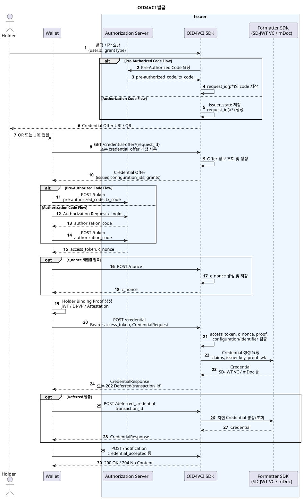

---
puppeteer:
    pdf:
        format: A4
        displayHeaderFooter: true
        landscape: false
        scale: 0.8
        margin:
            top: 1.2cm
            right: 1cm
            bottom: 1cm
            left: 1cm
    image:
        quality: 100
        fullPage: false
---

OID4VCI 발급
==

- 주제 : OID4VCI 발급 프로토콜
- 작성 : 오픈소스개발팀
- 일자 : 2026-06-01
- 버전 : v1.0.0

| 버전 | 일자       | 변경 |
| ---- | ---------- | ---- |
| v1.0.0 | 2026-06-01 | 최초 작성 |

<br>

목차
---

<!-- TOC tocDepth:2..4 chapterDepth:2..6 -->

- [1. 개요](#1-개요)
    - [1.1. 참조문서 및 분석 대상](#11-참조문서-및-분석-대상)
- [2. 공통사항](#2-공통사항)
    - [2.1. 역할](#21-역할)
    - [2.2. 지원 Credential 포맷](#22-지원-credential-포맷)
    - [2.3. 주요 Endpoint](#23-주요-endpoint)
    - [2.4. 데이터 타입 및 상수](#24-데이터-타입-및-상수)
- [3. 사전준비 절차](#3-사전준비-절차)
    - [3.1. Issuer Metadata 구성](#31-issuer-metadata-구성)
    - [3.2. Credential Configuration 구성](#32-credential-configuration-구성)
    - [3.3. 사용자 클레임 및 서명 키 구성](#33-사용자-클레임-및-서명-키-구성)
- [4. 발급 절차](#4-발급-절차)
    - [4.1. Credential Offer 생성](#41-credential-offer-생성)
    - [4.2. Credential Offer 전달](#42-credential-offer-전달)
    - [4.3. Access Token 발급](#43-access-token-발급)
    - [4.4. Nonce 발급](#44-nonce-발급)
    - [4.5. Credential 발급 요청](#45-credential-발급-요청)
    - [4.6. Deferred Credential 조회](#46-deferred-credential-조회)
    - [4.7. Credential 상태 알림](#47-credential-상태-알림)
- [5. 주요 데이터 구조](#5-주요-데이터-구조)
    - [5.1. CredentialOfferResponse](#51-credentialofferresponse)
    - [5.2. TokenRequest](#52-tokenrequest)
    - [5.3. TokenResponse](#53-tokenresponse)
    - [5.4. CredentialRequest](#54-credentialrequest)
    - [5.5. CredentialResponse](#55-credentialresponse)
    - [5.6. IssuerMetadataResponse](#56-issuermetadataresponse)

<!-- /TOC -->

<div style="page-break-after: always;"></div>

## 1. 개요

본 문서는 OpenID for Verifiable Credential Issuance(OID4VCI) 발급 흐름을 프로토콜, API, 데이터 포맷 관점에서 정리한다.

발급 흐름은 다음과 같다.

1. Issuer 사전 구성
    - Issuer Metadata 등록
    - Credential Configuration 등록
    - 사용자 클레임 및 Issuer 서명 키 제공자 구성
1. 발급 개시
    - Issuer 또는 테스트 화면이 Credential Offer URI 생성
    - Wallet이 `openid-credential-offer://` URI 또는 QR을 통해 Offer 수신
1. 인가
    - Pre-Authorized Code Flow 또는 Authorization Code Flow 사용
    - Wallet이 Token Endpoint에서 Access Token과 `c_nonce` 획득
1. Credential 발급
    - Wallet이 Holder Binding Proof를 포함하여 Credential Endpoint 호출
    - Issuer가 Access Token, Proof, `c_nonce`, Credential Configuration을 검증
    - Issuer가 SD-JWT VC, MSO mDoc 등 설정된 포맷의 Credential 생성
1. 후속 처리
    - 지연 발급인 경우 Deferred Credential Endpoint를 조회
    - Wallet은 저장 결과를 Notification Endpoint로 통지 가능

### 1.1. 참조문서 및 분석 대상

| 참조명 | 문서명 | 위치 |
| ------ | ------ | ---- |
| [OID4VCI] | OpenID for Verifiable Credential Issuance 1.0 | https://openid.net/specs/openid-4-verifiable-credential-issuance-1_0.html |

<div style="page-break-after: always;"></div>

## 2. 공통사항

### 2.1. 역할

| 역할 | 설명 |
| ---- | ---- |
| Issuer | Credential을 발급하는 주체이며 Metadata, Offer, Credential Endpoint를 제공한다. |
| Authorization Server | Pre-Authorized Code 또는 Authorization Code를 Access Token으로 교환한다. 별도 모듈 또는 Issuer 내 `/token` endpoint로 구성 가능하다. |
| Wallet | Credential Offer를 수신하고 Token 및 Credential 발급 요청을 수행한다. |
| Holder | Credential의 주체이며 Wallet을 통해 Holder Binding Proof를 생성한다. |

### 2.2. 지원 Credential 포맷

Credential Configuration의 `format` 값에 따라 실제 Credential 생성기를 선택한다.

| 포맷 | 설명 |
| ---- | ---- |
| `dc+sd-jwt` | SD-JWT VC 기반 Credential. 선택적 공개와 Key Binding을 지원한다. |
| `mso_mdoc` | ISO/IEC 18013-5 mDoc 기반 Credential. mDL, PID 등 mDoc 문서 발급에 사용한다. |
| OpenDID VC | Formatter SDK의 생성기 등록 상태에 따라 OpenDID VC 계열 포맷을 생성할 수 있다. |

### 2.3. 주요 Endpoint

Issuer endpoint는 Metadata의 endpoint 값을 읽어 동적으로 등록된다. 기본 예시는 아래와 같다.

| API | Method | Endpoint | 설명 |
| --- | ------ | -------- | ---- |
| Credential Offer 조회 | `GET` | `/credential-offer/{request_id}` | Offer Request ID에 해당하는 Credential Offer를 반환한다. |
| Issuer Metadata 조회 | `GET` | `/.well-known/openid-credential-issuer` | Issuer 기능, endpoint, Credential Configuration을 반환한다. |
| Access Token 발급 | `POST` | `/token` | Pre-Authorized Code 등을 Access Token으로 교환한다. |
| Credential 발급 | `POST` | `/credential` | Access Token과 Proof를 검증하고 Credential을 발급한다. |
| Deferred Credential 조회 | `POST` | `/deferred_credential` | 지연 발급 트랜잭션의 Credential을 조회한다. |
| Nonce 발급 | `POST` | `/nonce` | Proof 검증에 사용할 `c_nonce`를 발급한다. |
| Notification | `POST` | `/notification` | Wallet의 Credential 저장 결과를 수신한다. |
| Credential Identifier 조회 | `GET` | `/get-credential-identifier` | Credential Configuration ID에 매핑된 Identifier 목록을 반환한다. |

### 2.4. 데이터 타입 및 상수

여기에 정의되지 않은 항목은 `[OID4VCI]`를 참조한다.

```c#
def enum GRANT_TYPE: "OID4VCI grant type"
{
    "authorization_code" : "Authorization Code Flow"
    "urn:ietf:params:oauth:grant-type:pre-authorized_code": "Pre-Authorized Code Flow"
}

def enum OFFER_DELIVERY: "Credential Offer 전달 방식"
{
    "credential_offer"    : "Offer를 URI에 값으로 포함하는 by value 방식"
    "credential_offer_uri": "Offer 조회 URI를 전달하는 by reference 방식"
}

def enum PROOF_TYPE: "Holder Binding Proof 유형"
{
    "jwt"        : "JWT proof"
    "di_vp"      : "Data Integrity VP proof"
    "attestation": "Attestation proof"
}
```

<div style="page-break-after: always;"></div>

## 3. 사전준비 절차

OID4VCI 발급을 수행하기 전에 Issuer는 아래 정보를 준비한다.

1. Issuer Metadata
    - Issuer 식별자
    - Credential, Nonce, Deferred, Notification endpoint
    - 지원 Credential Configuration
    - 지원 Grant 및 암호화 정책
1. Credential Configuration
    - Credential Configuration ID
    - Credential 포맷
    - Credential Identifier
    - Proof Type 및 서명 알고리즘
    - 표시 정보와 Credential Definition
1. 데이터 제공자
    - `UserDataProvider`: Credential에 포함될 사용자 클레임 제공
    - `KeyDataProvider`: Issuer 서명 키 및 Credential Schema 정보 제공
    - `CredentialConfigurationSource`: Metadata/설정에서 Credential Configuration 조회

### 3.1. Issuer Metadata 구성

Wallet은 Issuer Metadata를 조회하여 발급 서버의 기능과 endpoint를 확인한다.

```json
{
  "credential_issuer": "http://localhost:8080",
  "credential_offer_endpoint": "http://localhost:8080/credential-offer",
  "credential_endpoint": "http://localhost:8080/credential",
  "nonce_endpoint": "http://localhost:8080/nonce",
  "deferred_credential_endpoint": "http://localhost:8080/deferred_credential",
  "notification_endpoint": "http://localhost:8080/notification",
  "credential_configurations_supported": {
    "UniversityDegree_JWT": {
      "format": "jwt_vc_json",
      "scope": "UniversityDegree",
      "proof_types_supported": {
        "jwt": {
          "proof_signing_alg_values_supported": ["ES256"]
        }
      }
    }
  }
}
```

### 3.2. Credential Configuration 구성

Credential Configuration은 Wallet이 어떤 Credential을 요청할 수 있는지 정의한다.

| 항목 | 설명 |
| ---- | ---- |
| `credential_configuration_id` | 발급 요청에서 사용할 설정 식별자 |
| `format` | Credential 포맷 |
| `scope` | Authorization Code Flow에서 사용할 수 있는 OAuth scope |
| `credential_definition` | W3C VC 계열 Credential 타입 정의 |
| `doctype` | mDoc 계열 문서 타입 |
| `proof_types_supported` | Wallet이 제출할 수 있는 Proof 유형과 알고리즘 |
| `cryptographic_binding_methods_supported` | Holder Binding 방식 |

### 3.3. 사용자 클레임 및 서명 키 구성

Issuer SDK는 Credential 생성 시 아래 제공자를 호출한다.

```java
public interface UserDataProvider {
    Map<String, Object> getUserClaims(String userId, String credentialType);
}

public interface KeyDataProvider {
    IssuerKeyInfo getKeyInfo(String userId, String credentialType);
}
```

- `userId`는 Access Token의 `sub` 클레임에서 추출한다.
- `credentialType`은 `credential_identifier` 또는 Credential Configuration에 등록된 Identifier로 결정한다.
- JWT Proof Header에 `jwk`가 포함된 경우 해당 JWK를 IssuerKeyInfo에 반영하여 Holder Binding Credential을 생성한다.

<div style="page-break-after: always;"></div>

## 4. 발급 절차

발급 절차의 전체 흐름은 다음과 같다.



### 4.1. Credential Offer 생성

Credential Offer는 Wallet이 발급 절차를 시작하기 위한 정보이다.
프로젝트의 `IssuanceGatewayService.generateCredentialOfferUri()`는 `grantType`, `offerType`, `scheme`에 따라 Offer URI를 생성한다.

1. `grantType = pre-authorized_code`
    - Authorization Server에서 Pre-Authorized Code와 사용자 PIN을 발급받는다.
    - `request_id`는 `p` 접두사로 생성한다.
    - `CredentialOfferStore`에 Pre-Authorized Code 응답을 저장한다.
1. `grantType = authorization_code`
    - `request_id`는 `a` 접두사로 생성한다.
    - Credential Offer의 `grants.authorization_code.issuer_state`를 생성한다.
1. `offerType = value`
    - Credential Offer JSON을 URI의 `credential_offer` 파라미터에 직접 포함한다.
1. 그 외
    - `credential_offer_uri`에 `/credential-offer/{request_id}`를 지정한다.

### 4.2. Credential Offer 전달

Wallet에 전달되는 URI의 기본 scheme은 `openid-credential-offer://`이다.

**■ By Reference 방식**

```text
openid-credential-offer://?credential_offer_uri=http://localhost:8080/credential-offer/pGkurKxf5T0Y...
```

Wallet은 `credential_offer_uri`를 GET으로 호출하여 Credential Offer를 조회한다.

**■ By Value 방식**

```text
openid-credential-offer://credential_offer?credential_offer={url-encoded CredentialOfferResponse}
```

Wallet은 URI 안의 `credential_offer` JSON을 복원하여 즉시 발급 절차를 진행한다.

### 4.3. Access Token 발급

Pre-Authorized Code Flow에서는 Wallet이 Offer의 `pre-authorized_code`와 사용자 입력 `tx_code`를 Token Endpoint에 제출한다.

```json
{
  "grant_type": "urn:ietf:params:oauth:grant-type:pre-authorized_code",
  "pre-authorized_code": "oaKazRN8I0IbtZ0C7JuMn5",
  "tx_code": "1234"
}
```

응답에는 Credential Endpoint 호출에 사용할 Access Token과 Holder Binding Proof에 사용할 `c_nonce`가 포함된다.

```json
{
  "access_token": "eyJhbGciOiJSUzI1NiIsInR5cCI6IkpXVCJ9...",
  "token_type": "bearer",
  "expires_in": 86400,
  "c_nonce": "tZignsnFbp",
  "c_nonce_expires_in": 86400
}
```

### 4.4. Nonce 발급

Wallet은 Token 응답의 `c_nonce`가 없거나 새 Proof Nonce가 필요한 경우 Nonce Endpoint를 호출한다.

```http
POST /nonce
```

```json
{
  "c_nonce": "uG5F23h4Yg",
  "c_nonce_expires_in": 86400
}
```

Issuer는 발급한 `c_nonce`를 저장하고 Credential 발급 요청의 Proof에서 동일한 값을 검증한 뒤 사용한 Nonce를 제거한다.

### 4.5. Credential 발급 요청

Wallet은 Access Token을 `Authorization: Bearer` 헤더에 포함하고 Credential Endpoint를 호출한다.

발급 요청은 `credential_configuration_id` 또는 `credential_identifier` 중 하나만 포함하여야 한다.

**■ Credential Configuration ID 사용**

```json
{
  "credential_configuration_id": "UniversityDegree_JWT",
  "proofs": {
    "jwt": [
      "eyJhbGciOiJFUzI1NiIsImp3ayI6eyJrdHkiOiJFQyJ9...SIGNATURE"
    ]
  }
}
```

**■ Credential Identifier 사용**

```json
{
  "credential_identifier": "UniversityDegreeCredential-2023",
  "proofs": {
    "jwt": [
      "eyJhbGciOiJFUzI1NiIsIng1YyI6WyJNSUlD...Il19...SIGNATURE"
    ]
  }
}
```

Issuer는 다음 순서로 요청을 처리한다.

1. `credential_configuration_id`와 `credential_identifier`의 상호 배타성 검증
1. `proofs` 내부 Proof 유형 검증
    - `jwt`, `di_vp`, `attestation` 중 하나만 허용
1. JWT Proof 검증
    - Header의 `jwk`를 Holder 공개키로 추출
    - Payload의 `nonce`가 저장된 `c_nonce`인지 확인
    - Header의 `x5c`가 있으면 인증서 체인 및 서명 검증
    - Header의 `kid`가 있으면 DID 기반 검증 대상으로 처리
1. Access Token의 `sub`에서 사용자 식별자 추출
1. Credential Configuration 및 Credential Type 결정
1. 사용자 클레임과 Issuer 키 정보를 조회
1. 포맷별 생성기로 Credential 생성

**■ 즉시 발급 응답**

```json
{
  "credentials": [
    {
      "credential": "eyJhbGciOiJFUzI1NiIsInR5cCI6ImRjK3NkLWp3dCJ9..."
    }
  ],
  "notification_id": "3fwe98js"
}
```

**■ 지연 발급 응답**

```json
{
  "transaction_id": "8xL0xBtZp8",
  "interval": 5
}
```

지연 발급 응답은 HTTP `202 Accepted`로 반환된다.

### 4.6. Deferred Credential 조회

지연 발급 응답을 받은 Wallet은 `transaction_id`를 사용하여 Deferred Credential Endpoint를 호출한다.

```json
{
  "transaction_id": "8xL0xBtZp8"
}
```

발급이 완료되면 일반 Credential Response와 동일한 구조를 반환한다.

```json
{
  "credentials": [
    {
      "credential": "LUpixVCWJk0eOt4CXQe1NXK....WZwmhmn9OQp6YxX0a2L"
    }
  ]
}
```

### 4.7. Credential 상태 알림

Wallet은 Credential 저장 결과를 Notification Endpoint로 전송할 수 있다.

```json
{
  "notification_id": "3fwe98js",
  "event": "credential_accepted",
  "event_description": "Credential was stored successfully."
}
```

<div style="page-break-after: always;"></div>

## 5. 주요 데이터 구조

### 5.1. CredentialOfferResponse

```c#
def object CredentialOfferResponse: "OID4VCI Credential Offer"
{
    + url        "credential_issuer": "Issuer 식별자 URL"
    + array(string) "credential_configuration_ids": "발급 가능한 Credential Configuration ID 목록"
    + object     "grants": "지원 Grant 정보"
    {
        - object "urn:ietf:params:oauth:grant-type:pre-authorized_code"
        {
            + string "pre-authorized_code": "Pre-Authorized Code"
            - object "tx_code"
            {
                + string "input_mode": "입력 모드", value("numeric")
                + number "length": "PIN 길이"
                - string "description": "PIN 입력 안내"
            }
        }
        - object "authorization_code"
        {
            + string "issuer_state": "Authorization Request에 포함할 Issuer 상태값"
        }
    }
}
```

### 5.2. TokenRequest

```c#
def object TokenRequest: "Access Token 발급 요청"
{
    + GRANT_TYPE "grant_type": "Grant 유형"
    - string "pre-authorized_code": "Pre-Authorized Code"
    - string "tx_code": "사용자 PIN 또는 트랜잭션 코드"
    - string "code": "Authorization Code"
    - string "redirect_uri": "Authorization Code Flow redirect URI"
}
```

### 5.3. TokenResponse

```c#
def object TokenResponse: "Access Token 발급 응답"
{
    + string "access_token": "Credential Endpoint 호출용 Access Token"
    + string "token_type": "Token 유형", value("bearer")
    - number "expires_in": "Access Token 만료 시간(초)"
    - string "c_nonce": "Holder Binding Proof Nonce"
    - number "c_nonce_expires_in": "c_nonce 만료 시간(초)"
}
```

### 5.4. CredentialRequest

```c#
def object CredentialRequest: "Credential 발급 요청"
{
    + select(1)
    {
        ^ string "credential_configuration_id": "요청할 Credential Configuration ID"
        ^ string "credential_identifier": "요청할 Credential Identifier"
    }
    - Proofs "proofs": "Holder Binding Proof 목록"
}

def object Proofs: "Holder Binding Proof 컨테이너"
{
    - array(string) "jwt": "JWT Proof 목록"
    - array(string) "di_vp": "Data Integrity VP Proof 목록"
    - array(string) "attestation": "Attestation Proof 목록"
}
```

### 5.5. CredentialResponse

```c#
def object CredentialResponse: "Credential 발급 응답"
{
    + array(Credential) "credentials": "발급된 Credential 목록"
    - string "notification_id": "상태 알림에 사용할 Notification ID"
}

def object Credential: "발급 Credential"
{
    + any "credential": "Credential 문자열 또는 포맷별 객체"
}
```

### 5.6. IssuerMetadataResponse

```c#
def object IssuerMetadataResponse: "Issuer Metadata"
{
    + url "credential_issuer": "Issuer 식별자"
    - array(url) "authorization_servers": "Authorization Server 목록"
    - url "credential_offer_endpoint": "Credential Offer Endpoint"
    + url "credential_endpoint": "Credential Endpoint"
    - url "nonce_endpoint": "Nonce Endpoint"
    - url "deferred_credential_endpoint": "Deferred Credential Endpoint"
    - url "notification_endpoint": "Notification Endpoint"
    - object "credential_request_encryption": "Credential Request 암호화 정책"
    - object "credential_response_encryption": "Credential Response 암호화 정책"
    - array(object) "display": "Issuer 표시 정보"
    - array(string) "grants_supported": "지원 Grant 목록"
    - object "batch_credential_issuance": "Batch 발급 정책"
    + object "credential_configurations_supported": "Credential Configuration Map"
}
```
