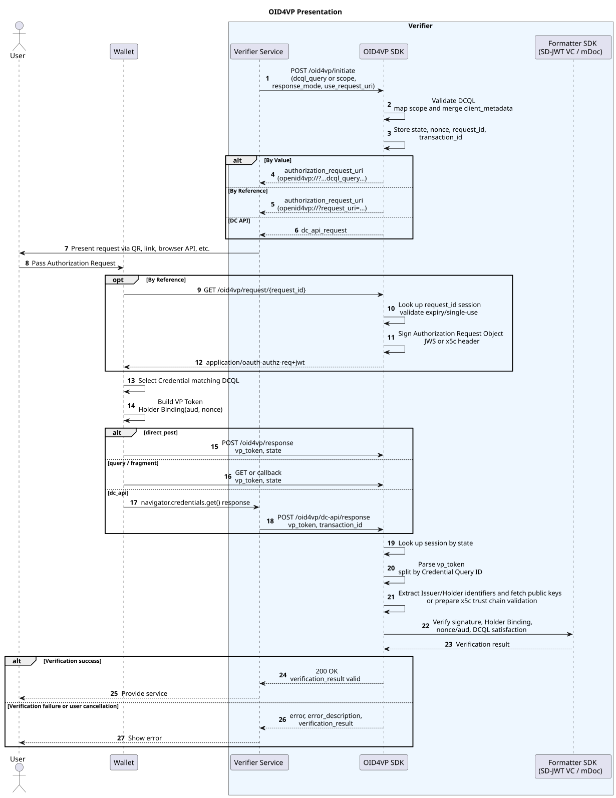

---
puppeteer:
    pdf:
        format: A4
        displayHeaderFooter: true
        landscape: false
        scale: 0.8
        margin:
            top: 1.2cm
            right: 1cm
            bottom: 1cm
            left: 1cm
    image:
        quality: 100
        fullPage: false
---

OID4VP Presentation
==

- Subject : OID4VP Presentation Protocol
- Author : Open Source Development Team
- Date : 2026-06-01
- Version : v1.0.0

| Version | Date       | Change |
| ---- | ---------- | ---- |
| v1.0.0 | 2026-06-01 | Initial version |

<br>

Table of Contents
---

<!-- TOC tocDepth:2..4 chapterDepth:2..6 -->

- [1. Overview](#1-overview)
    - [1.1. Reference Documents and Analysis Targets](#11-reference-documents-and-analysis-targets)
- [2. Common Items](#2-common-items)
    - [2.1. Roles](#21-roles)
    - [2.2. Supported Credential and VP Token Formats](#22-supported-credential-and-vp-token-formats)
    - [2.3. Key Endpoints](#23-key-endpoints)
    - [2.4. Data Types and Constants](#24-data-types-and-constants)
- [3. Preparation Procedure](#3-preparation-procedure)
    - [3.1. Verifier Configuration](#31-verifier-configuration)
    - [3.2. DCQL and Scope Mapping](#32-dcql-and-scope-mapping)
    - [3.3. Client Metadata Composition](#33-client-metadata-composition)
- [4. Presentation Procedure](#4-presentation-procedure)
    - [4.1. Starting a Verification Session](#41-starting-a-verification-session)
    - [4.2. Delivering the Authorization Request](#42-delivering-the-authorization-request)
    - [4.3. Retrieving the Authorization Request](#43-retrieving-the-authorization-request)
    - [4.4. VP Token Generation by the Wallet](#44-vp-token-generation-by-the-wallet)
    - [4.5. VP Token Submission and Verification](#45-vp-token-submission-and-verification)
- [5. Key Data Structures](#5-key-data-structures)
    - [5.1. Initiation Request](#51-initiation-request)
    - [5.2. Initiation Response](#52-initiation-response)
    - [5.3. Authorization Request](#53-authorization-request)
    - [5.4. DCQLQuery](#54-dcqlquery)
    - [5.5. VP Token Response](#55-vp-token-response)
    - [5.6. VerificationSession](#56-verificationsession)

<!-- /TOC -->

<div style="page-break-after: always;"></div>

## 1. Overview

This document organizes the OpenID for Verifiable Presentations (OID4VP) presentation flow from the perspectives of protocol, API, and data format.

The presentation flow is as follows.

1. Verifier pre-configuration
    - Configure the Verifier base URL, Invocation Scheme, and Client ID Scheme
    - Configure the response endpoint and the request_uri endpoint
    - Configure the supported VP Token formats and Client Metadata
    - Register the mapping between Scope and DCQL Query
1. Verification session creation
    - The Verifier creates a session based on the provided DCQL Query or scope
    - Generate and store `state`, `nonce`, `request_id`, and `transaction_id`
1. Authorization Request delivery
    - By Value: include the Authorization Request parameters directly in the `openid4vp://` URI
    - By Reference: include only the `request_uri` in the URI, and the Wallet retrieves the Request Object
1. VP Token submission
    - The Wallet selects Credentials matching the DCQL conditions and generates a VP Token
    - Submit using the configured response mode among `direct_post`, `query`, `fragment`, and `dc_api`
1. Verifier verification
    - Look up the session by `state`
    - Verify the Issuer/Holder identifiers and public keys
    - Verify the Credential signature, Holder Binding, `aud`, `nonce`, and whether the DCQL conditions are satisfied

### 1.1. Reference Documents and Analysis Targets

| Reference | Document | Location |
| ------ | ------ | ---- |
| [OID4VP] | OpenID for Verifiable Presentations 1.0 | https://openid.net/specs/openid-4-verifiable-presentations-1_0.html |

<div style="page-break-after: always;"></div>

## 2. Common Items

### 2.1. Roles

| Role | Description |
| ---- | ---- |
| Verifier | The entity that requests VP Token submission and verifies the received Credentials. |
| Wallet | Receives the Authorization Request and submits Credentials matching the conditions as a VP Token. |
| Holder | The owner of the Credential, who provides submission consent and performs Holder Binding through the Wallet. |
| Issuer | The issuer of the Credential. During Credential verification, the Verifier checks the Issuer's public key or certificate chain. |

### 2.2. Supported Credential and VP Token Formats

The Verifier SDK handles multiple formats through format-specific `VPTokenVerifier`, `CredentialAdapter`, and `DCQLCredentialMatcher` components.

| Format | Description |
| ---- | ---- |
| `vc+sd-jwt`, `dc+sd-jwt` | SD-JWT VC based presentation. Verifies the Issuer signature, Key Binding JWT, and selectively disclosed claims. |
| `mso_mdoc` | mDoc based presentation. Verifies DeviceAuth and the mDoc Namespace/Claim. |
| x5c based Credential | Verifies the `x5c` certificate chain in the JWS Header or within the Credential against the trust root. |
| kid/DID based Credential | Resolves the public key from the Credential's `kid` or the Holder/Issuer identifier for verification. |

### 2.3. Key Endpoints

| API | Method | Endpoint | Description |
| --- | ------ | -------- | ---- |
| Start verification session | `POST` | `/oid4vp/initiate` | Generates an Authorization Request URI based on DCQL or scope. |
| Retrieve Authorization Request | `GET` | `/oid4vp/request/{request_id}` | Returns the JWS Authorization Request Object for the By Reference method. |
| Receive VP Token | `POST`, `GET` | `/oid4vp/response` | Receives and verifies the Wallet's VP Token or an error response. |
| Validate DCQL | `POST` | `/oid4vp/validate-dcql` | Validates the structure and rules of the DCQL Query JSON. |
| Receive DC API response | `POST` | `/oid4vp/dc-api/response` | Receives a browser-mediated Digital Credentials API response. |

### 2.4. Data Types and Constants

Items not defined here refer to `[OID4VP]`.

```c#
def enum RESPONSE_MODE: "OID4VP response mode"
{
    "direct_post": "Wallet POSTs the submission to the response_uri"
    "query"      : "Wallet submits to the redirect_uri as a query parameter"
    "fragment"   : "Wallet submits via the redirect_uri fragment"
    "dc_api"     : "Submission via the browser Digital Credentials API"
}

def enum REQUEST_METHOD: "Authorization Request delivery method"
{
    "by_value"    : "Include the Authorization Request directly in the URI"
    "by_reference": "Deliver the request_uri and have the Wallet retrieve the Request Object"
    "dc_api"      : "Return a request object for navigator.credentials.get()"
}

def enum CLIENT_ID_SCHEME: "OID4VP Client ID Scheme"
{
    "redirect_uri" : "Redirect URI based client_id"
    "did"          : "DID based client_id"
    "x509_san_dns" : "X.509 SAN DNS based client_id"
    "origin"       : "Web Origin based client_id"
}
```

<div style="page-break-after: always;"></div>

## 3. Preparation Procedure

### 3.1. Verifier Configuration

The Verifier configuration is managed via `oid4vp-config.json` or DB settings.

```json
{
  "baseUrl": "http://10.48.17.127:8088",
  "clientName": "OID4VP Verifier",
  "invocationScheme": "openid4vp://",
  "clientId": {
    "scheme": "redirect_uri",
    "value": "http://10.48.17.127:8088/oid4vp/callback"
  },
  "session": {
    "sessionTtl": 300000
  },
  "endpoints": {
    "response": "/oid4vp/response",
    "request": "/oid4vp/request",
    "fragmentCallback": "/oid4vp/fragment/callback"
  }
}
```

The meaning of the key settings is as follows.

| Item | Description |
| ---- | ---- |
| `baseUrl` | Verifier server base URL |
| `invocationScheme` | Wallet invocation URI scheme |
| `clientId.scheme` | Client ID resolution method |
| `clientId.value` | Client ID value |
| `session.sessionTtl` | Validity period of the session and request_uri |
| `endpoints.response` | VP Token receiving endpoint |
| `endpoints.request` | Authorization Request retrieval endpoint |
| `endpoints.fragmentCallback` | Callback endpoint for the fragment response mode |

### 3.2. DCQL and Scope Mapping

The Verifier expresses the Credential conditions to be submitted by the Wallet using DCQL (Digital Credentials Query Language).
When calling `/oid4vp/initiate`, you can pass `dcql_query` directly, or pass a `scope` to convert it into a registered DCQL.

```json
{
  "credentials": [
    {
      "id": "national_id",
      "format": "vc+sd-jwt",
      "meta": {
        "vct_values": [
          "https://credentials.gov.kr/identity_credential"
        ]
      },
      "claims": [
        {
          "id": "family_name",
          "path": ["family_name"]
        },
        {
          "id": "given_name",
          "path": ["given_name"]
        }
      ]
    }
  ]
}
```

### 3.3. Client Metadata Composition

The Authorization Request includes Client Metadata so that the Wallet can determine the Verifier's capabilities.

```json
{
  "client_name": "OID4VP Verifier",
  "client_id": "redirect_uri:http://localhost:8081/oid4vp/callback",
  "response_types_supported": ["vp_token"],
  "response_modes_supported": ["direct_post", "query", "fragment"],
  "vp_formats_supported": {
    "vc+sd-jwt": {
      "sd-jwt_alg_values": ["ES256"],
      "kb-jwt_alg_values": ["ES256"]
    },
    "mso_mdoc": {
      "alg_values": ["ES256"]
    }
  }
}
```

<div style="page-break-after: always;"></div>

## 4. Presentation Procedure

The overall flow of the presentation procedure is as follows.



### 4.1. Starting a Verification Session

The Verifier starts a verification session by calling `/oid4vp/initiate`.

**■ Direct DCQL input**

```shell
curl -X POST "http://${Host}:8088/oid4vp/initiate" \
-H "Content-Type: application/x-www-form-urlencoded" \
-d 'dcql_query={"credentials":[{"id":"StudentID"}]}&response_mode=direct_post&use_request_uri=false'
```

**■ Scope based input**

```shell
curl -X POST "http://${Host}:8088/oid4vp/initiate" \
-H "Content-Type: application/x-www-form-urlencoded" \
-d 'scope=StudentID&response_mode=direct_post&use_request_uri=true'
```

The Verifier generates the following values and stores them in the session.

| Item | Description |
| ---- | ---- |
| `transaction_id` | Verifier internal transaction identifier |
| `request_id` | Authorization Request retrieval identifier for the By Reference method |
| `state` | State value used to bind the Wallet response to the session |
| `nonce` | Random value used to verify Holder Binding and Presentation Binding |
| `dcql_query` | Verification request conditions |
| `response_mode` | Wallet response method |

### 4.2. Delivering the Authorization Request

**■ By Value method**

The Authorization Request parameters are included directly in the `openid4vp://` URI.

```text
openid4vp://?response_type=vp_token
&client_id=redirect_uri%3Ahttp%3A%2F%2Flocalhost%3A8088%2Foid4vp%2Fcallback
&response_mode=direct_post
&nonce=550e8400-e29b-41d4-a716-446655440000
&state=a1b2c3d4e5f6g7h8
&response_uri=http%3A%2F%2Flocalhost%3A8088%2Foid4vp%2Fresponse
&dcql_query=%7B%22credentials%22%3A%5B%7B%22id%22%3A%22StudentID%22%7D%5D%7D
&client_metadata=%7B%22client_name%22%3A%22OID4VP%20Verifier%22%7D
```

**■ By Reference method**

Only the `request_uri` is delivered to the Wallet.

```text
openid4vp://?request_uri=http%3A%2F%2Flocalhost%3A8088%2Foid4vp%2Frequest%2F550e8400...
&client_id=redirect_uri%3Ahttp%3A%2F%2Flocalhost%3A8088%2Foid4vp%2Fcallback
```

### 4.3. Retrieving the Authorization Request

In the By Reference method, the Wallet calls the `request_uri` with a GET request.

```http
GET /oid4vp/request/{request_id}
Accept: application/oauth-authz-req+jwt
```

The Authorization Request is signed as a JWS Request Object and returned.

An example JWS Header is as follows.

```json
{
  "alg": "ES256",
  "typ": "oauth-authz-req+jwt",
  "kid": "did:omn:verifier?versionId=1#assert",
  "jwk": {
    "kty": "EC",
    "crv": "P-256",
    "x": "...",
    "y": "..."
  }
}
```

When using an X.509 SAN DNS based Client ID, the JWS Header may include the `x5c` certificate chain.

The JWS Payload is the Authorization Request data and includes the following items.

```json
{
  "response_type": "vp_token",
  "client_id": "redirect_uri:http://localhost:8088/oid4vp/callback",
  "response_mode": "direct_post",
  "nonce": "550e8400-e29b-41d4-a716-446655440000",
  "state": "a1b2c3d4e5f6g7h8",
  "response_uri": "http://localhost:8088/oid4vp/response",
  "dcql_query": {
    "credentials": [
      {
        "id": "StudentID"
      }
    ]
  },
  "client_metadata": {
    "client_name": "OID4VP Verifier"
  },
  "iat": 1770000000
}
```

The `request_uri` is treated as single-use, and after retrieval the session state changes to the request fetched state.

### 4.4. VP Token Generation by the Wallet

The Wallet interprets the `dcql_query` of the Authorization Request and selects Credentials that can be submitted.

The VP Token is delivered as a JSON string and is internally parsed into a Map structure with Credential Query IDs as keys and lists of Credentials as values.

```json
{
  "StudentID": [
    "eyJhbGciOiJFUzI1NiIsInR5cCI6ImRjK3NkLWp3dCJ9..."
  ]
}
```

In the case of SD-JWT VC, selectively disclosed Disclosures and a Key Binding JWT may be included.
In the case of mDoc, `client_id`, `nonce`, and `response_uri` are used as Presentation Binding values to verify DeviceAuth.

### 4.5. VP Token Submission and Verification

**■ direct_post**

```shell
curl -X POST "http://${Host}:8088/oid4vp/response" \
-H "Content-Type: application/x-www-form-urlencoded" \
-d 'vp_token={"StudentID":["eyJhbGciOiJFUzI1NiJ9..."]}&state=a1b2c3d4e5f6g7h8'
```

**■ query**

```text
GET /oid4vp/response?vp_token={url-encoded-vp-token}&state=a1b2c3d4e5f6g7h8
```

When the Wallet returns an error, the following parameters are used.

```text
error=access_denied&error_description=User%20cancelled&state=a1b2c3d4e5f6g7h8
```

The Verifier's verification procedure is as follows.

1. Look up the verification session by `state`.
1. Parse the `vp_token` JSON into a `credential type -> credentials` Map.
1. Extract the Issuer identifier and Holder identifier for each Credential.
1. If there is an x5c based Credential, verify the chain against the list of trust root certificates.
1. If it is a kid/DID based Credential, resolve the public key from the identifier.
1. Select the format-specific `VPTokenVerifier`.
1. Perform Credential signature verification.
1. Verify the Presentation Binding.
    - The `aud` or client binding value must match the `client_id` of the Authorization Request.
    - The `nonce` must match the session's `nonce`.
1. Check whether the Credential, Claim, and Credential Set conditions of the DCQL Query are satisfied.

On success, HTTP `200 OK` is returned. On failure, an error in the following format is returned.

```json
{
  "error": "invalid_token",
  "error_description": "VP Token signature validation failed",
  "state": "a1b2c3d4e5f6g7h8",
  "verification_result": {
    "valid": false,
    "message": "VP Token signature is invalid",
    "errors": [
      "Signature verification failed for credential StudentID"
    ],
    "warnings": []
  }
}
```

<div style="page-break-after: always;"></div>

## 5. Key Data Structures

### 5.1. Initiation Request

```c#
def object InitiationRequest: "Verification session start request"
{
    + select(1)
    {
        ^ string "dcql_query": "DCQL Query JSON string"
        ^ string "scope": "Registered DCQL Scope"
    }
    + RESPONSE_MODE "response_mode": "Response mode", default("direct_post")
    - string "client_metadata": "Additional Client Metadata JSON string"
    + bool "use_request_uri": "Whether to use By Reference", default(true)
}
```

### 5.2. Initiation Response

```c#
def object InitiationResponse: "Verification session start response"
{
    - uri "authorization_request_uri": "Wallet invocation URI"
    - uri "request_uri": "Authorization Request retrieval URI"
    - object "dc_api_request": "Request Object for DC API"
    + REQUEST_METHOD "method": "Delivery method"
    + uuid "transaction_id": "Verification transaction identifier"
    + uuid "request_id": "Request Object retrieval identifier"
    + string "state": "Response binding state value"
    + string "nonce": "Presentation Binding Nonce"
    + RESPONSE_MODE "response_mode": "Response mode"
    + bool "dcql_validated": "Whether DCQL validation succeeded"
    + number "credential_count": "Number of requested Credentials"
    + string "query_source": "direct or scope"
    + bool "use_request_uri": "Whether to use By Reference"
    + string "client_id": "Verifier Client ID"
    + object "client_metadata": "Client Metadata"
    - string "scope": "Original Scope when Scope is provided"
    - string "mapped_dcql": "DCQL converted from Scope"
}
```

### 5.3. Authorization Request

```c#
def object AuthorizationRequest: "OID4VP Authorization Request"
{
    + string "response_type": "Response type", value("vp_token")
    + string "client_id": "Verifier Client ID"
    + RESPONSE_MODE "response_mode": "Response mode"
    + string "nonce": "Presentation Binding Nonce"
    + string "state": "Session state value"
    + select(1)
    {
        ^ uri "response_uri": "URI for receiving direct_post responses"
        ^ uri "redirect_uri": "URI for receiving query or fragment responses"
    }
    + DCQLQuery "dcql_query": "Submission request conditions"
    - object "client_metadata": "Verifier Metadata"
    - number "iat": "JWS Request Object issuance time"
}
```

### 5.4. DCQLQuery

```c#
def object DCQLQuery: "Digital Credentials Query Language"
{
    + array(CredentialQuery) "credentials": "List of requested Credential conditions"
    - array(CredentialSet) "credential_sets": "Credential combination conditions"
    - array(object) "transaction_data": "Transaction data"
}

def object CredentialQuery: "Credential request condition"
{
    + string "id": "Credential Query ID"
    - string "format": "Credential format"
    - object "meta": "Format-specific Metadata conditions"
    - array(ClaimQuery) "claims": "List of claim conditions"
    - array(array(string)) "claim_sets": "Combinations of Claim IDs that must be satisfied"
    - array(TrustedAuthority) "trusted_authorities": "Trusted authority conditions"
    - string "purpose": "Submission purpose"
    - bool "multiple": "Whether returning multiple Credentials is allowed"
    - bool "require_cryptographic_holder_binding": "Whether Holder Binding is required"
}

def object ClaimQuery: "Claim request condition"
{
    - string "id": "Claim Query ID"
    - array(any) "path": "JSON Credential claim path"
    - string "namespace": "mDoc Namespace"
    - string "claim_name": "mDoc Claim name"
    - string "purpose": "Claim submission purpose"
    - array(any) "values": "List of allowed values"
    - any "value": "Required value"
    - any "max": "Maximum value condition"
    - any "min": "Minimum value condition"
}

def object TrustedAuthority: "Trusted authority condition"
{
    + string "type": "Trust verification type", oneof("aki", "etsi_tl", "openid_federation", "x509_san_dns", "x509_san_uri")
    - array(string) "values": "List of trusted authority values"
}

def object CredentialSet: "Credential combination condition"
{
    + string "id": "Credential Set ID"
    + array(array(string)) "options": "Combinations of Credential Query IDs"
    - bool "required": "Whether the condition is mandatory", default(true)
    - string "purpose": "Purpose of the combination condition"
}
```

### 5.5. VP Token Response

```c#
def object VPTokenResponse: "Wallet submission response"
{
    - string "vp_token": "VP Token JSON string or Credential string"
    + string "state": "state of the Authorization Request"
    - string "error": "Error code"
    - string "error_description": "Error description"
}

def object VPTokenMap: "VP Token parsing structure"
{
    + map(array(any)) "<credential_query_id>": "List of submitted Credentials per Credential Query ID"
}
```

### 5.6. VerificationSession

```c#
def object VerificationSession: "Verification session"
{
    + uuid "transactionId": "Transaction identifier"
    + string "state": "Wallet response binding state value"
    + string "nonce": "Presentation Binding Nonce"
    + string "dcqlQuery": "DCQL Query JSON string"
    + RESPONSE_MODE "responseMode": "Response mode"
    + uuid "requestId": "Authorization Request retrieval identifier"
    - string "clientMetadata": "Merged Client Metadata JSON"
    + number "createdAt": "Session creation time"
    - number "requestUriFetchedAt": "request_uri retrieval time"
    - string "status": "Session status"
    - number "expiresAt": "Expiration time"
}
```
