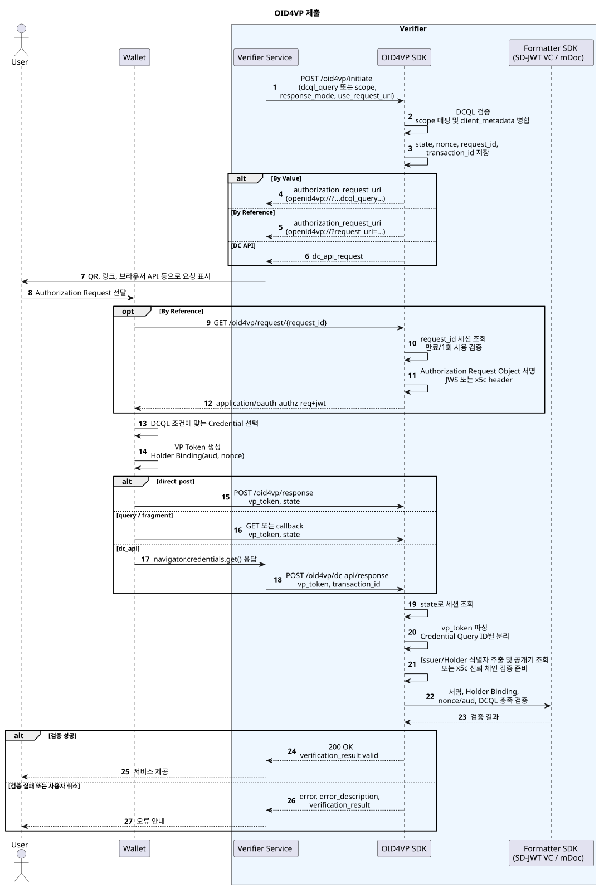

---
puppeteer:
    pdf:
        format: A4
        displayHeaderFooter: true
        landscape: false
        scale: 0.8
        margin:
            top: 1.2cm
            right: 1cm
            bottom: 1cm
            left: 1cm
    image:
        quality: 100
        fullPage: false
---

OID4VP 제출
==

- 주제 : OID4VP 제출 프로토콜
- 작성 : 오픈소스개발팀
- 일자 : 2026-06-01
- 버전 : v1.0.0

| 버전 | 일자       | 변경 |
| ---- | ---------- | ---- |
| v1.0.0 | 2026-06-01 | 최초 작성 |

<br>

목차
---

<!-- TOC tocDepth:2..4 chapterDepth:2..6 -->

- [1. 개요](#1-개요)
    - [1.1. 참조문서 및 분석 대상](#11-참조문서-및-분석-대상)
- [2. 공통사항](#2-공통사항)
    - [2.1. 역할](#21-역할)
    - [2.2. 지원 Credential 및 VP Token 포맷](#22-지원-credential-및-vp-token-포맷)
    - [2.3. 주요 Endpoint](#23-주요-endpoint)
    - [2.4. 데이터 타입 및 상수](#24-데이터-타입-및-상수)
- [3. 사전준비 절차](#3-사전준비-절차)
    - [3.1. Verifier 설정](#31-verifier-설정)
    - [3.2. DCQL 및 Scope 매핑](#32-dcql-및-scope-매핑)
    - [3.3. Client Metadata 구성](#33-client-metadata-구성)
- [4. 제출 절차](#4-제출-절차)
    - [4.1. 검증 세션 시작](#41-검증-세션-시작)
    - [4.2. Authorization Request 전달](#42-authorization-request-전달)
    - [4.3. Authorization Request 조회](#43-authorization-request-조회)
    - [4.4. Wallet의 VP Token 생성](#44-wallet의-vp-token-생성)
    - [4.5. VP Token 제출 및 검증](#45-vp-token-제출-및-검증)
- [5. 주요 데이터 구조](#5-주요-데이터-구조)
    - [5.1. Initiation Request](#51-initiation-request)
    - [5.2. Initiation Response](#52-initiation-response)
    - [5.3. Authorization Request](#53-authorization-request)
    - [5.4. DCQLQuery](#54-dcqlquery)
    - [5.5. VP Token Response](#55-vp-token-response)
    - [5.6. VerificationSession](#56-verificationsession)

<!-- /TOC -->

<div style="page-break-after: always;"></div>

## 1. 개요

본 문서는 OpenID for Verifiable Presentations(OID4VP) 제출 흐름을 프로토콜, API, 데이터 포맷 관점에서 정리한다.

제출 흐름은 다음과 같다.

1. Verifier 사전 구성
    - Verifier 기본 URL, Invocation Scheme, Client ID Scheme 설정
    - 응답 endpoint 및 request_uri endpoint 설정
    - 지원 VP Token 포맷 및 Client Metadata 설정
    - Scope와 DCQL Query 매핑 등록
1. 검증 세션 생성
    - Verifier가 DCQL Query 또는 scope를 입력받아 세션을 생성
    - `state`, `nonce`, `request_id`, `transaction_id`를 생성하고 저장
1. Authorization Request 전달
    - By Value: Authorization Request 파라미터를 `openid4vp://` URI에 직접 포함
    - By Reference: `request_uri`만 URI에 포함하고 Wallet이 Request Object를 조회
1. VP Token 제출
    - Wallet이 DCQL 조건에 맞는 Credential을 선택하고 VP Token 생성
    - `direct_post`, `query`, `fragment`, `dc_api` 중 설정된 응답 방식으로 제출
1. Verifier 검증
    - `state`로 세션 조회
    - Issuer/Holder 식별자와 공개키 확인
    - Credential 서명, Holder Binding, `aud`, `nonce`, DCQL 충족 여부 검증

### 1.1. 참조문서 및 분석 대상

| 참조명 | 문서명 | 위치 |
| ------ | ------ | ---- |
| [OID4VP] | OpenID for Verifiable Presentations 1.0 | https://openid.net/specs/openid-4-verifiable-presentations-1_0.html |

<div style="page-break-after: always;"></div>

## 2. 공통사항

### 2.1. 역할

| 역할 | 설명 |
| ---- | ---- |
| Verifier | VP Token 제출을 요청하고 수신한 Credential을 검증하는 주체이다. |
| Wallet | Authorization Request를 수신하고 조건에 맞는 Credential을 VP Token으로 제출한다. |
| Holder | Credential 보유자이며 Wallet을 통해 제출 동의 및 Holder Binding을 수행한다. |
| Issuer | Credential 발급자이며 Verifier는 Credential 검증 시 Issuer 공개키 또는 인증서 체인을 확인한다. |

### 2.2. 지원 Credential 및 VP Token 포맷

Verifier SDK는 포맷별 `VPTokenVerifier`, `CredentialAdapter`, `DCQLCredentialMatcher`를 통해 다중 포맷을 처리한다.

| 포맷 | 설명 |
| ---- | ---- |
| `vc+sd-jwt`, `dc+sd-jwt` | SD-JWT VC 기반 제출. Issuer 서명, Key Binding JWT, 선택 공개 클레임을 검증한다. |
| `mso_mdoc` | mDoc 기반 제출. DeviceAuth와 mDoc Namespace/Claim을 검증한다. |
| x5c 기반 Credential | JWS Header 또는 Credential 내부의 `x5c` 인증서 체인을 신뢰 루트 기준으로 검증한다. |
| kid/DID 기반 Credential | Credential의 `kid` 또는 Holder/Issuer 식별자로 공개키를 해석하여 검증한다. |

### 2.3. 주요 Endpoint

| API | Method | Endpoint | 설명 |
| --- | ------ | -------- | ---- |
| 검증 세션 시작 | `POST` | `/oid4vp/initiate` | DCQL 또는 scope 기반으로 Authorization Request URI를 생성한다. |
| Authorization Request 조회 | `GET` | `/oid4vp/request/{request_id}` | By Reference 방식에서 JWS Authorization Request Object를 반환한다. |
| VP Token 수신 | `POST`, `GET` | `/oid4vp/response` | Wallet의 VP Token 또는 오류 응답을 수신하고 검증한다. |
| DCQL 검증 | `POST` | `/oid4vp/validate-dcql` | DCQL Query JSON의 구조와 규칙을 검증한다. |
| DC API 응답 수신 | `POST` | `/oid4vp/dc-api/response` | Browser-mediated Digital Credentials API 응답을 수신한다. |

### 2.4. 데이터 타입 및 상수

여기에 정의되지 않은 항목은 `[OID4VP]`를 참조한다.

```c#
def enum RESPONSE_MODE: "OID4VP 응답 모드"
{
    "direct_post": "Wallet이 response_uri로 POST 제출"
    "query"      : "Wallet이 redirect_uri에 query parameter로 제출"
    "fragment"   : "Wallet이 redirect_uri fragment로 제출"
    "dc_api"     : "Browser Digital Credentials API를 통한 제출"
}

def enum REQUEST_METHOD: "Authorization Request 전달 방식"
{
    "by_value"    : "Authorization Request를 URI에 직접 포함"
    "by_reference": "request_uri를 전달하고 Wallet이 Request Object 조회"
    "dc_api"      : "navigator.credentials.get()용 request object 반환"
}

def enum CLIENT_ID_SCHEME: "OID4VP Client ID Scheme"
{
    "redirect_uri" : "Redirect URI 기반 client_id"
    "did"          : "DID 기반 client_id"
    "x509_san_dns" : "X.509 SAN DNS 기반 client_id"
    "origin"       : "Web Origin 기반 client_id"
}
```

<div style="page-break-after: always;"></div>

## 3. 사전준비 절차

### 3.1. Verifier 설정

Verifier 설정은 `oid4vp-config.json` 또는 DB 설정으로 관리된다.

```json
{
  "baseUrl": "http://10.48.17.127:8088",
  "clientName": "OID4VP Verifier",
  "invocationScheme": "openid4vp://",
  "clientId": {
    "scheme": "redirect_uri",
    "value": "http://10.48.17.127:8088/oid4vp/callback"
  },
  "session": {
    "sessionTtl": 300000
  },
  "endpoints": {
    "response": "/oid4vp/response",
    "request": "/oid4vp/request",
    "fragmentCallback": "/oid4vp/fragment/callback"
  }
}
```

주요 설정의 의미는 다음과 같다.

| 항목 | 설명 |
| ---- | ---- |
| `baseUrl` | Verifier 서버 기본 URL |
| `invocationScheme` | Wallet 호출 URI scheme |
| `clientId.scheme` | Client ID 해석 방식 |
| `clientId.value` | Client ID 값 |
| `session.sessionTtl` | 세션 및 request_uri 유효 시간 |
| `endpoints.response` | VP Token 수신 endpoint |
| `endpoints.request` | Authorization Request 조회 endpoint |
| `endpoints.fragmentCallback` | Fragment 응답 모드의 callback endpoint |

### 3.2. DCQL 및 Scope 매핑

Verifier는 Wallet에 제출할 Credential 조건을 DCQL(Digital Credentials Query Language)로 표현한다.
`/oid4vp/initiate` 호출 시 `dcql_query`를 직접 전달하거나, `scope`를 전달하여 등록된 DCQL로 변환할 수 있다.

```json
{
  "credentials": [
    {
      "id": "national_id",
      "format": "vc+sd-jwt",
      "meta": {
        "vct_values": [
          "https://credentials.gov.kr/identity_credential"
        ]
      },
      "claims": [
        {
          "id": "family_name",
          "path": ["family_name"]
        },
        {
          "id": "given_name",
          "path": ["given_name"]
        }
      ]
    }
  ]
}
```

### 3.3. Client Metadata 구성

Authorization Request에는 Wallet이 Verifier 기능을 판단할 수 있도록 Client Metadata를 포함한다.

```json
{
  "client_name": "OID4VP Verifier",
  "client_id": "redirect_uri:http://localhost:8081/oid4vp/callback",
  "response_types_supported": ["vp_token"],
  "response_modes_supported": ["direct_post", "query", "fragment"],
  "vp_formats_supported": {
    "vc+sd-jwt": {
      "sd-jwt_alg_values": ["ES256"],
      "kb-jwt_alg_values": ["ES256"]
    },
    "mso_mdoc": {
      "alg_values": ["ES256"]
    }
  }
}
```

<div style="page-break-after: always;"></div>

## 4. 제출 절차

제출 절차의 전체 흐름은 다음과 같다.



### 4.1. 검증 세션 시작

Verifier는 `/oid4vp/initiate`를 호출하여 검증 세션을 시작한다.

**■ DCQL 직접 입력**

```shell
curl -X POST "http://${Host}:8088/oid4vp/initiate" \
-H "Content-Type: application/x-www-form-urlencoded" \
-d 'dcql_query={"credentials":[{"id":"StudentID"}]}&response_mode=direct_post&use_request_uri=false'
```

**■ Scope 기반 입력**

```shell
curl -X POST "http://${Host}:8088/oid4vp/initiate" \
-H "Content-Type: application/x-www-form-urlencoded" \
-d 'scope=StudentID&response_mode=direct_post&use_request_uri=true'
```

Verifier는 다음 값을 생성하여 세션에 저장한다.

| 항목 | 설명 |
| ---- | ---- |
| `transaction_id` | Verifier 내부 거래 식별자 |
| `request_id` | By Reference 방식의 Authorization Request 조회 식별자 |
| `state` | Wallet 응답과 세션을 바인딩하기 위한 상태값 |
| `nonce` | Holder Binding 및 Presentation Binding 검증용 난수 |
| `dcql_query` | 검증 요청 조건 |
| `response_mode` | Wallet 응답 방식 |

### 4.2. Authorization Request 전달

**■ By Value 방식**

Authorization Request 파라미터를 `openid4vp://` URI에 직접 포함한다.

```text
openid4vp://?response_type=vp_token
&client_id=redirect_uri%3Ahttp%3A%2F%2Flocalhost%3A8088%2Foid4vp%2Fcallback
&response_mode=direct_post
&nonce=550e8400-e29b-41d4-a716-446655440000
&state=a1b2c3d4e5f6g7h8
&response_uri=http%3A%2F%2Flocalhost%3A8088%2Foid4vp%2Fresponse
&dcql_query=%7B%22credentials%22%3A%5B%7B%22id%22%3A%22StudentID%22%7D%5D%7D
&client_metadata=%7B%22client_name%22%3A%22OID4VP%20Verifier%22%7D
```

**■ By Reference 방식**

Wallet에는 `request_uri`만 전달한다.

```text
openid4vp://?request_uri=http%3A%2F%2Flocalhost%3A8088%2Foid4vp%2Frequest%2F550e8400...
&client_id=redirect_uri%3Ahttp%3A%2F%2Flocalhost%3A8088%2Foid4vp%2Fcallback
```

### 4.3. Authorization Request 조회

By Reference 방식에서 Wallet은 `request_uri`를 GET으로 호출한다.

```http
GET /oid4vp/request/{request_id}
Accept: application/oauth-authz-req+jwt
```

Authorization Request를 JWS Request Object로 서명하여 반환한다.

JWS Header 예시는 다음과 같다.

```json
{
  "alg": "ES256",
  "typ": "oauth-authz-req+jwt",
  "kid": "did:omn:verifier?versionId=1#assert",
  "jwk": {
    "kty": "EC",
    "crv": "P-256",
    "x": "...",
    "y": "..."
  }
}
```

X.509 SAN DNS 기반 Client ID를 사용하는 경우 JWS Header에 `x5c` 인증서 체인을 포함할 수 있다.

JWS Payload는 Authorization Request 데이터이며 다음 항목을 포함한다.

```json
{
  "response_type": "vp_token",
  "client_id": "redirect_uri:http://localhost:8088/oid4vp/callback",
  "response_mode": "direct_post",
  "nonce": "550e8400-e29b-41d4-a716-446655440000",
  "state": "a1b2c3d4e5f6g7h8",
  "response_uri": "http://localhost:8088/oid4vp/response",
  "dcql_query": {
    "credentials": [
      {
        "id": "StudentID"
      }
    ]
  },
  "client_metadata": {
    "client_name": "OID4VP Verifier"
  },
  "iat": 1770000000
}
```

`request_uri`는 1회 사용으로 처리되며, 조회 후 세션 상태는 request fetched 상태로 변경된다.

### 4.4. Wallet의 VP Token 생성

Wallet은 Authorization Request의 `dcql_query`를 해석하여 제출 가능한 Credential을 선택한다.

VP Token은 JSON 문자열로 전달되며, 내부적으로 Credential Query ID를 key로 하고 Credential 목록을 value로 하는 Map 구조로 파싱된다.

```json
{
  "StudentID": [
    "eyJhbGciOiJFUzI1NiIsInR5cCI6ImRjK3NkLWp3dCJ9..."
  ]
}
```

SD-JWT VC의 경우 선택 공개 Disclosure와 Key Binding JWT가 포함될 수 있다.
mDoc의 경우 DeviceAuth 검증을 위해 `client_id`, `nonce`, `response_uri`가 Presentation Binding 값으로 사용된다.

### 4.5. VP Token 제출 및 검증

**■ direct_post**

```shell
curl -X POST "http://${Host}:8088/oid4vp/response" \
-H "Content-Type: application/x-www-form-urlencoded" \
-d 'vp_token={"StudentID":["eyJhbGciOiJFUzI1NiJ9..."]}&state=a1b2c3d4e5f6g7h8'
```

**■ query**

```text
GET /oid4vp/response?vp_token={url-encoded-vp-token}&state=a1b2c3d4e5f6g7h8
```

Wallet이 오류를 반환하는 경우 다음 파라미터를 사용한다.

```text
error=access_denied&error_description=User%20cancelled&state=a1b2c3d4e5f6g7h8
```

Verifier의 검증 절차는 다음과 같다.

1. `state`로 검증 세션을 조회한다.
1. `vp_token` JSON을 `credential type -> credentials` Map으로 파싱한다.
1. Credential별 Issuer 식별자와 Holder 식별자를 추출한다.
1. x5c 기반 Credential이 있으면 신뢰 루트 인증서 목록으로 체인을 검증한다.
1. kid/DID 기반 Credential이면 식별자에서 공개키를 해석한다.
1. 포맷별 `VPTokenVerifier`를 선택한다.
1. Credential 서명 검증을 수행한다.
1. Presentation Binding을 검증한다.
    - `aud` 또는 client binding 값이 Authorization Request의 `client_id`와 일치해야 한다.
    - `nonce`가 세션의 `nonce`와 일치해야 한다.
1. DCQL Query의 Credential, Claim, Credential Set 조건 충족 여부를 확인한다.

성공 시 HTTP `200 OK`를 반환한다. 실패 시 아래 형식의 오류를 반환한다.

```json
{
  "error": "invalid_token",
  "error_description": "VP Token signature validation failed",
  "state": "a1b2c3d4e5f6g7h8",
  "verification_result": {
    "valid": false,
    "message": "VP Token signature is invalid",
    "errors": [
      "Signature verification failed for credential StudentID"
    ],
    "warnings": []
  }
}
```

<div style="page-break-after: always;"></div>

## 5. 주요 데이터 구조

### 5.1. Initiation Request

```c#
def object InitiationRequest: "검증 세션 시작 요청"
{
    + select(1)
    {
        ^ string "dcql_query": "DCQL Query JSON 문자열"
        ^ string "scope": "등록된 DCQL Scope"
    }
    + RESPONSE_MODE "response_mode": "응답 모드", default("direct_post")
    - string "client_metadata": "추가 Client Metadata JSON 문자열"
    + bool "use_request_uri": "By Reference 사용 여부", default(true)
}
```

### 5.2. Initiation Response

```c#
def object InitiationResponse: "검증 세션 시작 응답"
{
    - uri "authorization_request_uri": "Wallet 호출 URI"
    - uri "request_uri": "Authorization Request 조회 URI"
    - object "dc_api_request": "DC API용 Request Object"
    + REQUEST_METHOD "method": "전달 방식"
    + uuid "transaction_id": "검증 거래 식별자"
    + uuid "request_id": "Request Object 조회 식별자"
    + string "state": "응답 바인딩 상태값"
    + string "nonce": "Presentation Binding Nonce"
    + RESPONSE_MODE "response_mode": "응답 모드"
    + bool "dcql_validated": "DCQL 검증 성공 여부"
    + number "credential_count": "요청 Credential 개수"
    + string "query_source": "direct 또는 scope"
    + bool "use_request_uri": "By Reference 사용 여부"
    + string "client_id": "Verifier Client ID"
    + object "client_metadata": "Client Metadata"
    - string "scope": "Scope 입력 시 원본 Scope"
    - string "mapped_dcql": "Scope에서 변환된 DCQL"
}
```

### 5.3. Authorization Request

```c#
def object AuthorizationRequest: "OID4VP Authorization Request"
{
    + string "response_type": "응답 타입", value("vp_token")
    + string "client_id": "Verifier Client ID"
    + RESPONSE_MODE "response_mode": "응답 모드"
    + string "nonce": "Presentation Binding Nonce"
    + string "state": "세션 상태값"
    + select(1)
    {
        ^ uri "response_uri": "direct_post 응답 수신 URI"
        ^ uri "redirect_uri": "query 또는 fragment 응답 수신 URI"
    }
    + DCQLQuery "dcql_query": "제출 요청 조건"
    - object "client_metadata": "Verifier Metadata"
    - number "iat": "JWS Request Object 발급 시각"
}
```

### 5.4. DCQLQuery

```c#
def object DCQLQuery: "Digital Credentials Query Language"
{
    + array(CredentialQuery) "credentials": "요청 Credential 조건 목록"
    - array(CredentialSet) "credential_sets": "Credential 조합 조건"
    - array(object) "transaction_data": "거래 데이터"
}

def object CredentialQuery: "Credential 요청 조건"
{
    + string "id": "Credential Query ID"
    - string "format": "Credential 포맷"
    - object "meta": "포맷별 Metadata 조건"
    - array(ClaimQuery) "claims": "클레임 조건 목록"
    - array(array(string)) "claim_sets": "충족해야 할 Claim ID 조합"
    - array(TrustedAuthority) "trusted_authorities": "신뢰 기관 조건"
    - string "purpose": "제출 목적"
    - bool "multiple": "복수 Credential 반환 허용 여부"
    - bool "require_cryptographic_holder_binding": "Holder Binding 필수 여부"
}

def object ClaimQuery: "Claim 요청 조건"
{
    - string "id": "Claim Query ID"
    - array(any) "path": "JSON Credential 클레임 경로"
    - string "namespace": "mDoc Namespace"
    - string "claim_name": "mDoc Claim 이름"
    - string "purpose": "Claim 제출 목적"
    - array(any) "values": "허용 값 목록"
    - any "value": "요구 값"
    - any "max": "최댓값 조건"
    - any "min": "최솟값 조건"
}

def object TrustedAuthority: "신뢰 기관 조건"
{
    + string "type": "신뢰 검증 유형", oneof("aki", "etsi_tl", "openid_federation", "x509_san_dns", "x509_san_uri")
    - array(string) "values": "신뢰 기관 값 목록"
}

def object CredentialSet: "Credential 조합 조건"
{
    + string "id": "Credential Set ID"
    + array(array(string)) "options": "Credential Query ID 조합"
    - bool "required": "필수 충족 여부", default(true)
    - string "purpose": "조합 조건 목적"
}
```

### 5.5. VP Token Response

```c#
def object VPTokenResponse: "Wallet 제출 응답"
{
    - string "vp_token": "VP Token JSON 문자열 또는 Credential 문자열"
    + string "state": "Authorization Request의 state"
    - string "error": "오류 코드"
    - string "error_description": "오류 설명"
}

def object VPTokenMap: "VP Token 파싱 구조"
{
    + map(array(any)) "<credential_query_id>": "Credential Query ID별 제출 Credential 목록"
}
```

### 5.6. VerificationSession

```c#
def object VerificationSession: "검증 세션"
{
    + uuid "transactionId": "거래 식별자"
    + string "state": "Wallet 응답 바인딩 상태값"
    + string "nonce": "Presentation Binding Nonce"
    + string "dcqlQuery": "DCQL Query JSON 문자열"
    + RESPONSE_MODE "responseMode": "응답 모드"
    + uuid "requestId": "Authorization Request 조회 식별자"
    - string "clientMetadata": "병합된 Client Metadata JSON"
    + number "createdAt": "세션 생성 시각"
    - number "requestUriFetchedAt": "request_uri 조회 시각"
    - string "status": "세션 상태"
    - number "expiresAt": "만료 시각"
}
```
